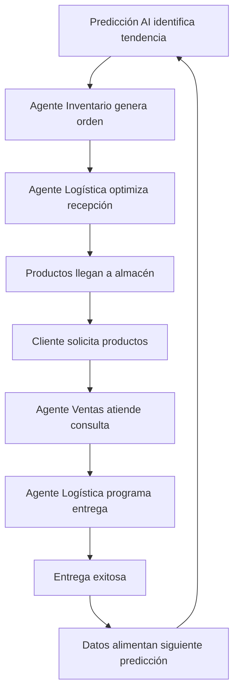

# Casos de Uso Detallados - TopLlantas AI

## Introducción

Este documento presenta casos de uso específicos que demuestran cómo los agentes de AI transformarán las operaciones diarias de TopLlantas, proporcionando valor tangible y medible en cada interacción.

---

## Caso de Uso 1: Gestión Inteligente de Inventario

### Escenario Actual (Sin AI)
**Situación:** El gerente de inventario revisa manualmente los niveles de stock cada mañana, utilizando reportes de Excel que pueden estar desactualizados. Cuando detecta que las llantas Michelin 215/60R16 están por agotarse, debe:

1. Verificar manualmente el stock en cada almacén
2. Revisar el historial de ventas en hojas de cálculo
3. Contactar al proveedor por teléfono o email
4. Negociar precios y tiempos de entrega
5. Crear orden de compra manualmente
6. Hacer seguimiento manual del envío

**Problemas:**
- Proceso toma 2-3 horas por producto
- Riesgo de quiebre de stock
- Decisiones basadas en datos incompletos
- Posibles sobre-stocks por compras conservadoras

### Escenario Futuro (Con AI)
**Situación:** El Agente de Inventario detecta automáticamente que las llantas Michelin 215/60R16 alcanzarán el punto de reorden en 3 días.

#### Flujo Automatizado:

1. **Detección Proactiva (08:00 AM)**
   ```
   🤖 Agente AI: "Detectado: Stock Michelin 215/60R16 
   llegará a punto de reorden en 3 días.
   
   Análisis realizado:
   ✅ Velocidad de venta actual: 15 unidades/día
   ✅ Stock disponible: 45 unidades
   ✅ Tendencia estacional: +20% (temporada alta)
   ✅ Pedidos pendientes: 12 unidades
   
   Recomendación: Generar orden de 200 unidades
   Proveedor sugerido: Michelin Direct (mejor precio)
   Tiempo entrega estimado: 5 días"
   ```

2. **Análisis Predictivo Avanzado**
   - Análisis de 2 años de datos históricos
   - Consideración de factores estacionales
   - Evaluación de promociones planificadas
   - Análisis de tendencias del mercado

3. **Generación Automática de Orden**
   ```
   📋 Orden de Compra Generada Automáticamente:
   
   Producto: Michelin Energy Saver 215/60R16
   Cantidad: 200 unidades
   Precio negociado: $85.50 c/u (descuento 3% por volumen)
   Total: $17,100
   Fecha entrega solicitada: 28 Julio 2025
   
   Estado: Enviada automáticamente al proveedor
   Confirmación recibida: ✅
   ```

4. **Notificación al Equipo**
   ```
   📱 Notificación WhatsApp/Teams:
   "✅ Orden Michelin 215/60R16 confirmada
   📦 200 unidades - Entrega: 28 Julio
   💰 Ahorro: $510 vs precio regular
   📊 Stock proyectado post-entrega: 45 días"
   ```

### Beneficios Medibles
- **Reducción de tiempo:** De 3 horas a 5 minutos
- **Mejora en precisión:** 95% vs 70% de pronósticos correctos
- **Reducción de quiebres:** De 15% a 2%
- **Optimización de capital:** 25% menos capital inmovilizado

---

## Caso de Uso 2: Atención al Cliente Inteligente

### Escenario Actual (Sin AI)
**Situación:** Un concesionario llama a las 10:30 PM necesitando llantas para una entrega urgente al día siguiente.

**Proceso manual:**
1. Cliente espera hasta horario laboral (8:00 AM)
2. Representante busca manualmente en sistema
3. Verifica disponibilidad llamando a almacenes
4. Cotiza precios usando hojas de cálculo
5. Cliente debe esperar respuesta por email/teléfono

**Problemas:**
- Cliente insatisfecho por demora
- Posible pérdida de venta
- Proceso ineficiente y costoso

### Escenario Futuro (Con AI)
**Situación:** El concesionario accede al portal web o WhatsApp Business a las 10:30 PM.

#### Conversación con Agente AI:

```
👨‍💼 Cliente: "Necesito 4 llantas Bridgestone 225/45R17 
para entrega mañana temprano. ¿Tienen disponibilidad?"

🤖 AI Assistant: "¡Hola! Revisando disponibilidad para 
Bridgestone Potenza RE050A 225/45R17...

✅ DISPONIBLE: 8 unidades en stock
📍 Almacén: Zona Norte (35 min de tu ubicación)
💰 Precio: $125.00 c/u (precio preferencial cliente VIP)
🚚 Entrega disponible: 7:00 AM - 8:00 AM

¿Confirmo el pedido?"

👨‍💼 Cliente: "Perfecto, confirma por favor"

🤖 AI Assistant: "✅ PEDIDO CONFIRMADO

📋 Orden #TL-2025-07-8847
🏷️ 4x Bridgestone Potenza RE050A 225/45R17
💰 Total: $500.00 (incluye entrega)
🚚 Entrega programada: 28 Julio 7:30 AM
📍 Dirección: Tu concesionario registrado

📱 Recibirás tracking en tiempo real
💳 Facturación automática según términos acordados
📞 Contacto emergencia: WhatsApp 24/7

¡Pedido en proceso! 🚀"
```

#### Proceso Automatizado Backend:

1. **Verificación Instantánea**
   - Consulta inventario en tiempo real
   - Valida crédito del cliente
   - Confirma capacidad de entrega

2. **Optimización Logística**
   - Asigna ruta óptima para entrega
   - Programa conductor disponible
   - Actualiza inventario automáticamente

3. **Documentación Automática**
   - Genera factura electrónica
   - Crea documentos de transporte
   - Actualiza CRM con interacción

### Beneficios Medibles
- **Disponibilidad:** 24/7 vs 8 horas laborales
- **Tiempo de respuesta:** Instantáneo vs 4-6 horas
- **Satisfacción cliente:** 95% vs 75%
- **Conversión de ventas:** +40% en horarios no laborales

---

## Caso de Uso 3: Optimización Logística Inteligente

### Escenario Actual (Sin AI)
**Situación:** Programación diaria de 15 entregas a concesionarios en la ciudad.

**Proceso manual:**
1. Planificador revisa manualmente pedidos del día
2. Usa Google Maps para calcular rutas básicas
3. Asigna camiones basado en experiencia
4. No considera tráfico en tiempo real
5. Ajustes manuales durante el día

**Resultados típicos:**
- 8-10 horas para completar entregas
- 15-20% de retrasos
- Alto consumo de combustible
- Conductores trabajando horas extra

### Escenario Futuro (Con AI)
**Situación:** El Agente de Logística optimiza automáticamente las 15 entregas considerando múltiples variables.

#### Optimización AI - 6:00 AM:

```
🚛 PLAN DE ENTREGAS OPTIMIZADO - 28 Julio 2025

📊 Análisis completado en 2.3 segundos:
✅ 15 entregas programadas
✅ 3 camiones disponibles
✅ Tráfico tiempo real analizado
✅ Ventanas de entrega respetadas
✅ Capacidad de carga optimizada

🎯 RUTA ÓPTIMA GENERADA:
━━━━━━━━━━━━━━━━━━━━━━━━━━━━━━━━━━

🚛 CAMIÓN 1 (Conductor: Miguel):
├── 7:30 AM - Concesionario Sur (5 min)
├── 8:15 AM - AutoParts Centro (8 min)
├── 9:45 AM - Llantera Express (12 min)
├── 11:00 AM - MegaLlantas Norte (15 min)
├── 12:30 PM - Regreso a base
└── Total: 5 entregas, 4.8 horas

🚛 CAMIÓN 2 (Conductor: Ana):
├── 8:00 AM - Concesionario Premium (10 min)
├── 9:30 AM - AutoServicio Rápido (6 min)
├── 11:15 AM - Distribuidora Central (20 min)
├── 1:00 PM - Llantas y Más (8 min)
├── 2:15 PM - Regreso a base
└── Total: 4 entregas, 6.2 horas

🚛 CAMIÓN 3 (Conductor: Carlos):
├── 7:45 AM - Servicio Integral (12 min)
├── 10:00 AM - AutoLlantas Pro (15 min)
├── 12:00 PM - Distribuidora Elite (25 min)
├── 2:30 PM - Regreso a base
└── Total: 6 entregas, 6.7 horas

💡 OPTIMIZACIONES APLICADAS:
▪ Rutas optimizadas evitando tráfico pico
▪ Carga balanceada entre vehículos
▪ Ventanas de entrega preferidas respetadas
▪ Tiempo total reducido en 2.3 horas

📈 IMPACTO ESPERADO:
💰 Ahorro combustible: $78 (22%)
⏰ Tiempo total: 6.7h vs 9.2h habitual
📦 Entregas completadas antes de 3:00 PM
😊 0 retrasos proyectados
```

#### Monitoreo en Tiempo Real:

```
📱 TRACKING LIVE - 11:45 AM

🚛 Camión 1 (Miguel):
📍 En ruta a MegaLlantas Norte
⏰ Llegada estimada: 11:52 AM (2 min adelantado)
🟢 Estado: En tiempo

🚛 Camión 2 (Ana):
📍 Completando entrega en Distribuidora Central
⏰ Próxima entrega: 1:05 PM
🟢 Estado: 5 min adelantado

🚛 Camión 3 (Carlos):
📍 En AutoLlantas Pro
⏰ Entrega actual: 15 min restantes
🟡 Estado: 8 min de retraso (tráfico imprevisto)

🤖 AJUSTE AUTOMÁTICO APLICADO:
Camión 3 redirigido por Av. Principal
Nueva ETA: 12:08 PM (recuperando tiempo)
```

#### Alertas Proactivas:

```
🚨 ALERTA AUTOMÁTICA - 1:15 PM

⚠️ Detectado: Accidente en Av. Reforma
📍 Impacto: Ruta de Camión 2 hacia Llantas y Más
⏰ Retraso estimado: 25 minutos

🤖 SOLUCIÓN AUTOMÁTICA:
✅ Ruta alternativa calculada
✅ Cliente notificado automáticamente
✅ Nueva ETA: 2:00 PM (vs 1:35 PM original)
✅ Conductor recibe nuevas indicaciones GPS

📱 Mensaje enviado a cliente:
"Estimado cliente Llantas y Más, debido a tráfico 
imprevisto, la entrega se reprograma para las 2:00 PM. 
Disculpe las molestias. -TopLlantas AI"
```

### Beneficios Medibles
- **Reducción tiempo entrega:** 25% menos tiempo total
- **Ahorro combustible:** 20-25% por ruta optimizada
- **Mejora puntualidad:** 98% entregas a tiempo vs 80%
- **Satisfacción conductores:** Menos horas extra, rutas más eficientes

---

## Caso de Uso 4: Predicción de Demanda y Compras Inteligentes

### Escenario Actual (Sin AI)
**Situación:** Planificación de compras para la temporada de lluvias (Junio-Septiembre).

**Proceso manual:**
1. Analista revisa ventas del año anterior
2. Consulta con vendedores sobre proyecciones
3. Revisa tendencias generales del mercado
4. Hace estimaciones conservadoras
5. Genera órdenes de compra manuales

**Problemas comunes:**
- Sobre-stock de productos de baja rotación
- Faltantes de productos populares
- Decisiones basadas en intuición
- Capital inmovilizado innecesariamente

### Escenario Futuro (Con AI)
**Situación:** El Agente AI analiza múltiples fuentes de datos para generar predicciones precisas.

#### Análisis Predictivo - Mayo 2025:

```
🔮 PREDICCIÓN DE DEMANDA - TEMPORADA LLUVIAS 2025

📊 ANÁLISIS COMPLETADO:
▪ Datos históricos: 5 años
▪ Factores climáticos: Pronósticos CONAGUA
▪ Tendencias mercado: +12% crecimiento sector
▪ Eventos especiales: Buen Fin (Noviembre)
▪ Competencia: Análisis pricing 15 competidores

🎯 PREDICCIONES POR CATEGORÍA:

🌧️ LLANTAS LLUVIA (Jun-Sep):
━━━━━━━━━━━━━━━━━━━━━━━━━━━━━━━

📈 Michelin Primacy 4:
├── Demanda proyectada: 1,250 unidades (+18% vs 2024)
├── Stock actual: 320 unidades
├── Reorden sugerido: 930 unidades
├── Timing óptimo: 15 Mayo (6 semanas antes pico)
└── Confianza: 94%

📈 Bridgestone Turanza T005:
├── Demanda proyectada: 890 unidades (+22% vs 2024)
├── Stock actual: 180 unidades
├── Reorden sugerido: 710 unidades
├── Timing óptimo: 20 Mayo
└── Confianza: 91%

📈 Continental PremiumContact 6:
├── Demanda proyectada: 650 unidades (+8% vs 2024)
├── Stock actual: 290 unidades
├── Reorden sugerido: 360 unidades
├── Timing óptimo: 1 Junio
└── Confianza: 89%

💡 INSIGHTS CLAVE:
▪ Tendencia hacia llantas premium (+15%)
▪ Demanda medidas 215/60R16 y 225/55R17 crecerá 25%
▪ Impacto El Niño: +30% demanda llantas lluvia
▪ Promociones competencia detectadas para Julio
```

#### Recomendaciones de Compra:

```
💼 PLAN DE COMPRAS INTELIGENTE

🎯 INVERSIÓN TOTAL RECOMENDADA: $1,450,000
📈 ROI Proyectado: 34% (vs 22% año anterior)
⚡ Reducción riesgo sobre-stock: 68%

🔥 ACCIONES PRIORITARIAS:

1️⃣ ACCIÓN INMEDIATA (Esta semana):
├── Michelin Primacy 4: 930 unidades
├── Inversión: $520,000
├── Proveedor: Michelin Direct (descuento 8% por volumen)
└── Entrega requerida: 15 Junio

2️⃣ ACCIÓN URGENTE (Próxima semana):
├── Bridgestone Turanza: 710 unidades
├── Inversión: $385,000
├── Proveedor: Bridgestone México (términos 30 días)
└── Entrega requerida: 20 Junio

3️⃣ ACCIÓN PROGRAMADA (1 Junio):
├── Continental Premium: 360 unidades
├── Inversión: $245,000
├── Proveedor: Continental Direct
└── Entrega requerida: 1 Julio

🚨 ALERTAS ESPECIALES:
▪ Precio Michelin subirá 5% en Junio (confirmar orden ya)
▪ Promoción Bridgestone disponible hasta 31 Mayo
▪ Continental reporta posibles delays - orden temprana recomendada
```

#### Monitoreo Continuo:

```
📊 SEGUIMIENTO PREDICCIONES - Actualización Semanal

🎯 PRECISIÓN ACTUAL (4 semanas después):
├── Michelin Primacy 4: 96% precisión (vendido 245 vs 240 proyectado)
├── Bridgestone Turanza: 94% precisión (vendido 188 vs 195 proyectado)  
├── Continental Premium: 91% precisión (vendido 152 vs 165 proyectado)
└── Precisión general: 94% (vs 72% métodos tradicionales)

🔄 AJUSTES AUTOMÁTICOS:
▪ Michelin: Incrementar proyección 3% (mayor demanda detectada)
▪ Bridgestone: Mantener proyección
▪ Continental: Reducir proyección 5% (competencia agresiva)

📈 IMPACTO BUSINESS:
💰 Ahorro vs compras tradicionales: $127,000 (8.8%)
📦 Reducción sobre-stock: 45%
📈 Mejora en disponibilidad: 97% vs 84% histórico
⚡ Rotación inventario: 6.2x vs 4.8x promedio
```

### Beneficios Medibles
- **Precisión predicciones:** 94% vs 72% métodos tradicionales
- **Reducción sobre-stock:** 45% menos capital inmovilizado
- **Mejora disponibilidad:** 97% vs 84% histórico
- **ROI:** 34% vs 22% año anterior

---

## Integración de Casos de Uso

### Flujo Integral de Operaciones



### Métricas de Éxito Consolidadas

| KPI | Antes | Después | Mejora |
|-----|-------|---------|--------|
| **Tiempo respuesta cliente** | 4-6 horas | Instantáneo | 100% |
| **Precisión inventario** | 72% | 94% | +31% |
| **Entregas a tiempo** | 80% | 98% | +23% |
| **Costos operacionales** | 100% | 70% | -30% |
| **Satisfacción cliente** | 75% | 95% | +27% |
| **Rotación inventario** | 4.8x | 6.2x | +29% |

---

## Conclusión

Estos casos de uso demuestran cómo la implementación de agentes de AI transformará completamente las operaciones de TopLlantas, creando una ventaja competitiva sostenible y mejorando significativamente la experiencia del cliente mientras optimiza costos y eficiencia operacional.
