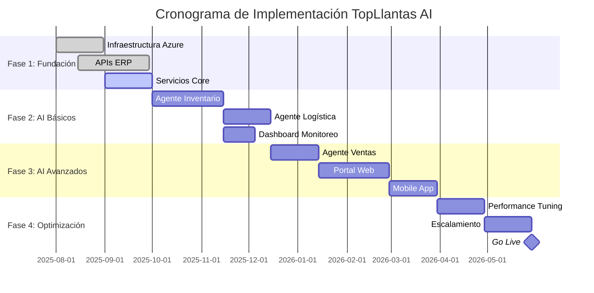

## Presupuesto y Timeline

### Timeline del Proyecto (12 meses)



### Presupuesto Detallado

#### Fase 1: Fundación e Integración (Meses 1-3)
| Concepto | Costo (USD) | Descripción |
|----------|-------------|-------------|
| **Desarrollo y Configuración** | | |
| Arquitecto de Soluciones (3 meses) | $45,000 | Diseño y supervisión técnica |
| Desarrolladores Senior (2 x 3 meses) | $72,000 | Desarrollo de APIs y servicios core |
| DevOps Engineer (3 meses) | $36,000 | Infraestructura y CI/CD |
| **Infraestructura Azure** | | |
| Azure Container Apps | $3,600 | Hosting de microservicios |
| Azure SQL Database (Premium) | $4,500 | Base de datos principal |
| Azure Cosmos DB | $2,400 | NoSQL para alta velocidad |
| Azure API Management | $2,700 | Gateway y gestión de APIs |
| Azure Storage Premium | $1,800 | Almacenamiento y backup |
| **Licencias y Herramientas** | | |
| Azure DevOps Advanced | $1,800 | CI/CD y project management |
| Monitoreo y Logging | $1,200 | Application Insights, Log Analytics |
| **Subtotal Fase 1** | **$171,000** | |

#### Fase 2: Agentes de AI Básicos (Meses 4-6)
| Concepto | Costo (USD) | Descripción |
|----------|-------------|-------------|
| **Desarrollo** | | |
| AI/ML Specialist (3 meses) | $54,000 | Desarrollo de agentes inteligentes |
| Desarrolladores (2 x 3 meses) | $72,000 | Integración y frontend |
| Data Scientist (2 meses) | $30,000 | Modelos predictivos |
| **Servicios Azure AI** | | |
| Azure OpenAI Service | $7,200 | GPT-4 y modelos de lenguaje |
| Azure Machine Learning | $4,500 | Entrenamiento de modelos |
| Azure Cognitive Services | $2,400 | Servicios de AI adicionales |
| **Infraestructura Adicional** | | |
| Escalamiento de servicios | $3,600 | Incremento de capacidad |
| **Subtotal Fase 2** | **$173,700** | |

#### Fase 3: Agentes Avanzados y Portal Web (Meses 7-9)
| Concepto | Costo (USD) | Descripción |
|----------|-------------|-------------|
| **Desarrollo** | | |
| Frontend Developer (3 meses) | $36,000 | Portal web y mobile app |
| UX/UI Designer (2 meses) | $24,000 | Diseño de interfaces |
| Desarrolladores Backend (2 x 3 meses) | $72,000 | Agentes avanzados |
| **Servicios Adicionales** | | |
| Azure Bot Service | $1,800 | Chatbots inteligentes |
| Power BI Premium | $6,000 | Analytics y reporting |
| Azure SignalR Service | $2,400 | Notificaciones en tiempo real |
| CDN y servicios web | $3,600 | Performance y distribución |
| **Subtotal Fase 3** | **$145,800** | |

#### Fase 4: Optimización y Escalamiento (Meses 10-12)
| Concepto | Costo (USD) | Descripción |
|----------|-------------|-------------|
| **Optimización** | | |
| Performance Engineer (3 meses) | $45,000 | Optimización y tuning |
| Security Specialist (2 meses) | $32,000 | Auditoría y hardening |
| **Testing y QA** | | |
| QA Engineers (2 x 2 meses) | $32,000 | Testing integral |
| Load Testing Tools | $3,600 | Herramientas de carga |
| **Capacitación y Documentación** | | |
| Technical Writer (2 meses) | $16,000 | Documentación completa |
| Training Materials | $8,000 | Materiales de capacitación |
| **Go-Live Support** | | |
| Support Team (1 mes) | $18,000 | Soporte durante lanzamiento |
| **Subtotal Fase 4** | **$154,600** | |

### Resumen Financiero

#### Inversión Total por Categorías
| Categoría | Costo (USD) | Porcentaje |
|-----------|-------------|------------|
| **Desarrollo y Personal** | $537,000 | 83.2% |
| **Infraestructura Azure** | $66,000 | 10.2% |
| **Licencias y Herramientas** | $25,000 | 3.9% |
| **Testing y QA** | $17,600 | 2.7% |
| **TOTAL INVERSIÓN** | **$645,100** | **100%** |

#### Costos Operacionales Mensuales (Post Go-Live)
| Servicio | Costo Mensual (USD) | Descripción |
|----------|---------------------|-------------|
| Azure Infrastructure | $12,000 | Hosting y compute |
| Azure AI Services | $8,000 | OpenAI, ML, Cognitive Services |
| Licencias Software | $3,000 | DevOps, Power BI, monitoreo |
| Support y Mantenimiento | $15,000 | Equipo de soporte 24/7 |
| **Total Mensual** | **$38,000** | |
| **Total Anual** | **$456,000** | |

### ROI Proyectado

#### Ahorros Anuales Esperados
| Concepto | Ahorro Anual (USD) | Descripción |
|----------|-------------------|-------------|
| Reducción costos operacionales (30%) | $800,000 | Automatización de procesos |
| Reducción costos inventario (25%) | $500,000 | Optimización de stock |
| Reducción costos logísticos (20%) | $300,000 | Rutas optimizadas |
| Incremento ventas (15%) | $1,200,000 | Mejor disponibilidad |
| **Total Ahorros Anuales** | **$2,800,000** | |

#### Análisis ROI
| Métrica | Valor |
|---------|-------|
| **Inversión Inicial** | $645,100 |
| **Costos Operacionales Anuales** | $456,000 |
| **Ahorros Anuales** | $2,800,000 |
| **Beneficio Neto Anual** | $2,344,000 |
| **ROI Año 1** | **263%** |
| **Payback Period** | **3.3 meses** |

---

## Riesgos y Mitigación

### Riesgos Técnicos

#### Alto Riesgo
| Riesgo | Probabilidad | Impacto | Mitigación |
|--------|--------------|---------|------------|
| **Integración ERP Compleja** | Media | Alto | - Análisis detallado pre-implementación<br>- Desarrollo incremental<br>- Ambiente de testing dedicado |
| **Performance de AI** | Media | Alto | - Benchmarking continuo<br>- Modelos de fallback<br>- Optimización iterativa |
| **Escalabilidad Azure** | Baja | Alto | - Arquitectura cloud-native<br>- Auto-scaling configurado<br>- Load testing regular |

#### Medio Riesgo
| Riesgo | Probabilidad | Impacto | Mitigación |
|--------|--------------|---------|------------|
| **Adopción Usuario** | Media | Medio | - Capacitación extensiva<br>- UI/UX intuitivo<br>- Soporte 24/7 inicial |
| **Calidad de Datos** | Media | Medio | - Data cleaning automatizado<br>- Validaciones estrictas<br>- Monitoreo continuo |

### Riesgos de Negocio

#### Alto Riesgo
| Riesgo | Probabilidad | Impacto | Mitigación |
|--------|--------------|---------|------------|
| **Resistencia al Cambio** | Media | Alto | - Change management formal<br>- Comunicación clara<br>- Beneficios tangibles tempranos |
| **Budget Overrun** | Baja | Alto | - Metodología ágil con entregas<br>- Control estricto de scope<br>- Contingencia del 15% |

### Riesgos de Seguridad

#### Alto Riesgo
| Riesgo | Probabilidad | Impacto | Mitigación |
|--------|--------------|---------|------------|
| **Breach de Datos** | Baja | Muy Alto | - Encryption end-to-end<br>- Azure Security Center<br>- Auditorías regulares |
| **Acceso No Autorizado** | Baja | Alto | - Multi-factor authentication<br>- Role-based access<br>- Monitoreo de accesos |

### Plan de Contingencia

#### Estrategias de Fallback
1. **Sistema Dual**: Mantener sistema legacy en paralelo durante 6 meses
2. **Rollback Automatizado**: Capacidad de revertir a versión anterior en <1 hora
3. **Soporte 24/7**: Equipo de respuesta rápida durante primeros 3 meses
4. **Data Backup**: Backups automáticos cada 4 horas con retención de 30 días

---

## Equipo Requerido

### Estructura del Equipo

#### Core Team (Tiempo Completo)
| Rol | Cantidad | Responsabilidades |
|-----|----------|-------------------|
| **Project Manager** | 1 | Coordinación general y delivery |
| **Solution Architect** | 1 | Diseño técnico y decisiones de arquitectura |
| **AI/ML Specialist** | 1 | Desarrollo de agentes inteligentes |
| **Senior Backend Developer** | 2 | APIs y microservicios |
| **Frontend Developer** | 1 | Portal web y interfaces |
| **DevOps Engineer** | 1 | Infraestructura y CI/CD |

#### Equipo Especializado (Tiempo Parcial)
| Rol | Cantidad | Dedicación | Responsabilidades |
|-----|----------|------------|-------------------|
| **Data Scientist** | 1 | 50% | Modelos predictivos y analytics |
| **UX/UI Designer** | 1 | 40% | Diseño de experiencia usuario |
| **Security Specialist** | 1 | 30% | Seguridad y compliance |
| **QA Engineer** | 2 | 60% | Testing y calidad |
| **Technical Writer** | 1 | 25% | Documentación |

#### Equipo de Soporte
| Rol | Fase | Responsabilidades |
|-----|------|-------------------|
| **Change Manager** | Todas | Gestión del cambio organizacional |
| **Training Specialist** | Fases 3-4 | Capacitación de usuarios |
| **Business Analyst** | Fases 1-2 | Requirements y procesos |

### Perfiles Técnicos Requeridos

#### Solution Architect
**Experiencia Requerida:**
- 8+ años en arquitectura de soluciones enterprise
- Experiencia con Microsoft Azure (certificación preferida)
- Conocimiento en AI/ML y microservicios
- Experiencia en integración de sistemas ERP

#### AI/ML Specialist
**Experiencia Requerida:**
- 5+ años en desarrollo de soluciones AI/ML
- Experiencia con Azure OpenAI y Cognitive Services
- Conocimiento en NLP y modelos predictivos
- Experiencia en MLOps y deployment de modelos

#### Senior Backend Developer
**Experiencia Requerida:**
- 6+ años en desarrollo backend (.NET Core/C#)
- Experiencia con Azure Container Apps y Functions
- Conocimiento en patterns de microservicios
- Experiencia con APIs RESTful y GraphQL

### Organigrama del Proyecto

```
                    Project Manager
                          |
                 Solution Architect
                          |
        ┌─────────────────┼─────────────────┐
   AI/ML Specialist  DevOps Engineer  Frontend Dev
        |                 |                 |
Backend Devs (2)    Data Scientist    UX/UI Designer
        |                 |                 |
  QA Engineers     Security Spec.    Tech Writer
```

### Plan de Onboarding

#### Semana 1-2: Familiarización
- Introducción a TopLlantas y procesos actuales
- Setup de ambiente de desarrollo
- Acceso a sistemas y documentación
- Training en herramientas Azure

#### Semana 3-4: Inmersión Técnica
- Deep dive en arquitectura de la solución
- Review de requirements detallados
- Setup de metodología de trabajo
- Primeros sprint planning sessions

---

## Metodología de Desarrollo

### Enfoque Ágil Híbrido

#### Metodología SCRUM con SAFe
- **Sprints de 2 semanas** para desarrollo iterativo
- **Program Increment (PI)** de 8-12 semanas por fase
- **Daily standups** para coordinación
- **Sprint reviews** con stakeholders
- **Retrospectivas** para mejora continua

#### DevOps y CI/CD

```yaml
Development Pipeline:
  - Feature Branch Development
  - Automated Testing (Unit, Integration, E2E)
  - Code Review Process
  - Automated Deployment to Staging
  - Manual Approval for Production
  - Blue-Green Deployment
  - Automated Rollback Capability
```

### Governance y Control

#### Steering Committee
- **CEO TopLlantas** (Executive Sponsor)
- **CTO/IT Director** (Technical Owner)
- **Head of Operations** (Business Owner)
- **Project Manager** (Delivery Owner)

#### Decision Making Process
1. **Technical Decisions**: Solution Architect + Development Team
2. **Business Decisions**: Business Owner + Steering Committee
3. **Budget Decisions**: Executive Sponsor
4. **Scope Changes**: Steering Committee (formal approval required)

---

## Conclusiones

### Transformación Integral

La implementación de esta solución representa una **transformación digital completa** para TopLlantas, posicionando a la empresa como líder tecnológico en el sector de distribución de llantas. Los agentes de AI no solo automatizarán procesos existentes, sino que crearán nuevas capacidades antes impensables.

### Ventaja Competitiva Sostenible

La combinación de **tecnologías cutting-edge** con **deep domain knowledge** creará una ventaja competitiva difícil de replicar. Los competidores requerirían una inversión similar y tiempo considerable para alcanzar el mismo nivel de sofisticación.

### ROI Excepcional

Con un **ROI del 263% en el primer año** y un **payback period de 3.3 meses**, esta inversión se justifica ampliamente desde el punto de vista financiero. Los beneficios se aceleran exponencialmente tras el go-live.

### Escalabilidad Futura

La arquitectura cloud-native y modular permite **crecimiento orgánico** y **expansión a nuevos mercados** sin requerir reescribir la plataforma. La inversión actual soportará el crecimiento de TopLlantas por los próximos 5-10 años.

### Recomendación

**Recomendamos proceder con la implementación inmediata** de esta solución, comenzando con la Fase 1 para establecer las bases sólidas que permitirán el éxito de las fases subsecuentes.

La **ventana de oportunidad** para establecer liderazgo tecnológico en el sector es limitada. Los early adopters de AI en supply chain están obteniendo ventajas significativas que serán difíciles de superar una vez establecidas.

### Próximos Pasos

1. **Aprobación ejecutiva** y asignación de presupuesto
2. **Contratación del equipo core** (Solution Architect, PM)
3. **Setup inicial** de infraestructura Azure
4. **Kick-off oficial** del proyecto
5. **Inicio de Fase 1** con entregables en 90 días

---

*Esta propuesta está diseñada para transformar TopLlantas en una empresa digitalmente nativa, preparada para liderar el futuro de la distribución de llantas en América Latina.*
