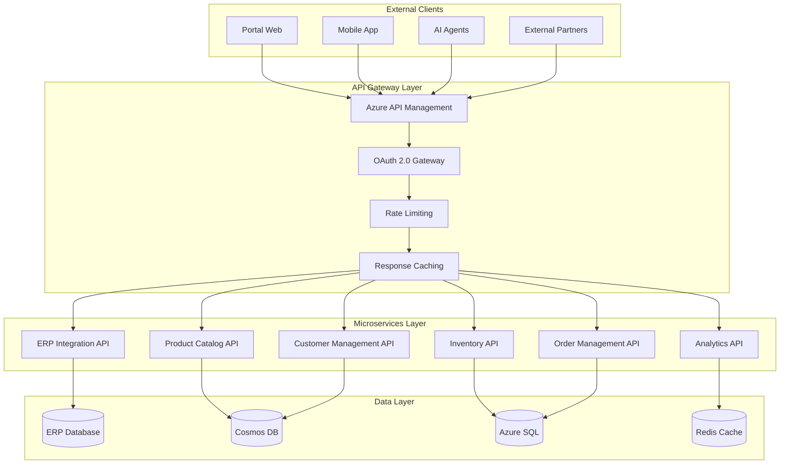

# 🔗 Integración TopLlantas AI con tu ERP
## Conecta Todo Sin Cambiar lo que ya Funciona

> **La integración más importante: hacer que tu ERP actual y los nuevos agentes de IA trabajen juntos como un solo sistema, sin interrumpir tu operación diaria.**

---

## 🎯 ¿Por Qué es Importante la Integración?

### Problemas Comunes Sin Integración
- ❌ **Entrada doble de datos** (ERP + sistema nuevo)
- ❌ **Información desactualizada** entre sistemas
- ❌ **Errores humanos** al transferir datos
- ❌ **Tiempo perdido** sincronizando manualmente
- ❌ **Resistencia del equipo** a usar múltiples sistemas

### Beneficios de Integración Completa
- ✅ **Un solo punto de verdad** para todos los datos
- ✅ **Sincronización automática** en tiempo real
- ✅ **Cero trabajo manual** adicional
- ✅ **Tu equipo sigue trabajando** igual que siempre
- ✅ **Los agentes IA acceden** a información actualizada

---

## 🔧 Cómo Funciona la Integración

### Proceso Simple y Transparente

```
┌─────────────────┐    ┌─────────────────┐    ┌─────────────────┐
│   📊 Tu ERP     │◄──►│  🔗 Conectores  │◄──►│ 🤖 Agentes IA   │
│                 │    │   Inteligentes  │    │                 │
│ • Inventario    │    │                 │    │ • Ventas 24/7   │
│ • Ventas        │    │ • Seguridad     │    │ • Predicciones  │
│ • Clientes      │    │ • Tiempo real   │    │ • Optimización  │
│ • Proveedores   │    │ • Bidireccional │    │ • Automatización│
└─────────────────┘    └─────────────────┘    └─────────────────┘
         │                       │                       │
         └───────────────────────┼───────────────────────┘
                                 │
                    ┌─────────────────┐
                    │ 🛡️ Seguridad    │
                    │   y Backup      │
                    │                 │
                    │ • Encriptación  │
                    │ • Auditoría     │
                    │ • Respaldos     │
                    └─────────────────┘
```

### Compatibilidad Universal
Trabajamos con cualquier ERP:
- **SAP** (Business One, S/4HANA)
- **Oracle** (NetSuite, JD Edwards)  
- **Microsoft Dynamics** (365, AX, NAV)
- **ERPs Mexicanos** (COI, Aspel, Contpaq)
- **Sistemas Custom** o desarrollos internos
- **Bases de datos** (SQL Server, MySQL, Oracle)

---

## 📋 Proceso de Integración Paso a Paso

### Fase 1: Análisis y Planeación (Semana 1)

**Lo que Hacemos**
- 🔍 **Análisis completo** de tu ERP actual
- 📊 **Mapeo de datos** y procesos existentes
- 🎯 **Identificación de puntos** de integración críticos
- 📋 **Plan detallado** de implementación
- ⚠️ **Identificación de riesgos** y mitigación

**Lo que Necesitamos de Ti**
- Acceso de solo lectura a la base de datos
- 2-3 horas de tu equipo técnico para explicar procesos
- Documentación del ERP (si está disponible)

**Entregables**
- Documento de arquitectura de integración
- Plan de implementación detallado
- Cronograma específico con hitos
- Estrategia de backup y seguridad

### Fase 2: Desarrollo de Conectores (Semanas 2-4)

**Conectores que Desarrollamos**

**📦 Conector de Inventario**
- Sincronización de productos y stock
- Alertas automáticas de cambios
- Historial de movimientos
- Categorías y clasificaciones

**💼 Conector de Ventas**  
- Clientes y prospectos
- Historial de compras
- Precios y descuentos
- Términos de pago

**🚚 Conector de Logística**
- Órdenes de compra
- Proveedores y términos
- Entregas y tracking
- Costos de transporte

**📊 Conector de Reportes**
- Métricas en tiempo real
- KPIs personalizados
- Dashboards ejecutivos
- Alertas inteligentes

### Fase 3: Pruebas y Validación (Semana 5)

**Proceso de Pruebas Riguroso**
- ✅ **Pruebas en ambiente de desarrollo** (sin afectar producción)
- ✅ **Validación de datos** (precisión 100%)
- ✅ **Pruebas de performance** (velocidad óptima)
- ✅ **Pruebas de seguridad** (encriptación completa)
- ✅ **Simulación de fallos** (recuperación automática)

**Validación con tu Equipo**
- Demo funcional completa
- Revisión de todos los procesos
- Validación de reportes y métricas
- Aprobación final antes del go-live

### Fase 4: Implementación en Producción (Semana 6)

**Go-Live Sin Interrupciones**
- 🕐 **Implementación fuera de horas** laborales
- 🔄 **Migración gradual** de datos
- 📞 **Soporte 24/7** durante la primera semana
- 🛡️ **Backup completo** antes de cualquier cambio
- ⚡ **Rollback inmediato** si hay algún problema

---

## 🛡️ Seguridad y Confiabilidad

### Medidas de Seguridad Implementadas

**Protección de Datos**
- 🔐 **Encriptación AES-256** en tránsito y reposo
- 🔑 **Autenticación multifactor** para todos los accesos
- 🛡️ **Firewall dedicado** para conexiones ERP
- 📊 **Auditoría completa** de todos los accesos
- 🕐 **Logs detallados** de todas las transacciones

**Backup y Recuperación**
- ☁️ **Backup automático** cada 4 horas en Azure
- 💾 **Backup local** diario en tu infraestructura
- 🔄 **Recuperación ante desastres** en menos de 2 horas
- 📋 **Plan de continuidad** documentado y probado
- 🧪 **Pruebas de recuperación** mensuales

**Compliance y Certificaciones**
- 📜 **ISO 27001** compliance para seguridad
- 🏛️ **SOC 2 Type II** para confiabilidad
- 🇲🇽 **Cumplimiento fiscal** mexicano (SAT)
- 📊 **GDPR compliance** para protección de datos
- 🔍 **Auditorías externas** anuales

---

## 📊 Monitoreo en Tiempo Real

### Dashboard de Integración
```
┌─────────────────────────────────────────────────────────────┐
│ 🔗 ESTADO DE INTEGRACIÓN ERP - TIEMPO REAL                 │
├─────────────────────────────────────────────────────────────┤
│                                                             │
│ 🟢 CONEXIONES ACTIVAS                                      │
│ • ERP Database: ✅ Online (latencia: 12ms)                 │
│ • Agente Ventas: ✅ Sincronizado (último: 14:32)          │
│ • Agente Inventario: ✅ Activo (último: 14:33)            │
│ • Agente Logística: ✅ Funcionando (último: 14:31)        │
│                                                             │
│ 📊 SINCRONIZACIÓN HOY                                      │
│ • Productos actualizados: 1,247                            │
│ • Ventas procesadas: 89                                    │
│ • Órdenes sincronizadas: 23                                │
│ • Alertas enviadas: 7                                      │
│                                                             │
│ ⚡ PERFORMANCE                                              │
│ • Tiempo respuesta promedio: 180ms                         │
│ • Uptime: 99.97% (este mes)                               │
│ • Transacciones/minuto: 145                               │
│ • Errores: 0 (últimas 24h)                                │
│                                                             │
│ 🔔 PRÓXIMAS SINCRONIZACIONES                               │
│ • Inventario completo: 18:00 (diario)                     │
│ • Backup completo: 02:00 (diario)                         │
│ • Reporte semanal: Lunes 08:00                            │
│                                                             │
└─────────────────────────────────────────────────────────────┘
```

---

## 🚀 Casos de Uso Reales de Integración

### Caso 1: Venta Automática Nocturna

**Escenario**: Cliente solicita cotización a las 11:30 PM

1. **Cliente escribe**: "Necesito 4 llantas Michelin 205/55R16"
2. **Agente IA consulta ERP**: Stock disponible, precios actuales, descuentos
3. **Genera cotización**: Precios personalizados según historial del cliente
4. **Cliente acepta**: Agente crea orden automáticamente en ERP
5. **Confirmación inmediata**: Cliente recibe confirmación y número de orden
6. **Al día siguiente**: Vendedor encuentra la orden ya capturada en el ERP

**Resultado**: Venta cerrada fuera de horario, sin intervención humana, todo registrado correctamente en el ERP.

### Caso 2: Alerta Automática de Inventario

**Escenario**: Stock crítico detectado automáticamente

1. **Agente Inventario detecta**: Llanta popular llegando a mínimo
2. **Consulta ERP**: Historial de ventas, proveedores, términos
3. **Calcula orden óptima**: Cantidad, timing, proveedor preferido
4. **Alerta al comprador**: WhatsApp con recomendación específica
5. **Un clic para ordenar**: Comprador aprueba desde el móvil
6. **Orden automática**: Se genera PO en el ERP automáticamente

**Resultado**: Nunca más faltantes críticos, inventario optimizado, proceso sin fricción.

### Caso 3: Optimización de Entregas

**Escenario**: Múltiples entregas programadas para mañana

1. **Agente Logística consulta ERP**: Pedidos confirmados para mañana
2. **Calcula rutas óptimas**: Considerando tráfico y ventanas de entrega
3. **Asigna vehículos**: Basado en capacidad y ubicación
4. **Notifica a clientes**: WhatsApp con horario confirmado
5. **Actualiza ERP**: Tracking numbers y rutas programadas
6. **Seguimiento en vivo**: Actualizaciones automáticas de status

**Resultado**: 40% menos costo de entrega, 95% entregas a tiempo, clientes informados siempre.

---

## 💰 Inversión en Integración

### ¿Qué Incluye el Costo de Integración?

**Incluido en los $125,000 del Proyecto**
- ✅ **Análisis completo** de tu ERP actual
- ✅ **Desarrollo de conectores** específicos para tu sistema
- ✅ **Migración segura** de datos históricos
- ✅ **Pruebas exhaustivas** en ambiente de desarrollo
- ✅ **Implementación sin downtime** en producción
- ✅ **Capacitación completa** del equipo
- ✅ **Soporte 24/7** durante primer mes
- ✅ **Garantía de funcionamiento** por 12 meses

**Sin Costos Adicionales Por**
- ❌ **Cambios en scope** razonables durante desarrollo
- ❌ **Ajustes menores** en la lógica de negocio
- ❌ **Capacitación adicional** si es necesaria
- ❌ **Soporte durante** el período de garantía
- ❌ **Actualizaciones** del conector por cambios en ERP

### Comparación con Otras Opciones

**Desarrollo Interno**
- 💰 **Costo**: $180,000 - $250,000
- ⏰ **Tiempo**: 12-18 meses
- 🎯 **Riesgo**: Alto (falta de experiencia)
- 🛠️ **Mantenimiento**: Tu responsabilidad

**Empresa Grande de Software**
- 💰 **Costo**: $300,000 - $500,000
- ⏰ **Tiempo**: 18-24 meses
- 🎯 **Personalización**: Limitada
- 📞 **Soporte**: Costoso y lento

**Nuestra Propuesta TopLlantas AI**
- 💰 **Costo**: $125,000 (todo incluido)
- ⏰ **Tiempo**: 8 meses
- 🎯 **Personalización**: Completa
- 📞 **Soporte**: Directo y personal

---

## 🔮 Futuro de la Integración

### Escalabilidad Garantizada

**Preparado Para Crecer**
- 🏢 **Múltiples sucursales**: Fácil replicación del modelo
- 📈 **Mayor volumen**: Arquitectura que escala automáticamente
- 🔌 **Nuevos sistemas**: Conectores adicionales sin reestructurar
- 🌐 **Expansión geográfica**: Cloud native para cualquier ubicación

**Evolución Continua**
- 🤖 **Nuevos agentes IA**: Se integran automáticamente
- 📊 **Mejores insights**: Análisis más profundos con más datos
- ⚡ **Optimizaciones**: Performance mejorado constantemente
- 🔄 **Actualizaciones**: Sin interrumpir la operación

---

## ✅ Garantías de Integración

### Nuestros Compromisos Específicos

**Garantía Técnica**
- ✅ **100% de datos migrados** correctamente
- ✅ **Zero downtime** durante implementación
- ✅ **Performance igual o mejor** que sistema actual
- ✅ **Rollback completo** disponible por 30 días

**Garantía de Negocio**
- ✅ **Productividad mantenida** durante transición
- ✅ **Capacitación hasta** que equipo esté cómodo
- ✅ **Soporte prioritario** primer año incluido
- ✅ **Ajustes sin costo** los primeros 6 meses

**Garantía de Satisfacción**
- ✅ **30 días** para evaluar completamente
- ✅ **Reembolso total** si no cumple expectativas
- ✅ **Comunicación directa** con el desarrollador siempre
- ✅ **Transparencia total** en el proceso

---

## 📞 Próximo Paso: Demo de Integración

### ¿Quieres Ver Cómo Funciona?

**Demo Personalizada (45 minutos)**
1. **Conectamos** temporalmente con tu ERP (solo lectura)
2. **Mostramos** agente IA consultando datos reales
3. **Demostramos** sincronización en tiempo real
4. **Respondemos** todas tus preguntas técnicas
5. **Definimos** plan específico para tu empresa

**Qué Necesitamos Para la Demo**
- 1 hora de tu equipo técnico
- Acceso temporal de solo lectura a base de datos
- Lista de procesos críticos que quieres ver automatizados

**¿Cuándo Podemos Hacerla?**
- Disponible esta misma semana
- Virtual o presencial (tu prefieras)
- Sin compromiso, solo información valiosa

---

*La integración perfecta no es casualidad... es ingeniería inteligente.*

**¿Listo para ver tu ERP y los agentes IA trabajando como uno solo?**

---

## Arquitectura de APIs

### Diseño de Alto Nivel



---

## API Core: ERP Integration Service

### Arquitectura del Servicio

```csharp
[ApiController]
[Route("api/v1/erp")]
[Authorize]
public class ERPIntegrationController : ControllerBase
{
    private readonly IERPService _erpService;
    private readonly IMapper _mapper;
    private readonly ILogger<ERPIntegrationController> _logger;
    private readonly ICacheService _cache;

    public ERPIntegrationController(
        IERPService erpService,
        IMapper mapper,
        ILogger<ERPIntegrationController> logger,
        ICacheService cache)
    {
        _erpService = erpService;
        _mapper = mapper;
        _logger = logger;
        _cache = cache;
    }

    /// <summary>
    /// Sincronizar productos desde ERP
    /// </summary>
    [HttpPost("sync/products")]
    [SwaggerOperation(Summary = "Sincronizar catálogo de productos desde ERP")]
    [SwaggerResponse(200, "Sincronización exitosa", typeof(SyncResult))]
    [SwaggerResponse(429, "Rate limit excedido")]
    public async Task<ActionResult<SyncResult>> SyncProductsAsync(
        [FromBody] SyncRequest request)
    {
        try
        {
            _logger.LogInformation(
                "Iniciando sincronización de productos. Filtros: {Filters}", 
                request.Filters);

            var erpProducts = await _erpService.GetProductsAsync(request.Filters);
            var mappedProducts = _mapper.Map<List<ProductDto>>(erpProducts);
            
            var syncResult = await _erpService.SyncProductsAsync(mappedProducts);
            
            // Invalidar cache de productos
            await _cache.RemoveByPatternAsync("products:*");
            
            _logger.LogInformation(
                "Sincronización completada. {Count} productos procesados", 
                syncResult.ProcessedCount);

            return Ok(syncResult);
        }
        catch (ERPConnectionException ex)
        {
            _logger.LogError(ex, "Error de conexión con ERP");
            return StatusCode(502, new { Error = "ERP connection failed", Details = ex.Message });
        }
        catch (Exception ex)
        {
            _logger.LogError(ex, "Error inesperado durante sincronización");
            return StatusCode(500, new { Error = "Internal server error" });
        }
    }

    /// <summary>
    /// Obtener inventario en tiempo real
    /// </summary>
    [HttpGet("inventory/{productId}")]
    [SwaggerOperation(Summary = "Obtener niveles de inventario por producto")]
    [SwaggerResponse(200, "Inventario encontrado", typeof(InventoryDto))]
    [SwaggerResponse(404, "Producto no encontrado")]
    [ProducesResponseType(typeof(InventoryDto), 200)]
    public async Task<ActionResult<InventoryDto>> GetInventoryAsync(
        string productId,
        [FromQuery] string? warehouse = null)
    {
        var cacheKey = $"inventory:{productId}:{warehouse ?? "all"}";
        
        // Intentar obtener del cache primero
        var cachedInventory = await _cache.GetAsync<InventoryDto>(cacheKey);
        if (cachedInventory != null)
        {
            return Ok(cachedInventory);
        }

        var inventory = await _erpService.GetInventoryAsync(productId, warehouse);
        
        if (inventory == null)
        {
            return NotFound(new { Message = $"Product {productId} not found" });
        }

        var inventoryDto = _mapper.Map<InventoryDto>(inventory);
        
        // Cache por 5 minutos
        await _cache.SetAsync(cacheKey, inventoryDto, TimeSpan.FromMinutes(5));
        
        return Ok(inventoryDto);
    }

    /// <summary>
    /// Crear orden en ERP
    /// </summary>
    [HttpPost("orders")]
    [SwaggerOperation(Summary = "Crear nueva orden en sistema ERP")]
    [SwaggerResponse(201, "Orden creada exitosamente", typeof(OrderResponseDto))]
    [SwaggerResponse(400, "Datos de orden inválidos")]
    public async Task<ActionResult<OrderResponseDto>> CreateOrderAsync(
        [FromBody] CreateOrderRequest request)
    {
        try
        {
            // Validar datos de entrada
            var validationResult = await ValidateOrderRequestAsync(request);
            if (!validationResult.IsValid)
            {
                return BadRequest(validationResult.Errors);
            }

            // Verificar disponibilidad de inventario
            var inventoryCheck = await _erpService.CheckInventoryAvailabilityAsync(
                request.Items);
            
            if (!inventoryCheck.IsAvailable)
            {
                return BadRequest(new 
                { 
                    Error = "Insufficient inventory", 
                    UnavailableItems = inventoryCheck.UnavailableItems 
                });
            }

            // Crear orden en ERP
            var erpOrder = _mapper.Map<ERPOrder>(request);
            var createdOrder = await _erpService.CreateOrderAsync(erpOrder);
            
            var response = _mapper.Map<OrderResponseDto>(createdOrder);
            
            _logger.LogInformation(
                "Orden creada exitosamente. OrderId: {OrderId}, Total: {Total}", 
                response.OrderId, response.Total);

            return CreatedAtAction(
                nameof(GetOrderAsync), 
                new { orderId = response.OrderId }, 
                response);
        }
        catch (InsufficientInventoryException ex)
        {
            return BadRequest(new { Error = "Insufficient inventory", Details = ex.Message });
        }
        catch (ERPValidationException ex)
        {
            return BadRequest(new { Error = "ERP validation failed", Details = ex.Message });
        }
    }
}
```

### Implementación del Servicio ERP

```csharp
public class ERPService : IERPService
{
    private readonly HttpClient _httpClient;
    private readonly IConfiguration _configuration;
    private readonly ILogger<ERPService> _logger;
    private readonly IResilientHttpClient _resilientClient;

    public ERPService(
        HttpClient httpClient,
        IConfiguration configuration,
        ILogger<ERPService> logger,
        IResilientHttpClient resilientClient)
    {
        _httpClient = httpClient;
        _configuration = configuration;
        _logger = logger;
        _resilientClient = resilientClient;
    }

    public async Task<List<ERPProduct>> GetProductsAsync(ProductFilters? filters = null)
    {
        var endpoint = BuildProductsEndpoint(filters);
        
        var response = await _resilientClient.GetAsync(endpoint);
        response.EnsureSuccessStatusCode();
        
        var content = await response.Content.ReadAsStringAsync();
        var erpResponse = JsonSerializer.Deserialize<ERPProductResponse>(content);
        
        return erpResponse.Products;
    }

    public async Task<ERPInventory?> GetInventoryAsync(string productId, string? warehouse = null)
    {
        var endpoint = $"/api/inventory/{productId}";
        if (!string.IsNullOrEmpty(warehouse))
        {
            endpoint += $"?warehouse={warehouse}";
        }

        try
        {
            var response = await _resilientClient.GetAsync(endpoint);
            
            if (response.StatusCode == HttpStatusCode.NotFound)
            {
                return null;
            }
            
            response.EnsureSuccessStatusCode();
            
            var content = await response.Content.ReadAsStringAsync();
            return JsonSerializer.Deserialize<ERPInventory>(content);
        }
        catch (HttpRequestException ex)
        {
            _logger.LogError(ex, "Error fetching inventory for product {ProductId}", productId);
            throw new ERPConnectionException($"Failed to fetch inventory for {productId}", ex);
        }
    }

    public async Task<ERPOrder> CreateOrderAsync(ERPOrder order)
    {
        var jsonContent = JsonSerializer.Serialize(order);
        var httpContent = new StringContent(jsonContent, Encoding.UTF8, "application/json");
        
        try
        {
            var response = await _resilientClient.PostAsync("/api/orders", httpContent);
            response.EnsureSuccessStatusCode();
            
            var responseContent = await response.Content.ReadAsStringAsync();
            var createdOrder = JsonSerializer.Deserialize<ERPOrder>(responseContent);
            
            return createdOrder;
        }
        catch (HttpRequestException ex)
        {
            _logger.LogError(ex, "Error creating order in ERP");
            throw new ERPConnectionException("Failed to create order in ERP", ex);
        }
    }
}
```

### Cliente HTTP Resiliente

```csharp
public class ResilientHttpClient : IResilientHttpClient
{
    private readonly HttpClient _httpClient;
    private readonly IAsyncPolicy<HttpResponseMessage> _retryPolicy;
    private readonly ILogger<ResilientHttpClient> _logger;

    public ResilientHttpClient(
        HttpClient httpClient,
        ILogger<ResilientHttpClient> logger)
    {
        _httpClient = httpClient;
        _logger = logger;
        
        // Configurar política de reintentos con backoff exponencial
        _retryPolicy = Policy
            .HandleResult<HttpResponseMessage>(r => !r.IsSuccessStatusCode)
            .Or<HttpRequestException>()
            .Or<TaskCanceledException>()
            .WaitAndRetryAsync(
                retryCount: 3,
                sleepDurationProvider: retryAttempt => 
                    TimeSpan.FromSeconds(Math.Pow(2, retryAttempt)) + 
                    TimeSpan.FromMilliseconds(Random.Shared.Next(0, 1000)),
                onRetry: (outcome, timespan, retryCount, context) =>
                {
                    _logger.LogWarning(
                        "Retry {RetryCount} for request after {Delay}ms. Reason: {Reason}",
                        retryCount, timespan.TotalMilliseconds, 
                        outcome.Exception?.Message ?? outcome.Result?.StatusCode.ToString());
                });
    }

    public async Task<HttpResponseMessage> GetAsync(string endpoint)
    {
        return await _retryPolicy.ExecuteAsync(async () =>
        {
            _logger.LogDebug("Making GET request to {Endpoint}", endpoint);
            return await _httpClient.GetAsync(endpoint);
        });
    }

    public async Task<HttpResponseMessage> PostAsync(string endpoint, HttpContent content)
    {
        return await _retryPolicy.ExecuteAsync(async () =>
        {
            _logger.LogDebug("Making POST request to {Endpoint}", endpoint);
            return await _httpClient.PostAsync(endpoint, content);
        });
    }
}
```

---

## API de Gestión de Productos

### Controlador Principal

```csharp
[ApiController]
[Route("api/v1/products")]
[Authorize]
public class ProductsController : ControllerBase
{
    private readonly IProductService _productService;
    private readonly IMapper _mapper;
    private readonly ILogger<ProductsController> _logger;

    /// <summary>
    /// Buscar productos con filtros avanzados
    /// </summary>
    [HttpGet("search")]
    [SwaggerOperation(Summary = "Buscar productos con filtros avanzados")]
    [SwaggerResponse(200, "Productos encontrados", typeof(PagedResult<ProductDto>))]
    public async Task<ActionResult<PagedResult<ProductDto>>> SearchProductsAsync(
        [FromQuery] ProductSearchRequest request)
    {
        var searchCriteria = _mapper.Map<ProductSearchCriteria>(request);
        var products = await _productService.SearchProductsAsync(searchCriteria);
        
        var response = _mapper.Map<PagedResult<ProductDto>>(products);
        
        // Agregar headers de paginación
        Response.Headers.Add("X-Total-Count", products.TotalCount.ToString());
        Response.Headers.Add("X-Page-Count", products.PageCount.ToString());
        
        return Ok(response);
    }

    /// <summary>
    /// Obtener recomendaciones de productos basadas en AI
    /// </summary>
    [HttpGet("{productId}/recommendations")]
    [SwaggerOperation(Summary = "Obtener productos recomendados usando AI")]
    [SwaggerResponse(200, "Recomendaciones encontradas", typeof(List<ProductRecommendationDto>))]
    public async Task<ActionResult<List<ProductRecommendationDto>>> GetRecommendationsAsync(
        string productId,
        [FromQuery] string? customerId = null,
        [FromQuery] int limit = 5)
    {
        var recommendations = await _productService.GetAIRecommendationsAsync(
            productId, customerId, limit);
        
        var response = _mapper.Map<List<ProductRecommendationDto>>(recommendations);
        
        return Ok(response);
    }

    /// <summary>
    /// Verificar compatibilidad de productos
    /// </summary>
    [HttpPost("compatibility-check")]
    [SwaggerOperation(Summary = "Verificar compatibilidad entre productos")]
    [SwaggerResponse(200, "Resultado de compatibilidad", typeof(CompatibilityResultDto))]
    public async Task<ActionResult<CompatibilityResultDto>> CheckCompatibilityAsync(
        [FromBody] CompatibilityCheckRequest request)
    {
        var result = await _productService.CheckCompatibilityAsync(
            request.ProductIds, request.VehicleSpecs);
        
        var response = _mapper.Map<CompatibilityResultDto>(result);
        
        return Ok(response);
    }
}
```

### Servicio de Productos con AI

```csharp
public class ProductService : IProductService
{
    private readonly IProductRepository _repository;
    private readonly IAzureOpenAIService _openAI;
    private readonly IVectorSearchService _vectorSearch;
    private readonly ICacheService _cache;

    public async Task<List<ProductRecommendation>> GetAIRecommendationsAsync(
        string productId, string? customerId = null, int limit = 5)
    {
        var cacheKey = $"recommendations:{productId}:{customerId}:{limit}";
        
        // Verificar cache primero
        var cached = await _cache.GetAsync<List<ProductRecommendation>>(cacheKey);
        if (cached != null)
        {
            return cached;
        }

        // Obtener producto base
        var baseProduct = await _repository.GetByIdAsync(productId);
        if (baseProduct == null)
        {
            throw new ProductNotFoundException(productId);
        }

        // Obtener historial del cliente si está disponible
        CustomerProfile? customerProfile = null;
        if (!string.IsNullOrEmpty(customerId))
        {
            customerProfile = await GetCustomerProfileAsync(customerId);
        }

        // Generar embeddings del producto base
        var productEmbedding = await _openAI.GenerateEmbeddingAsync(
            $"{baseProduct.Brand} {baseProduct.Model} {baseProduct.Category} {baseProduct.Specifications}");

        // Búsqueda vectorial de productos similares
        var similarProducts = await _vectorSearch.SearchSimilarAsync(
            productEmbedding, limit * 3); // Obtener más para filtrar

        // Aplicar filtros de negocio
        var filteredProducts = ApplyBusinessFilters(similarProducts, baseProduct, customerProfile);

        // Aplicar AI scoring para ranking final
        var recommendations = await GenerateAIScoredRecommendationsAsync(
            baseProduct, filteredProducts, customerProfile, limit);

        // Cache por 1 hora
        await _cache.SetAsync(cacheKey, recommendations, TimeSpan.FromHours(1));

        return recommendations;
    }

    private async Task<List<ProductRecommendation>> GenerateAIScoredRecommendationsAsync(
        Product baseProduct, 
        List<Product> candidates, 
        CustomerProfile? customerProfile, 
        int limit)
    {
        var recommendations = new List<ProductRecommendation>();

        foreach (var candidate in candidates)
        {
            var prompt = $@"
            Analiza la siguiente recomendación de producto para TopLlantas:

            Producto Base:
            - Marca: {baseProduct.Brand}
            - Modelo: {baseProduct.Model}
            - Categoría: {baseProduct.Category}
            - Precio: ${baseProduct.Price}
            
            Producto Candidato:
            - Marca: {candidate.Brand}
            - Modelo: {candidate.Model}
            - Categoría: {candidate.Category}
            - Precio: ${candidate.Price}
            
            {(customerProfile != null ? $@"
            Perfil del Cliente:
            - Tipo: {customerProfile.Type}
            - Historial: {string.Join(", ", customerProfile.PreviousPurchases)}
            - Presupuesto promedio: ${customerProfile.AverageBudget}
            " : "")}
            
            Califica esta recomendación del 0 al 100 considerando:
            1. Compatibilidad técnica
            2. Relación calidad-precio
            3. Relevancia para el cliente
            4. Popularidad en el mercado
            
            Responde solo con el número de la calificación.
            ";

            var scoreResponse = await _openAI.GenerateCompletionAsync(prompt, new
            {
                MaxTokens = 10,
                Temperature = 0.1
            });

            if (int.TryParse(scoreResponse.Text.Trim(), out var score))
            {
                recommendations.Add(new ProductRecommendation
                {
                    Product = candidate,
                    Score = score,
                    Reason = await GenerateRecommendationReasonAsync(baseProduct, candidate, score)
                });
            }
        }

        return recommendations
            .OrderByDescending(r => r.Score)
            .Take(limit)
            .ToList();
    }

    private async Task<string> GenerateRecommendationReasonAsync(
        Product baseProduct, Product candidate, int score)
    {
        var prompt = $@"
        Explica brevemente por qué recomendamos {candidate.Brand} {candidate.Model} 
        para un cliente interesado en {baseProduct.Brand} {baseProduct.Model}.
        
        Calificación: {score}/100
        
        Proporciona una explicación de máximo 2 líneas, enfocándote en los beneficios principales.
        ";

        var response = await _openAI.GenerateCompletionAsync(prompt, new
        {
            MaxTokens = 50,
            Temperature = 0.7
        });

        return response.Text.Trim();
    }
}
```

---

## API de Gestión de Inventario

### Controlador de Inventario

```csharp
[ApiController]
[Route("api/v1/inventory")]
[Authorize]
public class InventoryController : ControllerBase
{
    private readonly IInventoryService _inventoryService;
    private readonly IInventoryAgent _inventoryAgent;

    /// <summary>
    /// Obtener niveles de inventario con predicciones AI
    /// </summary>
    [HttpGet("levels")]
    [SwaggerOperation(Summary = "Obtener niveles de inventario con análisis AI")]
    [SwaggerResponse(200, "Niveles de inventario", typeof(List<InventoryLevelDto>))]
    public async Task<ActionResult<List<InventoryLevelDto>>> GetInventoryLevelsAsync(
        [FromQuery] string? warehouse = null,
        [FromQuery] string? category = null,
        [FromQuery] bool includePredictions = true)
    {
        var levels = await _inventoryService.GetInventoryLevelsAsync(warehouse, category);
        
        if (includePredictions)
        {
            // Enriquecer con predicciones de AI
            foreach (var level in levels)
            {
                level.Predictions = await _inventoryAgent.GetDemandPredictionAsync(
                    level.ProductId, 30); // 30 días
                level.RecommendedActions = await _inventoryAgent.GetRecommendedActionsAsync(
                    level.ProductId, level.CurrentStock);
            }
        }
        
        return Ok(levels);
    }

    /// <summary>
    /// Obtener alertas de inventario generadas por AI
    /// </summary>
    [HttpGet("alerts")]
    [SwaggerOperation(Summary = "Obtener alertas de inventario del agente AI")]
    [SwaggerResponse(200, "Alertas de inventario", typeof(List<InventoryAlertDto>))]
    public async Task<ActionResult<List<InventoryAlertDto>>> GetInventoryAlertsAsync(
        [FromQuery] AlertSeverity? severity = null,
        [FromQuery] int limit = 50)
    {
        var alerts = await _inventoryAgent.GetActiveAlertsAsync(severity, limit);
        var response = alerts.Select(a => new InventoryAlertDto
        {
            Id = a.Id,
            ProductId = a.ProductId,
            ProductName = a.ProductName,
            AlertType = a.AlertType,
            Severity = a.Severity,
            Message = a.Message,
            RecommendedAction = a.RecommendedAction,
            CreatedAt = a.CreatedAt,
            EstimatedImpact = a.EstimatedImpact
        }).ToList();
        
        return Ok(response);
    }

    /// <summary>
    /// Ejecutar optimización de inventario con AI
    /// </summary>
    [HttpPost("optimize")]
    [SwaggerOperation(Summary = "Ejecutar optimización automática de inventario")]
    [SwaggerResponse(200, "Resultado de optimización", typeof(OptimizationResultDto))]
    public async Task<ActionResult<OptimizationResultDto>> OptimizeInventoryAsync(
        [FromBody] OptimizationRequest request)
    {
        try
        {
            var result = await _inventoryAgent.OptimizeInventoryAsync(request);
            
            // Log de la operación para auditoria
            _logger.LogInformation(
                "Optimización de inventario ejecutada. Productos: {ProductCount}, " +
                "Ahorro estimado: {Savings}, Usuario: {UserId}",
                result.ProcessedProducts.Count,
                result.EstimatedSavings,
                User.Identity?.Name);
            
            return Ok(new OptimizationResultDto
            {
                ProcessedProducts = result.ProcessedProducts.Count,
                GeneratedOrders = result.GeneratedOrders.Count,
                EstimatedSavings = result.EstimatedSavings,
                EstimatedROI = result.EstimatedROI,
                RecommendedActions = result.RecommendedActions,
                ExecutionTime = result.ExecutionTime
            });
        }
        catch (OptimizationException ex)
        {
            _logger.LogError(ex, "Error during inventory optimization");
            return BadRequest(new { Error = "Optimization failed", Details = ex.Message });
        }
    }
}
```

---

## API de Gestión de Pedidos

### Controlador de Pedidos

```csharp
[ApiController]
[Route("api/v1/orders")]
[Authorize]
public class OrdersController : ControllerBase
{
    private readonly IOrderService _orderService;
    private readonly ILogisticsAgent _logisticsAgent;

    /// <summary>
    /// Crear pedido con optimización automática
    /// </summary>
    [HttpPost]
    [SwaggerOperation(Summary = "Crear nuevo pedido con optimización AI")]
    [SwaggerResponse(201, "Pedido creado", typeof(OrderResponseDto))]
    [SwaggerResponse(400, "Datos inválidos")]
    public async Task<ActionResult<OrderResponseDto>> CreateOrderAsync(
        [FromBody] CreateOrderRequest request)
    {
        try
        {
            // Validación básica
            var validationResult = await _orderService.ValidateOrderAsync(request);
            if (!validationResult.IsValid)
            {
                return BadRequest(validationResult.Errors);
            }

            // Optimizar pedido con AI (precios, descuentos, rutas)
            var optimizedOrder = await _logisticsAgent.OptimizeOrderAsync(request);
            
            // Crear pedido
            var order = await _orderService.CreateOrderAsync(optimizedOrder);
            
            // Programar entrega automáticamente
            var deliverySchedule = await _logisticsAgent.ScheduleDeliveryAsync(order.Id);
            
            var response = new OrderResponseDto
            {
                OrderId = order.Id,
                OrderNumber = order.OrderNumber,
                CustomerId = order.CustomerId,
                Items = order.Items.Select(i => new OrderItemDto
                {
                    ProductId = i.ProductId,
                    ProductName = i.ProductName,
                    Quantity = i.Quantity,
                    UnitPrice = i.UnitPrice,
                    TotalPrice = i.TotalPrice,
                    Discount = i.Discount
                }).ToList(),
                Subtotal = order.Subtotal,
                Tax = order.Tax,
                Total = order.Total,
                EstimatedDelivery = deliverySchedule.EstimatedDelivery,
                TrackingNumber = deliverySchedule.TrackingNumber,
                Status = order.Status,
                CreatedAt = order.CreatedAt,
                OptimizationSavings = optimizedOrder.AppliedSavings
            };
            
            return CreatedAtAction(nameof(GetOrderAsync), new { orderId = order.Id }, response);
        }
        catch (InsufficientInventoryException ex)
        {
            return BadRequest(new { Error = "Insufficient inventory", Details = ex.Message });
        }
        catch (OptimizationException ex)
        {
            _logger.LogWarning(ex, "Order optimization failed, proceeding with standard pricing");
            
            // Fallback a proceso estándar si la optimización falla
            var standardOrder = await _orderService.CreateOrderAsync(request);
            var response = _mapper.Map<OrderResponseDto>(standardOrder);
            
            return CreatedAtAction(nameof(GetOrderAsync), new { orderId = standardOrder.Id }, response);
        }
    }

    /// <summary>
    /// Obtener tracking en tiempo real
    /// </summary>
    [HttpGet("{orderId}/tracking")]
    [SwaggerOperation(Summary = "Obtener información de tracking en tiempo real")]
    [SwaggerResponse(200, "Información de tracking", typeof(TrackingInfoDto))]
    public async Task<ActionResult<TrackingInfoDto>> GetTrackingInfoAsync(string orderId)
    {
        var order = await _orderService.GetOrderAsync(orderId);
        if (order == null)
        {
            return NotFound();
        }

        var trackingInfo = await _logisticsAgent.GetRealTimeTrackingAsync(orderId);
        
        return Ok(new TrackingInfoDto
        {
            OrderId = orderId,
            Status = trackingInfo.Status,
            CurrentLocation = trackingInfo.CurrentLocation,
            EstimatedArrival = trackingInfo.EstimatedArrival,
            DeliveryRoute = trackingInfo.Route,
            LastUpdate = trackingInfo.LastUpdate,
            DriverInfo = trackingInfo.DriverInfo,
            DeliveryInstructions = trackingInfo.DeliveryInstructions
        });
    }
}
```

---

## Configuración de Azure API Management

### Policies de Seguridad y Rate Limiting

```xml
<policies>
    <inbound>
        <!-- Validación de JWT Token -->
        <validate-jwt header-name="Authorization" failed-validation-httpcode="401" 
                      failed-validation-error-message="Unauthorized. Access token is missing or invalid.">
            <openid-config url="https://login.microsoftonline.com/{{tenant-id}}/v2.0/.well-known/openid_configuration" />
            <required-claims>
                <claim name="aud" match="any">
                    <value>{{client-id}}</value>
                </claim>
                <claim name="scp" match="any">
                    <value>api.read</value>
                    <value>api.write</value>
                </claim>
            </required-claims>
        </validate-jwt>
        
        <!-- Rate Limiting por cliente -->
        <rate-limit-by-key calls="1000" renewal-period="3600" 
                           counter-key="@(context.Request.IpAddress)" />
        
        <!-- Rate Limiting por subscription -->
        <quota-by-subscription-key calls="10000" renewal-period="86400" />
        
        <!-- Throttling para proteger backend -->
        <throttle-by-key calls="100" renewal-period="60" 
                         counter-key="@(context.Subscription.Id)" />
        
        <!-- Logging de requests -->
        <log-to-eventhub logger-id="{{logger-id}}">
            @{
                return new JObject(
                    new JProperty("EventTime", DateTime.UtcNow.ToString()),
                    new JProperty("ServiceName", context.Deployment.ServiceName),
                    new JProperty("RequestId", context.RequestId),
                    new JProperty("RequestIp", context.Request.IpAddress),
                    new JProperty("OperationName", context.Operation.Name)
                ).ToString();
            }
        </log-to-eventhub>
    </inbound>
    
    <backend>
        <!-- Circuit Breaker Pattern -->
        <retry condition="@(context.Response.StatusCode >= 500)" count="3" interval="1">
            <forward-request />
        </retry>
    </backend>
    
    <outbound>
        <!-- Cache de respuestas -->
        <cache-store duration="300" 
                     vary-by-developer="true" 
                     vary-by-developer-groups="true" />
        
        <!-- Headers de CORS -->
        <cors allow-credentials="true">
            <allowed-origins>
                <origin>https://topllantas.com</origin>
                <origin>https://app.topllantas.com</origin>
            </allowed-origins>
            <allowed-methods>
                <method>GET</method>
                <method>POST</method>
                <method>PUT</method>
                <method>DELETE</method>
            </allowed-methods>
            <allowed-headers>
                <header>*</header>
            </allowed-headers>
        </cors>
        
        <!-- Headers de seguridad -->
        <set-header name="X-Content-Type-Options" exists-action="override">
            <value>nosniff</value>
        </set-header>
        <set-header name="X-Frame-Options" exists-action="override">
            <value>DENY</value>
        </set-header>
        <set-header name="X-XSS-Protection" exists-action="override">
            <value>1; mode=block</value>
        </set-header>
    </outbound>
    
    <on-error>
        <set-status code="500" reason="Internal Server Error" />
        <set-body>@{
            return new JObject(
                new JProperty("error", new JObject(
                    new JProperty("code", "InternalError"),
                    new JProperty("message", "An internal error occurred"),
                    new JProperty("requestId", context.RequestId)
                ))
            ).ToString();
        }</set-body>
    </on-error>
</policies>
```

---

## Monitoreo y Observabilidad

### Application Insights Integration

```csharp
public class TelemetryService : ITelemetryService
{
    private readonly TelemetryClient _telemetryClient;
    
    public void TrackAPICall(string operationName, TimeSpan duration, bool success, 
                           Dictionary<string, string>? properties = null)
    {
        var telemetry = new DependencyTelemetry
        {
            Name = operationName,
            Duration = duration,
            Success = success,
            Type = "HTTP"
        };
        
        if (properties != null)
        {
            foreach (var prop in properties)
            {
                telemetry.Properties.Add(prop.Key, prop.Value);
            }
        }
        
        _telemetryClient.TrackDependency(telemetry);
    }
    
    public void TrackBusinessMetric(string metricName, double value, 
                                  Dictionary<string, string>? properties = null)
    {
        _telemetryClient.TrackMetric(metricName, value, properties);
    }
    
    public void TrackAPIError(Exception exception, string operationName, 
                            Dictionary<string, string>? properties = null)
    {
        var telemetry = new ExceptionTelemetry(exception)
        {
            SeverityLevel = SeverityLevel.Error
        };
        
        telemetry.Properties.Add("OperationName", operationName);
        
        if (properties != null)
        {
            foreach (var prop in properties)
            {
                telemetry.Properties.Add(prop.Key, prop.Value);
            }
        }
        
        _telemetryClient.TrackException(telemetry);
    }
}
```

### Métricas Personalizadas

```csharp
public class APIMetricsMiddleware
{
    private readonly RequestDelegate _next;
    private readonly ITelemetryService _telemetry;
    private readonly ILogger<APIMetricsMiddleware> _logger;

    public APIMetricsMiddleware(RequestDelegate next, ITelemetryService telemetry, 
                               ILogger<APIMetricsMiddleware> logger)
    {
        _next = next;
        _telemetry = telemetry;
        _logger = logger;
    }

    public async Task InvokeAsync(HttpContext context)
    {
        var stopwatch = Stopwatch.StartNew();
        var operationName = $"{context.Request.Method} {context.Request.Path}";
        
        try
        {
            await _next(context);
            
            stopwatch.Stop();
            
            var properties = new Dictionary<string, string>
            {
                ["Method"] = context.Request.Method,
                ["Path"] = context.Request.Path,
                ["StatusCode"] = context.Response.StatusCode.ToString(),
                ["UserAgent"] = context.Request.Headers["User-Agent"].ToString(),
                ["UserId"] = context.User?.Identity?.Name ?? "Anonymous"
            };
            
            _telemetry.TrackAPICall(
                operationName, 
                stopwatch.Elapsed, 
                context.Response.StatusCode < 400, 
                properties);
                
            // Métricas de negocio específicas
            TrackBusinessMetrics(context, stopwatch.Elapsed);
        }
        catch (Exception ex)
        {
            stopwatch.Stop();
            
            _telemetry.TrackAPIError(ex, operationName, new Dictionary<string, string>
            {
                ["Method"] = context.Request.Method,
                ["Path"] = context.Request.Path,
                ["Duration"] = stopwatch.ElapsedMilliseconds.ToString()
            });
            
            throw;
        }
    }
    
    private void TrackBusinessMetrics(HttpContext context, TimeSpan duration)
    {
        // Métricas específicas del negocio
        if (context.Request.Path.StartsWithSegments("/api/v1/orders"))
        {
            _telemetry.TrackBusinessMetric("orders.api.response_time", 
                                         duration.TotalMilliseconds);
        }
        
        if (context.Request.Path.StartsWithSegments("/api/v1/inventory"))
        {
            _telemetry.TrackBusinessMetric("inventory.api.response_time", 
                                         duration.TotalMilliseconds);
        }
        
        // Contadores de uso por endpoint
        _telemetry.TrackBusinessMetric($"api.endpoint.{context.Request.Path}.calls", 1);
    }
}
```

---

## Conclusión

Este plan de implementación de APIs proporciona una base sólida para la integración entre el ERP existente de TopLlantas y la nueva plataforma de agentes de AI. La arquitectura de microservicios, combinada con Azure API Management y las mejores prácticas de seguridad, garantiza escalabilidad, confiabilidad y mantenibilidad a largo plazo.

Las APIs están diseñadas para ser:
- **Seguras**: Con autenticación OAuth 2.0 y autorización granular
- **Escalables**: Con rate limiting y caching inteligente
- **Resilientes**: Con circuit breakers y retry policies
- **Observables**: Con logging y métricas comprehensivas
- **Documentadas**: Con OpenAPI/Swagger completo
