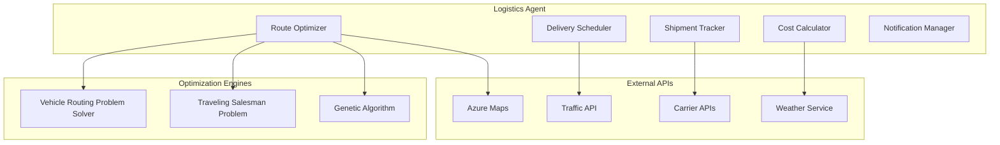
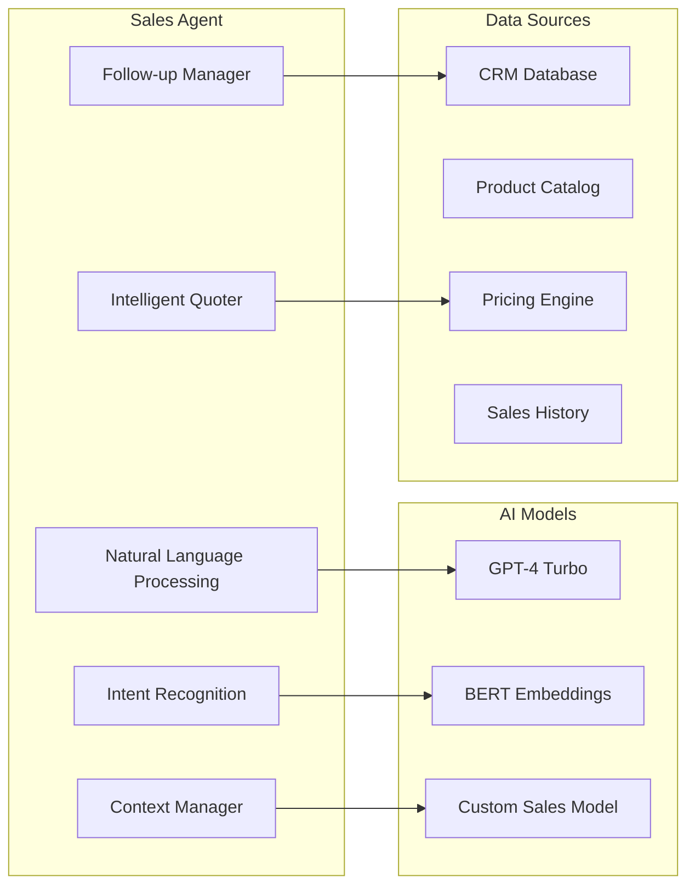
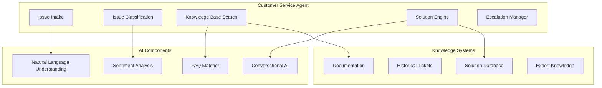

# 🤖 Agentes Inteligentes TopLlantas
## Tus Nuevos Empleados Digitales que Trabajan 24/7

Los agentes de inteligencia artificial son como empleados digitales especializados que nunca descansan, aprenden constantemente y ejecutan tareas con precisión perfecta. Cada agente se especializa en un área específica de tu negocio.

---

## 👥 Equipo de Agentes Inteligentes

### 🎯 Visión General del Sistema

```
┌─────────────────┐    ┌─────────────────┐    ┌─────────────────┐
│   📱 Clientes   │    │  💻 Empleados   │    │  🤝 Socios      │
│                 │    │                 │    │                 │
│ • WhatsApp      │    │ • Portal Web    │    │ • Proveedores   │
│ • Web/Mobile    │    │ • App Móvil     │    │ • Distribuidores│
└─────────────────┘    └─────────────────┘    └─────────────────┘
         │                       │                       │
         └───────────────────────┼───────────────────────┘
                                 │
                    ┌─────────────────┐
                    │  🧠 Coordinador │
                    │   de Agentes    │
                    └─────────────────┘
                                 │
        ┌────────────────────────┼────────────────────────┐
        │                       │                        │
┌───────▼────────┐    ┌─────────▼────────┐    ┌─────────▼────────┐
│ 📦 Agente de   │    │ 🚚 Agente        │    │ 💼 Agente de     │
│   Inventario   │    │   Logístico      │    │   Ventas         │
│                │    │                  │    │                  │
│• Predice       │    │• Optimiza rutas  │    │• Atiende clientes│
│  demanda       │    │• Programa        │    │• Genera          │
│• Optimiza      │    │  entregas        │    │  cotizaciones    │
│  stock         │    │• Rastrea         │    │• Cierra ventas   │
│• Alerta        │    │  envíos          │    │• Seguimiento     │
│  faltantes     │    │• Reduce costos   │    │  post-venta      │
└────────────────┘    └──────────────────┘    └──────────────────┘
         │                       │                        │
         └───────────────────────┼────────────────────────┘
                                 │
                    ┌─────────────────┐
                    │ 🛠️ Agente de    │
                    │   Soporte       │
                    │                 │
                    │• Resuelve       │
                    │  problemas      │
                    │• Guía técnica   │
                    │• Escalación     │
                    │  inteligente    │
                    └─────────────────┘
```

---

## 📦 Agente de Gestión de Inventario
### "Tu Especialista en Stock que Nunca Duerme"

#### 🎯 ¿Qué Hace por Ti?
- **Predice la demanda** de cada producto con 90% de precisión
- **Optimiza niveles de stock** para evitar faltantes y excesos
- **Alerta automáticamente** cuando es momento de reordenar
- **Calcula pedidos óptimos** considerando costos y tendencias
- **Genera reportes inteligentes** con insights de negocio

#### 💰 Beneficios Inmediatos
- ✅ **35% reducción** en costos de inventario
- ✅ **90% menos faltantes** de productos populares
- ✅ **50% menos productos obsoletos**
- ✅ **Ahorro de 15 horas semanales** en gestión manual

#### 🔧 Funcionalidades Principales

**Predicción Inteligente de Demanda**
- Analiza historial de ventas, estacionalidad y tendencias
- Considera factores externos (clima, economía, eventos)
- Ajusta predicciones en tiempo real
- Identifica productos con potencial de crecimiento

**Optimización Automática de Stock**
- Calcula niveles óptimos para cada producto
- Sugiere cantidades exactas a reordenar
- Considera descuentos por volumen y costos de almacenaje
- Balancea inversión vs. disponibilidad

**Sistema de Alertas Inteligentes**
- Notificaciones proactivas por WhatsApp/Email
- Diferentes niveles de urgencia (crítico, importante, informativo)
- Recomendaciones específicas de acción
- Integración con proveedores para pedidos automáticos

#### 📊 Panel de Control del Agente
```
┌─────────────────────────────────────────────────────────────┐
│ 📦 DASHBOARD - AGENTE DE INVENTARIO                         │
├─────────────────────────────────────────────────────────────┤
│                                                             │
│ 🚨 ALERTAS CRÍTICAS (3)                                    │
│ • Llanta 215/60R16 Michelin: 5 días de stock restante      │
│ • Rin 16" Deportivo: Pedido urgente requerido              │
│ • Aceite 5W30: Precio especial termina en 2 días          │
│                                                             │
│ 📈 PREDICCIONES HOY                                         │
│ • Demanda esperada: 145 llantas                            │
│ • Tendencia: ↗️ +12% vs semana pasada                       │
│ • Productos hot: Llantas para lluvia (+35%)                │
│                                                             │
│ 💰 OPTIMIZACIONES SUGERIDAS                                │
│ • Reordenar ahora: $45,000 en 8 productos                  │
│ • Ahorro potencial: $12,000 este mes                       │
│ • ROI proyectado: 340%                                     │
│                                                             │
└─────────────────────────────────────────────────────────────┘
```

---

## 🚚 Agente Logístico Inteligente
### "Tu Coordinador de Entregas que Nunca Se Equivoca"

#### 🎯 ¿Qué Hace por Ti?
- **Optimiza rutas de entrega** para reducir costos y tiempos
- **Programa entregas inteligentemente** maximizando eficiencia
- **Rastrea envíos en tiempo real** con actualizaciones automáticas
- **Predice y soluciona problemas** antes de que afecten al cliente
- **Coordina con transportistas** para mejores tarifas

#### 💰 Beneficios Inmediatos
- ✅ **40% reducción** en costos de transporte
- ✅ **25% menos tiempo** de entrega promedio
- ✅ **95% entregas a tiempo** (vs 70% actual)
- ✅ **60% menos llamadas** de clientes preguntando por pedidos

#### 🔧 Funcionalidades Principales

**Optimización de Rutas Inteligente**
- Calcula la ruta más eficiente considerando tráfico en tiempo real
- Agrupa entregas por zona para maximizar eficiencia
- Ajusta rutas dinámicamente ante imprevistos
- Considera ventanas de entrega preferidas de clientes

**Programación Automática de Entregas**
- Asigna vehículos óptimos según carga y destino
- Balancea workload entre conductores
- Programa mantenimiento preventivo de vehículos
- Optimiza uso de combustible y desgaste

**Tracking en Tiempo Real**
- Ubicación GPS en vivo de todos los envíos
- Notificaciones automáticas a clientes
- Alertas proactivas de retrasos o problemas
- Estimaciones precisas de tiempo de llegada

#### 📱 Experiencia del Cliente
```
┌─────────────────────────────────────────┐
│ 📱 NOTIFICACIÓN WHATSAPP                │
├─────────────────────────────────────────┤
│                                         │
│ 🚚 TopLlantas - Tracking de Pedido     │
│                                         │
│ ¡Hola María! Tu pedido #TL-2024-0156   │
│ está en camino:                         │
│                                         │
│ 📍 Ubicación actual: Av. Revolución    │
│ 🕐 Llegada estimada: 2:30 PM           │
│ 👤 Conductor: Carlos (⭐⭐⭐⭐⭐)          │
│ 📞 Tel: +52-xxx-xxx-xxxx               │
│                                         │
│ 🔗 Ver en tiempo real: topllantas.mx/t │
│                                         │
│ ¿Necesitas cambiar la hora? Responde   │
│ "REPROGRAMAR"                           │
│                                         │
└─────────────────────────────────────────┘
```

---

## 💼 Agente de Ventas y CRM
### "Tu Vendedor Estrella Que Nunca Descansa"

#### 🎯 ¿Qué Hace por Ti?
- **Atiende clientes 24/7** por WhatsApp, chat y teléfono
- **Genera cotizaciones instantáneas** con precios personalizados
- **Recomienda productos** basado en necesidades específicas
- **Da seguimiento automático** a prospectos y clientes
- **Cierra ventas** y programa entregas automáticamente

#### 💰 Beneficios Inmediatos
- ✅ **50% más ventas** por disponibilidad 24/7
- ✅ **80% menos tiempo** para generar cotizaciones
- ✅ **35% mayor conversión** con recomendaciones inteligentes
- ✅ **90% clientes satisfechos** con atención inmediata

#### 🔧 Funcionalidades Principales

**Atención al Cliente Inteligente**
- Responde consultas en lenguaje natural
- Identifica necesidades específicas del cliente
- Accede al historial completo de compras
- Transfiere a humanos solo cuando es necesario

**Cotizaciones Automáticas**
- Genera precios personalizados al instante
- Aplica descuentos y promociones vigentes
- Considera volumen y tipo de cliente
- Incluye opciones de financiamiento disponibles

**Recomendaciones Personalizadas**
- Sugiere productos complementarios
- Identifica necesidades no expresadas
- Considera budget y preferencias del cliente
- Aprende de cada interacción para mejorar

#### 💬 Conversación con Cliente
```
┌─────────────────────────────────────────────────────────────┐
│ 💬 CHAT WHATSAPP - AGENTE DE VENTAS                        │
├─────────────────────────────────────────────────────────────┤
│                                                             │
│ Cliente (2:30 PM): Hola, necesito llantas para mi Tsuru    │
│                                                             │
│ 🤖 TopLlantas AI (2:30 PM): ¡Hola! Con gusto te ayudo.    │
│ Veo que tienes un Tsuru 2009. ¿Cuál es el uso principal    │
│ del vehículo? ¿Ciudad, carretera o mixto?                  │
│                                                             │
│ Cliente (2:32 PM): Es para la ciudad, trabajo de Uber      │
│                                                             │
│ 🤖 TopLlantas AI (2:32 PM): Perfecto! Para Uber te        │
│ recomiendo estas opciones que duran más y dan mejor        │
│ kilometraje:                                                │
│                                                             │
│ 🏆 RECOMENDACIÓN TOP                                        │
│ • Michelin Energy XM2 175/65R14                           │
│ • Precio: $1,840 c/u (20% desc. Uber)                     │
│ • Duración: ~80,000 km                                     │
│ • Ahorro combustible: 8%                                   │
│                                                             │
│ 💰 OPCIÓN ECONÓMICA                                         │
│ • Bridgestone B250 175/65R14                              │
│ • Precio: $1,240 c/u                                      │
│ • Duración: ~50,000 km                                     │
│                                                             │
│ ¿Te gustaría la cotización completa? Incluyo instalación  │
│ gratis y garantía de 2 años.                              │
│                                                             │
└─────────────────────────────────────────────────────────────┘
```

---

## 🛠️ Agente de Soporte Técnico
### "Tu Especialista que Resuelve Todo al Instante"

#### 🎯 ¿Qué Hace por Ti?
- **Resuelve dudas técnicas** sobre productos y servicios
- **Diagnostica problemas** de llantas y vehículos
- **Guía instalación** paso a paso con videos
- **Programa mantenimiento** preventivo para flotas
- **Escala casos complejos** a técnicos humanos

#### 💰 Beneficios Inmediatos
- ✅ **85% problemas resueltos** al primer contacto
- ✅ **70% menos llamadas** a soporte humano
- ✅ **24/7 disponibilidad** sin costo adicional
- ✅ **95% satisfacción** del cliente en soporte

#### 🔧 Funcionalidades Principales

**Diagnóstico Inteligente**
- Identifica problemas por síntomas descritos
- Recomienda soluciones específicas
- Determina si requiere cambio de producto
- Programa citas de revisión cuando es necesario

**Base de Conocimiento Dinámica**
- Acceso a manuales de todos los productos
- Videos explicativos personalizados
- Casos similares resueltos anteriormente
- Actualizaciones automáticas de información

**Escalación Inteligente**
- Identifica cuándo necesita intervención humana
- Prepara contexto completo para técnico
- Programa citas con especialistas
- Seguimiento post-resolución automático

---

## 🧠 Coordinador de Agentes
### "El Director de Orquesta de tu Transformación Digital"

#### 🎯 ¿Qué Hace por Ti?
- **Coordina todos los agentes** para trabajar como equipo
- **Entiende contexto completo** de cada situación
- **Deriva inteligentemente** cada consulta al agente correcto
- **Aprende de cada interacción** para mejorar continuamente
- **Reporta métricas** y insights de toda la operación

#### 💡 Ejemplo de Coordinación Inteligente

**Caso: Cliente solicita llantas para flota de 20 vehículos**

1. **Agente de Ventas** → Identifica oportunidad de flota
2. **Agente de Inventario** → Verifica disponibilidad y stock
3. **Agente Logístico** → Planifica entrega escalonada
4. **Coordinador** → Ensambla propuesta integral con financiamiento

**Resultado**: Cotización completa en 5 minutos vs 2 días tradicionalmente

---

## 📊 Métricas y Monitoreo en Tiempo Real

### Panel Ejecutivo de Agentes
```
┌─────────────────────────────────────────────────────────────┐
│ 📊 DASHBOARD EJECUTIVO - AGENTES IA                        │
├─────────────────────────────────────────────────────────────┤
│                                                             │
│ 🤖 AGENTES ACTIVOS: 4/4    ⚡ UPTIME: 99.8%               │
│                                                             │
│ 📈 HOY (EN TIEMPO REAL)                                     │
│ • Consultas atendidas: 247                                 │
│ • Ventas generadas: $89,450                                │
│ • Problemas resueltos: 34                                  │
│ • Cotizaciones enviadas: 18                                │
│                                                             │
│ 🎯 MÉTRICAS CLAVE                                          │
│ • Satisfacción cliente: 96% ⭐⭐⭐⭐⭐                        │
│ • Tiempo respuesta: 12 segundos                            │
│ • Resolución primer contacto: 87%                          │
│ • Conversión ventas: 34% (↗️ +8%)                          │
│                                                             │
│ 💰 IMPACTO FINANCIERO                                       │
│ • Ahorro operativo mensual: $28,500                        │
│ • Ventas adicionales: $145,000                             │
│ • ROI acumulado: 285%                                      │
│                                                             │
└─────────────────────────────────────────────────────────────┘
```

---

## 🚀 Implementación Gradual

### Fase 1: Fundación (Meses 1-3) - $45,000
- ✅ **Agente de Ventas** básico en WhatsApp
- ✅ **Integración con ERP** para consultas
- ✅ **Panel de control** ejecutivo
- ✅ **Capacitación** del equipo

### Fase 2: Expansión (Meses 4-6) - $40,000
- ✅ **Agente de Inventario** con predicciones
- ✅ **Agente de Soporte** técnico
- ✅ **Optimización** y mejoras continuas
- ✅ **Reportes avanzados**

### Fase 3: Optimización (Meses 7-8) - $40,000
- ✅ **Agente Logístico** completo
- ✅ **Coordinación avanzada** entre agentes
- ✅ **Integraciones adicionales**
- ✅ **Análisis predictivo** avanzado

---

## 💡 Tu Inversión, Tu Futuro

### Inversión Total: $125,000 USD
### ROI Esperado: 285% primer año
### Payback: 4.2 meses

**¿Puedes permitirte NO hacer esta inversión cuando tu competencia ya está automatizando?**

Los agentes inteligentes no son el futuro... **son el presente**. Cada día que esperas, pierdes eficiencia, ventas y ventaja competitiva.

---

*¿Listo para conocer a tus nuevos empleados digitales?*

### Componentes Técnicos

#### 1. Demand Predictor Engine
```csharp
public class DemandPredictorEngine
{
    private readonly IAzureMLService _mlService;
    private readonly ITimeSeriesAnalyzer _tsAnalyzer;
    private readonly IExternalDataService _externalData;

    public async Task<DemandForecast> PredictDemandAsync(
        string productId, 
        DateTime forecastDate, 
        int horizon = 30)
    {
        // Recopilar datos históricos
        var salesHistory = await GetSalesHistoryAsync(productId, 365);
        var seasonalFactors = await GetSeasonalFactorsAsync(productId);
        var marketTrends = await _externalData.GetMarketTrendsAsync();
        
        // Aplicar múltiples modelos de predicción
        var lstmPrediction = await _mlService.PredictAsync(
            "lstm-demand-model", salesHistory);
        var arimaForecast = _tsAnalyzer.ForecastARIMA(
            salesHistory, horizon);
        var rfPrediction = await _mlService.PredictAsync(
            "random-forest-model", 
            CombineFeatures(salesHistory, seasonalFactors, marketTrends));
        
        // Ensemble prediction con pesos dinámicos
        return CombinePredictions(
            lstmPrediction, arimaForecast, rfPrediction);
    }
}
```

#### 2. Stock Optimization Engine
```csharp
public class StockOptimizer
{
    private readonly IDemandPredictor _demandPredictor;
    private readonly IInventoryRepository _inventory;
    private readonly ISupplierService _suppliers;

    public async Task<OptimizationResult> OptimizeStockLevelsAsync(
        List<string> productIds)
    {
        var recommendations = new List<StockRecommendation>();
        
        foreach (var productId in productIds)
        {
            var currentStock = await _inventory.GetCurrentStockAsync(productId);
            var demandForecast = await _demandPredictor.PredictDemandAsync(
                productId, DateTime.Now, 60);
            
            var safetyStock = CalculateSafetyStock(
                demandForecast.Variance, demandForecast.LeadTime);
            var reorderPoint = CalculateReorderPoint(
                demandForecast.Average, safetyStock);
            var economicOrderQuantity = CalculateEOQ(
                demandForecast.Average, 
                await GetOrderingCost(productId),
                await GetHoldingCost(productId));
            
            if (currentStock <= reorderPoint)
            {
                recommendations.Add(new StockRecommendation
                {
                    ProductId = productId,
                    CurrentStock = currentStock,
                    RecommendedOrderQuantity = economicOrderQuantity,
                    ExpectedDemand = demandForecast.Average,
                    Confidence = demandForecast.Confidence,
                    UrgencyLevel = CalculateUrgency(currentStock, reorderPoint)
                });
            }
        }
        
        return new OptimizationResult
        {
            Recommendations = recommendations,
            TotalInvestment = recommendations.Sum(r => r.TotalCost),
            ExpectedROI = CalculateExpectedROI(recommendations)
        };
    }
}
```

#### 3. Automated Alert System
```csharp
public class InventoryAlertManager
{
    private readonly INotificationService _notifications;
    private readonly IStockOptimizer _optimizer;

    public async Task ProcessInventoryAlertsAsync()
    {
        var allProducts = await GetAllProductsAsync();
        var optimizationResult = await _optimizer.OptimizeStockLevelsAsync(
            allProducts.Select(p => p.Id).ToList());
        
        foreach (var recommendation in optimizationResult.Recommendations)
        {
            var alertLevel = DetermineAlertLevel(recommendation);
            
            switch (alertLevel)
            {
                case AlertLevel.Critical:
                    await SendCriticalAlert(recommendation);
                    await AutoCreatePurchaseOrder(recommendation);
                    break;
                    
                case AlertLevel.Warning:
                    await SendWarningAlert(recommendation);
                    break;
                    
                case AlertLevel.Info:
                    await SendInfoAlert(recommendation);
                    break;
            }
        }
    }

    private async Task SendCriticalAlert(StockRecommendation recommendation)
    {
        var message = $@"
        🚨 ALERTA CRÍTICA DE INVENTARIO
        
        Producto: {recommendation.ProductName}
        Stock actual: {recommendation.CurrentStock} unidades
        Demanda proyectada: {recommendation.ExpectedDemand} unidades/día
        Días de stock restantes: {recommendation.DaysRemaining}
        
        ACCIÓN REQUERIDA:
        - Crear orden inmediata de {recommendation.RecommendedOrderQuantity} unidades
        - Proveedor sugerido: {recommendation.PreferredSupplier}
        - Inversión: ${recommendation.TotalCost:N2}
        
        ⚡ Orden automática será creada en 30 minutos si no se toma acción manual.
        ";
        
        await _notifications.SendTeamsMessageAsync("inventory-alerts", message);
        await _notifications.SendWhatsAppAsync("+52xxxxxxxxxx", message);
        await _notifications.SendEmailAsync("inventory@topllantas.com", 
            "ALERTA CRÍTICA DE INVENTARIO", message);
    }
}
```

---

## Agente de Logística Inteligente

### Arquitectura del Agente



### Implementación del Optimizador de Rutas

```csharp
public class RouteOptimizer
{
    private readonly IAzureMapsService _mapsService;
    private readonly ITrafficService _trafficService;
    private readonly IVehicleService _vehicleService;

    public async Task<OptimizedRouteResult> OptimizeDeliveryRoutesAsync(
        List<DeliveryOrder> orders, 
        DateTime deliveryDate)
    {
        // 1. Agrupar pedidos por zona geográfica
        var clusteredOrders = await ClusterOrdersByLocationAsync(orders);
        
        // 2. Obtener vehículos disponibles
        var availableVehicles = await _vehicleService.GetAvailableVehiclesAsync(deliveryDate);
        
        // 3. Calcular matriz de distancias y tiempos
        var distanceMatrix = await _mapsService.CalculateDistanceMatrixAsync(
            clusteredOrders.SelectMany(c => c.Locations).ToList());
        
        // 4. Aplicar algoritmo de optimización VRP con restricciones
        var vrpSolution = await SolveVehicleRoutingProblemAsync(
            clusteredOrders, availableVehicles, distanceMatrix);
        
        // 5. Optimizar cada ruta individualmente con TSP
        var optimizedRoutes = new List<OptimizedRoute>();
        foreach (var vehicleRoute in vrpSolution.Routes)
        {
            var tspRoute = await SolveTravelingSalesmanAsync(
                vehicleRoute.Orders, distanceMatrix);
            
            // Aplicar optimizaciones en tiempo real
            var realTimeOptimized = await ApplyRealTimeOptimizations(
                tspRoute, deliveryDate);
            
            optimizedRoutes.Add(realTimeOptimized);
        }
        
        return new OptimizedRouteResult
        {
            Routes = optimizedRoutes,
            TotalDistance = optimizedRoutes.Sum(r => r.TotalDistance),
            TotalTime = optimizedRoutes.Sum(r => r.EstimatedTime),
            FuelSavings = CalculateFuelSavings(optimizedRoutes),
            CO2Reduction = CalculateCO2Reduction(optimizedRoutes)
        };
    }

    private async Task<OptimizedRoute> ApplyRealTimeOptimizations(
        Route baseRoute, DateTime deliveryDate)
    {
        // Obtener condiciones de tráfico en tiempo real
        var trafficConditions = await _trafficService.GetTrafficConditionsAsync(
            baseRoute.Waypoints, deliveryDate);
        
        // Ajustar ruta basado en tráfico
        if (trafficConditions.HasSignificantDelays)
        {
            var alternativeRoute = await _mapsService.CalculateAlternativeRouteAsync(
                baseRoute.Waypoints, 
                trafficConditions.BlockedAreas);
            
            if (alternativeRoute.EstimatedTime < baseRoute.EstimatedTime)
            {
                baseRoute = alternativeRoute;
            }
        }
        
        // Optimizar horarios de entrega basado en ventanas preferidas
        var optimizedSchedule = OptimizeDeliverySchedule(
            baseRoute.Orders, trafficConditions);
        
        return new OptimizedRoute
        {
            Vehicle = baseRoute.Vehicle,
            Orders = optimizedSchedule.Orders,
            Waypoints = baseRoute.Waypoints,
            TotalDistance = baseRoute.TotalDistance,
            EstimatedTime = optimizedSchedule.TotalTime,
            OptimizationLevel = CalculateOptimizationLevel(baseRoute)
        };
    }
}
```

### Sistema de Tracking en Tiempo Real

```csharp
public class RealTimeTrackingService
{
    private readonly ISignalRHubContext _hubContext;
    private readonly IGPSService _gpsService;
    private readonly IDeliveryRepository _deliveryRepo;

    public async Task StartTrackingAsync(string deliveryId)
    {
        var delivery = await _deliveryRepo.GetDeliveryAsync(deliveryId);
        
        // Iniciar tracking GPS del vehículo
        await _gpsService.StartTrackingAsync(delivery.VehicleId);
        
        // Crear timer para actualizaciones cada 30 segundos
        var timer = new Timer(async _ => 
        {
            var location = await _gpsService.GetCurrentLocationAsync(delivery.VehicleId);
            var eta = await CalculateETAAsync(location, delivery.DestinationAddress);
            
            // Detectar desviaciones o retrasos
            var status = AnalyzeDeliveryStatus(delivery, location, eta);
            
            if (status.HasAlert)
            {
                await HandleDeliveryAlertAsync(delivery, status);
            }
            
            // Enviar actualización a cliente y dashboard
            await _hubContext.Clients.Group($"delivery-{deliveryId}")
                .SendAsync("LocationUpdate", new
                {
                    DeliveryId = deliveryId,
                    CurrentLocation = location,
                    EstimatedArrival = eta,
                    Status = status.Status,
                    Message = status.Message
                });
            
        }, null, TimeSpan.Zero, TimeSpan.FromSeconds(30));
    }

    private async Task HandleDeliveryAlertAsync(
        Delivery delivery, DeliveryStatus status)
    {
        switch (status.AlertType)
        {
            case AlertType.SignificantDelay:
                await NotifyCustomerOfDelayAsync(delivery, status.DelayMinutes);
                await SuggestRouteAlternativeAsync(delivery);
                break;
                
            case AlertType.VehicleBreakdown:
                await InitiateEmergencyProtocolAsync(delivery);
                await DispatchBackupVehicleAsync(delivery);
                break;
                
            case AlertType.TrafficIncident:
                await RecalculateRouteAsync(delivery);
                await UpdateETAAsync(delivery);
                break;
        }
    }
}
```

---

## Agente de Ventas y CRM

### Arquitectura del Agente



### Implementación del Agente Conversacional

```csharp
public class ConversationalSalesAgent
{
    private readonly IAzureOpenAIService _openAI;
    private readonly IProductCatalogService _catalog;
    private readonly IPricingEngine _pricing;
    private readonly ICRMService _crm;

    public async Task<AgentResponse> ProcessCustomerInquiryAsync(
        string customerId, string message, ConversationContext context)
    {
        // 1. Analizar intent del mensaje
        var intent = await AnalyzeCustomerIntentAsync(message, context);
        
        // 2. Obtener información del cliente
        var customer = await _crm.GetCustomerAsync(customerId);
        var purchaseHistory = await _crm.GetPurchaseHistoryAsync(customerId);
        
        // 3. Procesar según el intent identificado
        switch (intent.Category)
        {
            case IntentCategory.ProductInquiry:
                return await HandleProductInquiryAsync(intent, customer, context);
                
            case IntentCategory.PriceRequest:
                return await HandlePriceRequestAsync(intent, customer, context);
                
            case IntentCategory.OrderStatus:
                return await HandleOrderStatusAsync(intent, customer, context);
                
            case IntentCategory.TechnicalSupport:
                return await HandleTechnicalSupportAsync(intent, customer, context);
                
            default:
                return await HandleGeneralInquiryAsync(intent, customer, context);
        }
    }

    private async Task<AgentResponse> HandleProductInquiryAsync(
        CustomerIntent intent, Customer customer, ConversationContext context)
    {
        // Extraer especificaciones del producto solicitado
        var productSpecs = ExtractProductSpecifications(intent.Message);
        
        // Buscar productos que coincidan
        var matchingProducts = await _catalog.SearchProductsAsync(productSpecs);
        
        // Aplicar filtros basados en el perfil del cliente
        var recommendedProducts = await ApplyCustomerFilterAsync(
            matchingProducts, customer);
        
        // Generar respuesta personalizada con IA
        var prompt = $@"
        Actúa como un experto vendedor de llantas para TopLlantas. 
        
        Cliente: {customer.Name} ({customer.Type})
        Historial: {string.Join(", ", customer.PreviousPurchases)}
        Consulta: {intent.Message}
        
        Productos encontrados:
        {string.Join("\n", recommendedProducts.Select(p => $"- {p.Brand} {p.Model} {p.Size} - ${p.Price}"))}
        
        Proporciona una respuesta profesional, personalizada y útil que:
        1. Recomiende los mejores productos para sus necesidades
        2. Explique brevemente por qué son ideales
        3. Incluya precios preferenciales si aplica
        4. Ofrezca información adicional relevante
        
        Respuesta:";
        
        var aiResponse = await _openAI.GenerateCompletionAsync(prompt, new
        {
            MaxTokens = 300,
            Temperature = 0.7,
            Model = "gpt-4-turbo"
        });
        
        // Agregar elementos interactivos
        var response = new AgentResponse
        {
            Message = aiResponse.Text,
            Products = recommendedProducts.Take(3).ToList(),
            SuggestedActions = new List<SuggestedAction>
            {
                new SuggestedAction { Text = "Solicitar cotización", Action = "quote" },
                new SuggestedAction { Text = "Ver más detalles", Action = "details" },
                new SuggestedAction { Text = "Hablar con especialista", Action = "transfer" }
            },
            Context = UpdateContextWithProducts(context, recommendedProducts)
        };
        
        // Registrar interacción en CRM
        await _crm.LogInteractionAsync(customer.Id, new CustomerInteraction
        {
            Type = InteractionType.ProductInquiry,
            Message = intent.Message,
            Response = response.Message,
            ProductsShown = recommendedProducts.Select(p => p.Id).ToList(),
            Timestamp = DateTime.UtcNow
        });
        
        return response;
    }

    private async Task<AgentResponse> HandlePriceRequestAsync(
        CustomerIntent intent, Customer customer, ConversationContext context)
    {
        // Extraer productos específicos del contexto o mensaje
        var requestedProducts = ExtractProductsFromContext(intent, context);
        
        if (!requestedProducts.Any())
        {
            return new AgentResponse
            {
                Message = "Para generar una cotización precisa, ¿podrías especificar qué productos te interesan? Por ejemplo: 'Necesito precios para llantas 215/60R16 Michelin'",
                SuggestedActions = new List<SuggestedAction>
                {
                    new SuggestedAction { Text = "Ver catálogo", Action = "catalog" }
                }
            };
        }
        
        var quotes = new List<ProductQuote>();
        
        foreach (var product in requestedProducts)
        {
            var basePrice = await _pricing.GetBasePriceAsync(product.Id);
            var customerPrice = await _pricing.CalculateCustomerPriceAsync(
                product.Id, customer.Id, requestedProducts.Count);
            
            var quote = new ProductQuote
            {
                Product = product,
                BasePrice = basePrice,
                CustomerPrice = customerPrice,
                Discount = basePrice - customerPrice,
                DiscountPercentage = ((basePrice - customerPrice) / basePrice) * 100,
                ValidUntil = DateTime.Now.AddDays(7)
            };
            
            quotes.Add(quote);
        }
        
        // Generar respuesta personalizada de cotización
        var quotePrompt = $@"
        Genera una cotización profesional para el cliente {customer.Name} de TopLlantas.
        
        Productos cotizados:
        {string.Join("\n", quotes.Select(q => $"- {q.Product.Brand} {q.Product.Model} {q.Product.Size}: ${q.CustomerPrice:N2} (desc. {q.DiscountPercentage:F1}%)"))}
        
        Total: ${quotes.Sum(q => q.CustomerPrice):N2}
        Cliente tipo: {customer.Type}
        Descuento aplicado por volumen: {(quotes.Count > 5 ? "Sí" : "No")}
        
        Crea una respuesta que sea:
        1. Profesional y clara
        2. Destaque los ahorros obtenidos
        3. Incluya términos de validez
        4. Invite a finalizar la compra
        
        Respuesta:";
        
        var quoteResponse = await _openAI.GenerateCompletionAsync(quotePrompt);
        
        return new AgentResponse
        {
            Message = quoteResponse.Text,
            Quotes = quotes,
            SuggestedActions = new List<SuggestedAction>
            {
                new SuggestedAction { Text = "Crear pedido", Action = "create_order" },
                new SuggestedAction { Text = "Guardar cotización", Action = "save_quote" },
                new SuggestedAction { Text = "Modificar cantidades", Action = "modify_quote" }
            },
            Context = UpdateContextWithQuotes(context, quotes)
        };
    }
}
```

---

## Agente de Atención al Cliente

### Arquitectura del Agente



### Implementación del Sistema de Atención

```csharp
public class CustomerServiceAgent
{
    private readonly IAzureOpenAIService _openAI;
    private readonly IKnowledgeBaseService _knowledgeBase;
    private readonly ISentimentAnalysisService _sentiment;
    private readonly ITicketingService _ticketing;

    public async Task<ServiceResponse> HandleCustomerIssueAsync(
        string customerId, string issue, ServiceContext context)
    {
        // 1. Analizar sentimiento del cliente
        var sentimentAnalysis = await _sentiment.AnalyzeAsync(issue);
        
        // 2. Clasificar tipo de problema
        var issueClassification = await ClassifyIssueAsync(issue);
        
        // 3. Buscar en base de conocimientos
        var knowledgeResults = await _knowledgeBase.SearchAsync(issue);
        
        // 4. Determinar si puede resolverse automáticamente
        if (CanResolveAutomatically(issueClassification, sentimentAnalysis))
        {
            return await ProvideAutomatedSolutionAsync(
                issue, issueClassification, knowledgeResults, context);
        }
        else
        {
            return await EscalateToHumanAgentAsync(
                customerId, issue, issueClassification, sentimentAnalysis);
        }
    }

    private async Task<ServiceResponse> ProvideAutomatedSolutionAsync(
        string issue, IssueClassification classification, 
        List<KnowledgeItem> knowledgeResults, ServiceContext context)
    {
        var solutionPrompt = $@"
        Actúa como un experto agente de servicio al cliente de TopLlantas.
        
        Problema del cliente: {issue}
        Tipo de problema: {classification.Category}
        Nivel de urgencia: {classification.Urgency}
        
        Información relevante de la base de conocimientos:
        {string.Join("\n", knowledgeResults.Select(k => $"- {k.Title}: {k.Summary}"))}
        
        Proporciona una solución clara, empática y profesional que:
        1. Reconozca el problema del cliente
        2. Ofrezca una solución paso a paso
        3. Incluya información de contacto si necesita ayuda adicional
        4. Sea amigable pero profesional
        
        Respuesta:";
        
        var solution = await _openAI.GenerateCompletionAsync(solutionPrompt);
        
        // Crear acciones sugeridas basadas en el tipo de problema
        var suggestedActions = GenerateSuggestedActions(classification);
        
        return new ServiceResponse
        {
            Message = solution.Text,
            ResolvedAutomatically = true,
            SuggestedActions = suggestedActions,
            FollowUpRequired = DetermineFollowUpNeeded(classification),
            SatisfactionSurvey = true
        };
    }

    private async Task<ServiceResponse> EscalateToHumanAgentAsync(
        string customerId, string issue, 
        IssueClassification classification, SentimentAnalysis sentiment)
    {
        // Crear ticket con toda la información contextual
        var ticket = new SupportTicket
        {
            CustomerId = customerId,
            Issue = issue,
            Classification = classification,
            SentimentScore = sentiment.Score,
            Priority = DeterminePriority(classification, sentiment),
            AssignedAgent = await GetAvailableAgentAsync(classification.Category),
            CreatedAt = DateTime.UtcNow,
            Context = await GatherCustomerContextAsync(customerId)
        };
        
        await _ticketing.CreateTicketAsync(ticket);
        
        // Notificar al agente humano
        await NotifyHumanAgentAsync(ticket);
        
        return new ServiceResponse
        {
            Message = $@"
            Entiendo tu situación y quiero asegurarme de que recibas la mejor atención posible. 
            
            He creado un ticket de soporte (#{ticket.Id}) y uno de nuestros especialistas se 
            pondrá en contacto contigo en los próximos {GetResponseTime(ticket.Priority)} minutos.
            
            Mientras tanto, aquí tienes algunas opciones:
            ",
            TicketId = ticket.Id,
            ResolvedAutomatically = false,
            EscalatedToHuman = true,
            EstimatedResponseTime = GetResponseTime(ticket.Priority),
            SuggestedActions = new List<SuggestedAction>
            {
                new SuggestedAction { Text = "Ver estado del ticket", Action = "check_ticket" },
                new SuggestedAction { Text = "Hablar por WhatsApp", Action = "whatsapp" },
                new SuggestedAction { Text = "Llamar directamente", Action = "call" }
            }
        };
    }
}
```

---

## Coordinador de Agentes (Agent Orchestrator)

### Arquitectura del Coordinador

```csharp
public class AgentOrchestrator
{
    private readonly IIntentClassificationService _intentClassifier;
    private readonly Dictionary<AgentType, IIntelligentAgent> _agents;
    private readonly IConversationContextService _contextService;

    public async Task<AgentResponse> ProcessRequestAsync(
        string userId, string message, string channel)
    {
        // 1. Obtener o crear contexto de conversación
        var context = await _contextService.GetOrCreateContextAsync(userId, channel);
        
        // 2. Clasificar intención del mensaje
        var intent = await _intentClassifier.ClassifyAsync(message, context);
        
        // 3. Determinar qué agente debe manejar la solicitud
        var targetAgent = DetermineTargetAgent(intent, context);
        
        // 4. Verificar si necesita colaboración entre agentes
        if (RequiresMultiAgentCollaboration(intent))
        {
            return await HandleMultiAgentCollaborationAsync(
                intent, context, message);
        }
        
        // 5. Delegar al agente específico
        var response = await _agents[targetAgent].ProcessRequestAsync(
            userId, message, context);
        
        // 6. Actualizar contexto
        await _contextService.UpdateContextAsync(context, intent, response);
        
        return response;
    }

    private async Task<AgentResponse> HandleMultiAgentCollaborationAsync(
        ClassifiedIntent intent, ConversationContext context, string message)
    {
        var collaborationPlan = CreateCollaborationPlan(intent);
        var responses = new List<AgentResponse>();
        
        foreach (var step in collaborationPlan.Steps)
        {
            var agent = _agents[step.AgentType];
            var stepResponse = await agent.ProcessRequestAsync(
                context.UserId, step.Message, context);
            
            responses.Add(stepResponse);
            
            // Actualizar contexto con información de cada agente
            context = MergeContextFromResponse(context, stepResponse);
        }
        
        // Combinar respuestas en una respuesta cohesiva
        return await CombineAgentResponsesAsync(responses, intent);
    }
}
```

### Métricas y Monitoreo

```csharp
public class AgentMetricsService
{
    private readonly IApplicationInsights _telemetry;
    private readonly ICosmosDbService _metricsDb;

    public async Task RecordAgentInteractionAsync(
        string agentType, string userId, 
        AgentInteraction interaction)
    {
        // Métricas en tiempo real para Application Insights
        _telemetry.TrackEvent("AgentInteraction", new Dictionary<string, string>
        {
            ["AgentType"] = agentType,
            ["UserId"] = userId,
            ["Intent"] = interaction.Intent,
            ["Resolved"] = interaction.Resolved.ToString(),
            ["ResponseTime"] = interaction.ResponseTime.TotalMilliseconds.ToString(),
            ["SatisfactionScore"] = interaction.SatisfactionScore?.ToString()
        });
        
        // Almacenar métricas detalladas para análisis
        var metric = new AgentMetric
        {
            Id = Guid.NewGuid().ToString(),
            AgentType = agentType,
            UserId = userId,
            Timestamp = DateTime.UtcNow,
            Intent = interaction.Intent,
            Message = interaction.Message,
            Response = interaction.Response,
            Resolved = interaction.Resolved,
            ResponseTime = interaction.ResponseTime,
            SatisfactionScore = interaction.SatisfactionScore,
            Context = interaction.Context
        };
        
        await _metricsDb.CreateItemAsync(metric);
        
        // Trigger análisis de calidad si es necesario
        if (RequiresQualityAnalysis(interaction))
        {
            await TriggerQualityAnalysisAsync(metric);
        }
    }

    public async Task<AgentPerformanceReport> GeneratePerformanceReportAsync(
        string agentType, DateTime startDate, DateTime endDate)
    {
        var metrics = await _metricsDb.QueryItemsAsync<AgentMetric>(
            $"SELECT * FROM c WHERE c.agentType = '{agentType}' " +
            $"AND c.timestamp >= '{startDate:yyyy-MM-dd}' " +
            $"AND c.timestamp <= '{endDate:yyyy-MM-dd}'");
        
        return new AgentPerformanceReport
        {
            AgentType = agentType,
            PeriodStart = startDate,
            PeriodEnd = endDate,
            TotalInteractions = metrics.Count,
            AverageResponseTime = TimeSpan.FromMilliseconds(
                metrics.Average(m => m.ResponseTime.TotalMilliseconds)),
            ResolutionRate = metrics.Count(m => m.Resolved) / (double)metrics.Count,
            AverageSatisfactionScore = metrics
                .Where(m => m.SatisfactionScore.HasValue)
                .Average(m => m.SatisfactionScore.Value),
            TopIntents = metrics.GroupBy(m => m.Intent)
                .OrderByDescending(g => g.Count())
                .Take(10)
                .ToDictionary(g => g.Key, g => g.Count()),
            QualityScore = CalculateQualityScore(metrics)
        };
    }
}
```

---

## Conclusión

Esta arquitectura de agentes de IA proporciona una base sólida para la transformación digital de TopLlantas, con agentes especializados que trabajan de manera coordinada para ofrecer un servicio excepcional mientras optimizan todas las operaciones de la empresa.

Los patrones de diseño implementados aseguran escalabilidad, mantenibilidad y la capacidad de evolución continua de los agentes conforme las necesidades del negocio cambien.
