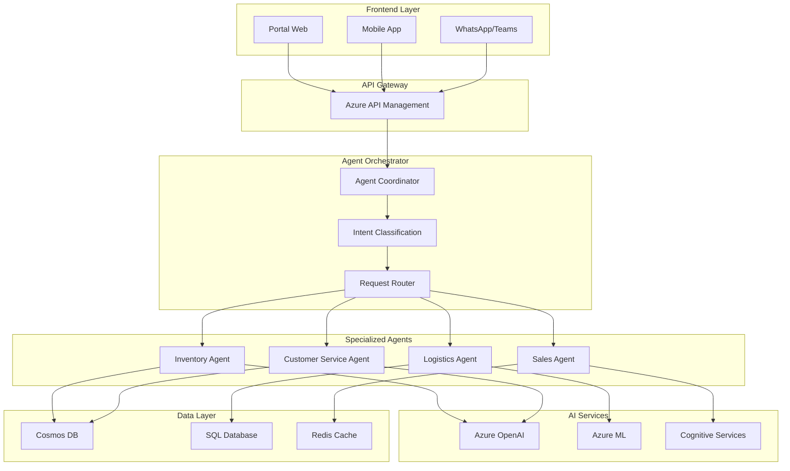
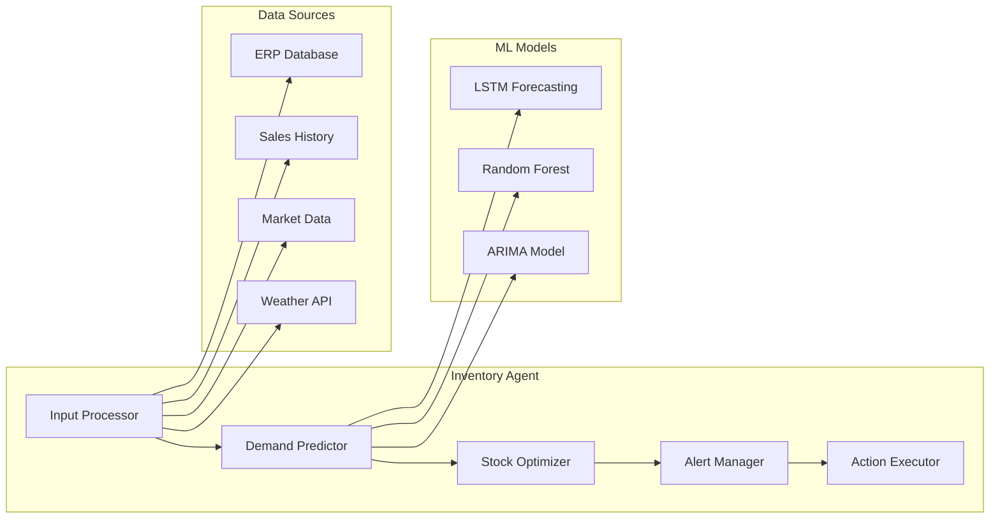

# Arquitectura de Agentes de IA - TopLlantas

## Introducción

Este documento detalla la arquitectura técnica de los agentes de inteligencia artificial que transformarán las operaciones de TopLlantas. Cada agente está diseñado como un microservicio especializado con capacidades específicas de AI/ML.

---

## Arquitectura General de Agentes

### Patrón de Diseño: Multi-Agent System



---

## Agente de Gestión de Inventario

### Arquitectura del Agente



### Componentes Técnicos

#### 1. Demand Predictor Engine
```csharp
public class DemandPredictorEngine
{
    private readonly IAzureMLService _mlService;
    private readonly ITimeSeriesAnalyzer _tsAnalyzer;
    private readonly IExternalDataService _externalData;

    public async Task<DemandForecast> PredictDemandAsync(
        string productId, 
        DateTime forecastDate, 
        int horizon = 30)
    {
        // Recopilar datos históricos
        var salesHistory = await GetSalesHistoryAsync(productId, 365);
        var seasonalFactors = await GetSeasonalFactorsAsync(productId);
        var marketTrends = await _externalData.GetMarketTrendsAsync();
        
        // Aplicar múltiples modelos de predicción
        var lstmPrediction = await _mlService.PredictAsync(
            "lstm-demand-model", salesHistory);
        var arimaForecast = _tsAnalyzer.ForecastARIMA(
            salesHistory, horizon);
        var rfPrediction = await _mlService.PredictAsync(
            "random-forest-model", 
            CombineFeatures(salesHistory, seasonalFactors, marketTrends));
        
        // Ensemble prediction con pesos dinámicos
        return CombinePredictions(
            lstmPrediction, arimaForecast, rfPrediction);
    }
}
```

#### 2. Stock Optimization Engine
```csharp
public class StockOptimizer
{
    private readonly IDemandPredictor _demandPredictor;
    private readonly IInventoryRepository _inventory;
    private readonly ISupplierService _suppliers;

    public async Task<OptimizationResult> OptimizeStockLevelsAsync(
        List<string> productIds)
    {
        var recommendations = new List<StockRecommendation>();
        
        foreach (var productId in productIds)
        {
            var currentStock = await _inventory.GetCurrentStockAsync(productId);
            var demandForecast = await _demandPredictor.PredictDemandAsync(
                productId, DateTime.Now, 60);
            
            var safetyStock = CalculateSafetyStock(
                demandForecast.Variance, demandForecast.LeadTime);
            var reorderPoint = CalculateReorderPoint(
                demandForecast.Average, safetyStock);
            var economicOrderQuantity = CalculateEOQ(
                demandForecast.Average, 
                await GetOrderingCost(productId),
                await GetHoldingCost(productId));
            
            if (currentStock <= reorderPoint)
            {
                recommendations.Add(new StockRecommendation
                {
                    ProductId = productId,
                    CurrentStock = currentStock,
                    RecommendedOrderQuantity = economicOrderQuantity,
                    ExpectedDemand = demandForecast.Average,
                    Confidence = demandForecast.Confidence,
                    UrgencyLevel = CalculateUrgency(currentStock, reorderPoint)
                });
            }
        }
        
        return new OptimizationResult
        {
            Recommendations = recommendations,
            TotalInvestment = recommendations.Sum(r => r.TotalCost),
            ExpectedROI = CalculateExpectedROI(recommendations)
        };
    }
}
```

#### 3. Automated Alert System
```csharp
public class InventoryAlertManager
{
    private readonly INotificationService _notifications;
    private readonly IStockOptimizer _optimizer;

    public async Task ProcessInventoryAlertsAsync()
    {
        var allProducts = await GetAllProductsAsync();
        var optimizationResult = await _optimizer.OptimizeStockLevelsAsync(
            allProducts.Select(p => p.Id).ToList());
        
        foreach (var recommendation in optimizationResult.Recommendations)
        {
            var alertLevel = DetermineAlertLevel(recommendation);
            
            switch (alertLevel)
            {
                case AlertLevel.Critical:
                    await SendCriticalAlert(recommendation);
                    await AutoCreatePurchaseOrder(recommendation);
                    break;
                    
                case AlertLevel.Warning:
                    await SendWarningAlert(recommendation);
                    break;
                    
                case AlertLevel.Info:
                    await SendInfoAlert(recommendation);
                    break;
            }
        }
    }

    private async Task SendCriticalAlert(StockRecommendation recommendation)
    {
        var message = $@"
        🚨 ALERTA CRÍTICA DE INVENTARIO
        
        Producto: {recommendation.ProductName}
        Stock actual: {recommendation.CurrentStock} unidades
        Demanda proyectada: {recommendation.ExpectedDemand} unidades/día
        Días de stock restantes: {recommendation.DaysRemaining}
        
        ACCIÓN REQUERIDA:
        - Crear orden inmediata de {recommendation.RecommendedOrderQuantity} unidades
        - Proveedor sugerido: {recommendation.PreferredSupplier}
        - Inversión: ${recommendation.TotalCost:N2}
        
        ⚡ Orden automática será creada en 30 minutos si no se toma acción manual.
        ";
        
        await _notifications.SendTeamsMessageAsync("inventory-alerts", message);
        await _notifications.SendWhatsAppAsync("+52xxxxxxxxxx", message);
        await _notifications.SendEmailAsync("inventory@topllantas.com", 
            "ALERTA CRÍTICA DE INVENTARIO", message);
    }
}
```

---

## Agente de Logística Inteligente

### Arquitectura del Agente


### Implementación del Optimizador de Rutas

```csharp
public class RouteOptimizer
{
    private readonly IAzureMapsService _mapsService;
    private readonly ITrafficService _trafficService;
    private readonly IVehicleService _vehicleService;

    public async Task<OptimizedRouteResult> OptimizeDeliveryRoutesAsync(
        List<DeliveryOrder> orders, 
        DateTime deliveryDate)
    {
        // 1. Agrupar pedidos por zona geográfica
        var clusteredOrders = await ClusterOrdersByLocationAsync(orders);
        
        // 2. Obtener vehículos disponibles
        var availableVehicles = await _vehicleService.GetAvailableVehiclesAsync(deliveryDate);
        
        // 3. Calcular matriz de distancias y tiempos
        var distanceMatrix = await _mapsService.CalculateDistanceMatrixAsync(
            clusteredOrders.SelectMany(c => c.Locations).ToList());
        
        // 4. Aplicar algoritmo de optimización VRP con restricciones
        var vrpSolution = await SolveVehicleRoutingProblemAsync(
            clusteredOrders, availableVehicles, distanceMatrix);
        
        // 5. Optimizar cada ruta individualmente con TSP
        var optimizedRoutes = new List<OptimizedRoute>();
        foreach (var vehicleRoute in vrpSolution.Routes)
        {
            var tspRoute = await SolveTravelingSalesmanAsync(
                vehicleRoute.Orders, distanceMatrix);
            
            // Aplicar optimizaciones en tiempo real
            var realTimeOptimized = await ApplyRealTimeOptimizations(
                tspRoute, deliveryDate);
            
            optimizedRoutes.Add(realTimeOptimized);
        }
        
        return new OptimizedRouteResult
        {
            Routes = optimizedRoutes,
            TotalDistance = optimizedRoutes.Sum(r => r.TotalDistance),
            TotalTime = optimizedRoutes.Sum(r => r.EstimatedTime),
            FuelSavings = CalculateFuelSavings(optimizedRoutes),
            CO2Reduction = CalculateCO2Reduction(optimizedRoutes)
        };
    }

    private async Task<OptimizedRoute> ApplyRealTimeOptimizations(
        Route baseRoute, DateTime deliveryDate)
    {
        // Obtener condiciones de tráfico en tiempo real
        var trafficConditions = await _trafficService.GetTrafficConditionsAsync(
            baseRoute.Waypoints, deliveryDate);
        
        // Ajustar ruta basado en tráfico
        if (trafficConditions.HasSignificantDelays)
        {
            var alternativeRoute = await _mapsService.CalculateAlternativeRouteAsync(
                baseRoute.Waypoints, 
                trafficConditions.BlockedAreas);
            
            if (alternativeRoute.EstimatedTime < baseRoute.EstimatedTime)
            {
                baseRoute = alternativeRoute;
            }
        }
        
        // Optimizar horarios de entrega basado en ventanas preferidas
        var optimizedSchedule = OptimizeDeliverySchedule(
            baseRoute.Orders, trafficConditions);
        
        return new OptimizedRoute
        {
            Vehicle = baseRoute.Vehicle,
            Orders = optimizedSchedule.Orders,
            Waypoints = baseRoute.Waypoints,
            TotalDistance = baseRoute.TotalDistance,
            EstimatedTime = optimizedSchedule.TotalTime,
            OptimizationLevel = CalculateOptimizationLevel(baseRoute)
        };
    }
}
```

### Sistema de Tracking en Tiempo Real

```csharp
public class RealTimeTrackingService
{
    private readonly ISignalRHubContext _hubContext;
    private readonly IGPSService _gpsService;
    private readonly IDeliveryRepository _deliveryRepo;

    public async Task StartTrackingAsync(string deliveryId)
    {
        var delivery = await _deliveryRepo.GetDeliveryAsync(deliveryId);
        
        // Iniciar tracking GPS del vehículo
        await _gpsService.StartTrackingAsync(delivery.VehicleId);
        
        // Crear timer para actualizaciones cada 30 segundos
        var timer = new Timer(async _ => 
        {
            var location = await _gpsService.GetCurrentLocationAsync(delivery.VehicleId);
            var eta = await CalculateETAAsync(location, delivery.DestinationAddress);
            
            // Detectar desviaciones o retrasos
            var status = AnalyzeDeliveryStatus(delivery, location, eta);
            
            if (status.HasAlert)
            {
                await HandleDeliveryAlertAsync(delivery, status);
            }
            
            // Enviar actualización a cliente y dashboard
            await _hubContext.Clients.Group($"delivery-{deliveryId}")
                .SendAsync("LocationUpdate", new
                {
                    DeliveryId = deliveryId,
                    CurrentLocation = location,
                    EstimatedArrival = eta,
                    Status = status.Status,
                    Message = status.Message
                });
            
        }, null, TimeSpan.Zero, TimeSpan.FromSeconds(30));
    }

    private async Task HandleDeliveryAlertAsync(
        Delivery delivery, DeliveryStatus status)
    {
        switch (status.AlertType)
        {
            case AlertType.SignificantDelay:
                await NotifyCustomerOfDelayAsync(delivery, status.DelayMinutes);
                await SuggestRouteAlternativeAsync(delivery);
                break;
                
            case AlertType.VehicleBreakdown:
                await InitiateEmergencyProtocolAsync(delivery);
                await DispatchBackupVehicleAsync(delivery);
                break;
                
            case AlertType.TrafficIncident:
                await RecalculateRouteAsync(delivery);
                await UpdateETAAsync(delivery);
                break;
        }
    }
}
```

---

## Agente de Ventas y CRM

### Arquitectura del Agente


### Implementación del Agente Conversacional

```csharp
public class ConversationalSalesAgent
{
    private readonly IAzureOpenAIService _openAI;
    private readonly IProductCatalogService _catalog;
    private readonly IPricingEngine _pricing;
    private readonly ICRMService _crm;

    public async Task<AgentResponse> ProcessCustomerInquiryAsync(
        string customerId, string message, ConversationContext context)
    {
        // 1. Analizar intent del mensaje
        var intent = await AnalyzeCustomerIntentAsync(message, context);
        
        // 2. Obtener información del cliente
        var customer = await _crm.GetCustomerAsync(customerId);
        var purchaseHistory = await _crm.GetPurchaseHistoryAsync(customerId);
        
        // 3. Procesar según el intent identificado
        switch (intent.Category)
        {
            case IntentCategory.ProductInquiry:
                return await HandleProductInquiryAsync(intent, customer, context);
                
            case IntentCategory.PriceRequest:
                return await HandlePriceRequestAsync(intent, customer, context);
                
            case IntentCategory.OrderStatus:
                return await HandleOrderStatusAsync(intent, customer, context);
                
            case IntentCategory.TechnicalSupport:
                return await HandleTechnicalSupportAsync(intent, customer, context);
                
            default:
                return await HandleGeneralInquiryAsync(intent, customer, context);
        }
    }

    private async Task<AgentResponse> HandleProductInquiryAsync(
        CustomerIntent intent, Customer customer, ConversationContext context)
    {
        // Extraer especificaciones del producto solicitado
        var productSpecs = ExtractProductSpecifications(intent.Message);
        
        // Buscar productos que coincidan
        var matchingProducts = await _catalog.SearchProductsAsync(productSpecs);
        
        // Aplicar filtros basados en el perfil del cliente
        var recommendedProducts = await ApplyCustomerFilterAsync(
            matchingProducts, customer);
        
        // Generar respuesta personalizada con IA
        var prompt = $@"
        Actúa como un experto vendedor de llantas para TopLlantas. 
        
        Cliente: {customer.Name} ({customer.Type})
        Historial: {string.Join(", ", customer.PreviousPurchases)}
        Consulta: {intent.Message}
        
        Productos encontrados:
        {string.Join("\n", recommendedProducts.Select(p => $"- {p.Brand} {p.Model} {p.Size} - ${p.Price}"))}
        
        Proporciona una respuesta profesional, personalizada y útil que:
        1. Recomiende los mejores productos para sus necesidades
        2. Explique brevemente por qué son ideales
        3. Incluya precios preferenciales si aplica
        4. Ofrezca información adicional relevante
        
        Respuesta:";
        
        var aiResponse = await _openAI.GenerateCompletionAsync(prompt, new
        {
            MaxTokens = 300,
            Temperature = 0.7,
            Model = "gpt-4-turbo"
        });
        
        // Agregar elementos interactivos
        var response = new AgentResponse
        {
            Message = aiResponse.Text,
            Products = recommendedProducts.Take(3).ToList(),
            SuggestedActions = new List<SuggestedAction>
            {
                new SuggestedAction { Text = "Solicitar cotización", Action = "quote" },
                new SuggestedAction { Text = "Ver más detalles", Action = "details" },
                new SuggestedAction { Text = "Hablar con especialista", Action = "transfer" }
            },
            Context = UpdateContextWithProducts(context, recommendedProducts)
        };
        
        // Registrar interacción en CRM
        await _crm.LogInteractionAsync(customer.Id, new CustomerInteraction
        {
            Type = InteractionType.ProductInquiry,
            Message = intent.Message,
            Response = response.Message,
            ProductsShown = recommendedProducts.Select(p => p.Id).ToList(),
            Timestamp = DateTime.UtcNow
        });
        
        return response;
    }

    private async Task<AgentResponse> HandlePriceRequestAsync(
        CustomerIntent intent, Customer customer, ConversationContext context)
    {
        // Extraer productos específicos del contexto o mensaje
        var requestedProducts = ExtractProductsFromContext(intent, context);
        
        if (!requestedProducts.Any())
        {
            return new AgentResponse
            {
                Message = "Para generar una cotización precisa, ¿podrías especificar qué productos te interesan? Por ejemplo: 'Necesito precios para llantas 215/60R16 Michelin'",
                SuggestedActions = new List<SuggestedAction>
                {
                    new SuggestedAction { Text = "Ver catálogo", Action = "catalog" }
                }
            };
        }
        
        var quotes = new List<ProductQuote>();
        
        foreach (var product in requestedProducts)
        {
            var basePrice = await _pricing.GetBasePriceAsync(product.Id);
            var customerPrice = await _pricing.CalculateCustomerPriceAsync(
                product.Id, customer.Id, requestedProducts.Count);
            
            var quote = new ProductQuote
            {
                Product = product,
                BasePrice = basePrice,
                CustomerPrice = customerPrice,
                Discount = basePrice - customerPrice,
                DiscountPercentage = ((basePrice - customerPrice) / basePrice) * 100,
                ValidUntil = DateTime.Now.AddDays(7)
            };
            
            quotes.Add(quote);
        }
        
        // Generar respuesta personalizada de cotización
        var quotePrompt = $@"
        Genera una cotización profesional para el cliente {customer.Name} de TopLlantas.
        
        Productos cotizados:
        {string.Join("\n", quotes.Select(q => $"- {q.Product.Brand} {q.Product.Model} {q.Product.Size}: ${q.CustomerPrice:N2} (desc. {q.DiscountPercentage:F1}%)"))}
        
        Total: ${quotes.Sum(q => q.CustomerPrice):N2}
        Cliente tipo: {customer.Type}
        Descuento aplicado por volumen: {(quotes.Count > 5 ? "Sí" : "No")}
        
        Crea una respuesta que sea:
        1. Profesional y clara
        2. Destaque los ahorros obtenidos
        3. Incluya términos de validez
        4. Invite a finalizar la compra
        
        Respuesta:";
        
        var quoteResponse = await _openAI.GenerateCompletionAsync(quotePrompt);
        
        return new AgentResponse
        {
            Message = quoteResponse.Text,
            Quotes = quotes,
            SuggestedActions = new List<SuggestedAction>
            {
                new SuggestedAction { Text = "Crear pedido", Action = "create_order" },
                new SuggestedAction { Text = "Guardar cotización", Action = "save_quote" },
                new SuggestedAction { Text = "Modificar cantidades", Action = "modify_quote" }
            },
            Context = UpdateContextWithQuotes(context, quotes)
        };
    }
}
```

---

## Agente de Atención al Cliente

### Arquitectura del Agente


### Implementación del Sistema de Atención

```csharp
public class CustomerServiceAgent
{
    private readonly IAzureOpenAIService _openAI;
    private readonly IKnowledgeBaseService _knowledgeBase;
    private readonly ISentimentAnalysisService _sentiment;
    private readonly ITicketingService _ticketing;

    public async Task<ServiceResponse> HandleCustomerIssueAsync(
        string customerId, string issue, ServiceContext context)
    {
        // 1. Analizar sentimiento del cliente
        var sentimentAnalysis = await _sentiment.AnalyzeAsync(issue);
        
        // 2. Clasificar tipo de problema
        var issueClassification = await ClassifyIssueAsync(issue);
        
        // 3. Buscar en base de conocimientos
        var knowledgeResults = await _knowledgeBase.SearchAsync(issue);
        
        // 4. Determinar si puede resolverse automáticamente
        if (CanResolveAutomatically(issueClassification, sentimentAnalysis))
        {
            return await ProvideAutomatedSolutionAsync(
                issue, issueClassification, knowledgeResults, context);
        }
        else
        {
            return await EscalateToHumanAgentAsync(
                customerId, issue, issueClassification, sentimentAnalysis);
        }
    }

    private async Task<ServiceResponse> ProvideAutomatedSolutionAsync(
        string issue, IssueClassification classification, 
        List<KnowledgeItem> knowledgeResults, ServiceContext context)
    {
        var solutionPrompt = $@"
        Actúa como un experto agente de servicio al cliente de TopLlantas.
        
        Problema del cliente: {issue}
        Tipo de problema: {classification.Category}
        Nivel de urgencia: {classification.Urgency}
        
        Información relevante de la base de conocimientos:
        {string.Join("\n", knowledgeResults.Select(k => $"- {k.Title}: {k.Summary}"))}
        
        Proporciona una solución clara, empática y profesional que:
        1. Reconozca el problema del cliente
        2. Ofrezca una solución paso a paso
        3. Incluya información de contacto si necesita ayuda adicional
        4. Sea amigable pero profesional
        
        Respuesta:";
        
        var solution = await _openAI.GenerateCompletionAsync(solutionPrompt);
        
        // Crear acciones sugeridas basadas en el tipo de problema
        var suggestedActions = GenerateSuggestedActions(classification);
        
        return new ServiceResponse
        {
            Message = solution.Text,
            ResolvedAutomatically = true,
            SuggestedActions = suggestedActions,
            FollowUpRequired = DetermineFollowUpNeeded(classification),
            SatisfactionSurvey = true
        };
    }

    private async Task<ServiceResponse> EscalateToHumanAgentAsync(
        string customerId, string issue, 
        IssueClassification classification, SentimentAnalysis sentiment)
    {
        // Crear ticket con toda la información contextual
        var ticket = new SupportTicket
        {
            CustomerId = customerId,
            Issue = issue,
            Classification = classification,
            SentimentScore = sentiment.Score,
            Priority = DeterminePriority(classification, sentiment),
            AssignedAgent = await GetAvailableAgentAsync(classification.Category),
            CreatedAt = DateTime.UtcNow,
            Context = await GatherCustomerContextAsync(customerId)
        };
        
        await _ticketing.CreateTicketAsync(ticket);
        
        // Notificar al agente humano
        await NotifyHumanAgentAsync(ticket);
        
        return new ServiceResponse
        {
            Message = $@"
            Entiendo tu situación y quiero asegurarme de que recibas la mejor atención posible. 
            
            He creado un ticket de soporte (#{ticket.Id}) y uno de nuestros especialistas se 
            pondrá en contacto contigo en los próximos {GetResponseTime(ticket.Priority)} minutos.
            
            Mientras tanto, aquí tienes algunas opciones:
            ",
            TicketId = ticket.Id,
            ResolvedAutomatically = false,
            EscalatedToHuman = true,
            EstimatedResponseTime = GetResponseTime(ticket.Priority),
            SuggestedActions = new List<SuggestedAction>
            {
                new SuggestedAction { Text = "Ver estado del ticket", Action = "check_ticket" },
                new SuggestedAction { Text = "Hablar por WhatsApp", Action = "whatsapp" },
                new SuggestedAction { Text = "Llamar directamente", Action = "call" }
            }
        };
    }
}
```

---

## Coordinador de Agentes (Agent Orchestrator)

### Arquitectura del Coordinador

```csharp
public class AgentOrchestrator
{
    private readonly IIntentClassificationService _intentClassifier;
    private readonly Dictionary<AgentType, IIntelligentAgent> _agents;
    private readonly IConversationContextService _contextService;

    public async Task<AgentResponse> ProcessRequestAsync(
        string userId, string message, string channel)
    {
        // 1. Obtener o crear contexto de conversación
        var context = await _contextService.GetOrCreateContextAsync(userId, channel);
        
        // 2. Clasificar intención del mensaje
        var intent = await _intentClassifier.ClassifyAsync(message, context);
        
        // 3. Determinar qué agente debe manejar la solicitud
        var targetAgent = DetermineTargetAgent(intent, context);
        
        // 4. Verificar si necesita colaboración entre agentes
        if (RequiresMultiAgentCollaboration(intent))
        {
            return await HandleMultiAgentCollaborationAsync(
                intent, context, message);
        }
        
        // 5. Delegar al agente específico
        var response = await _agents[targetAgent].ProcessRequestAsync(
            userId, message, context);
        
        // 6. Actualizar contexto
        await _contextService.UpdateContextAsync(context, intent, response);
        
        return response;
    }

    private async Task<AgentResponse> HandleMultiAgentCollaborationAsync(
        ClassifiedIntent intent, ConversationContext context, string message)
    {
        var collaborationPlan = CreateCollaborationPlan(intent);
        var responses = new List<AgentResponse>();
        
        foreach (var step in collaborationPlan.Steps)
        {
            var agent = _agents[step.AgentType];
            var stepResponse = await agent.ProcessRequestAsync(
                context.UserId, step.Message, context);
            
            responses.Add(stepResponse);
            
            // Actualizar contexto con información de cada agente
            context = MergeContextFromResponse(context, stepResponse);
        }
        
        // Combinar respuestas en una respuesta cohesiva
        return await CombineAgentResponsesAsync(responses, intent);
    }
}
```

### Métricas y Monitoreo

```csharp
public class AgentMetricsService
{
    private readonly IApplicationInsights _telemetry;
    private readonly ICosmosDbService _metricsDb;

    public async Task RecordAgentInteractionAsync(
        string agentType, string userId, 
        AgentInteraction interaction)
    {
        // Métricas en tiempo real para Application Insights
        _telemetry.TrackEvent("AgentInteraction", new Dictionary<string, string>
        {
            ["AgentType"] = agentType,
            ["UserId"] = userId,
            ["Intent"] = interaction.Intent,
            ["Resolved"] = interaction.Resolved.ToString(),
            ["ResponseTime"] = interaction.ResponseTime.TotalMilliseconds.ToString(),
            ["SatisfactionScore"] = interaction.SatisfactionScore?.ToString()
        });
        
        // Almacenar métricas detalladas para análisis
        var metric = new AgentMetric
        {
            Id = Guid.NewGuid().ToString(),
            AgentType = agentType,
            UserId = userId,
            Timestamp = DateTime.UtcNow,
            Intent = interaction.Intent,
            Message = interaction.Message,
            Response = interaction.Response,
            Resolved = interaction.Resolved,
            ResponseTime = interaction.ResponseTime,
            SatisfactionScore = interaction.SatisfactionScore,
            Context = interaction.Context
        };
        
        await _metricsDb.CreateItemAsync(metric);
        
        // Trigger análisis de calidad si es necesario
        if (RequiresQualityAnalysis(interaction))
        {
            await TriggerQualityAnalysisAsync(metric);
        }
    }

    public async Task<AgentPerformanceReport> GeneratePerformanceReportAsync(
        string agentType, DateTime startDate, DateTime endDate)
    {
        var metrics = await _metricsDb.QueryItemsAsync<AgentMetric>(
            $"SELECT * FROM c WHERE c.agentType = '{agentType}' " +
            $"AND c.timestamp >= '{startDate:yyyy-MM-dd}' " +
            $"AND c.timestamp <= '{endDate:yyyy-MM-dd}'");
        
        return new AgentPerformanceReport
        {
            AgentType = agentType,
            PeriodStart = startDate,
            PeriodEnd = endDate,
            TotalInteractions = metrics.Count,
            AverageResponseTime = TimeSpan.FromMilliseconds(
                metrics.Average(m => m.ResponseTime.TotalMilliseconds)),
            ResolutionRate = metrics.Count(m => m.Resolved) / (double)metrics.Count,
            AverageSatisfactionScore = metrics
                .Where(m => m.SatisfactionScore.HasValue)
                .Average(m => m.SatisfactionScore.Value),
            TopIntents = metrics.GroupBy(m => m.Intent)
                .OrderByDescending(g => g.Count())
                .Take(10)
                .ToDictionary(g => g.Key, g => g.Count()),
            QualityScore = CalculateQualityScore(metrics)
        };
    }
}
```

---

## Conclusión

Esta arquitectura de agentes de IA proporciona una base sólida para la transformación digital de TopLlantas, con agentes especializados que trabajan de manera coordinada para ofrecer un servicio excepcional mientras optimizan todas las operaciones de la empresa.

Los patrones de diseño implementados aseguran escalabilidad, mantenibilidad y la capacidad de evolución continua de los agentes conforme las necesidades del negocio cambien.
