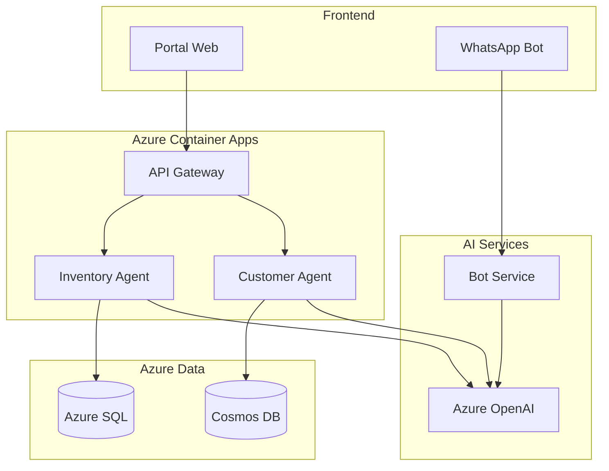

# Propuesta TopLlantas AI - Versión Desarrollo Personal

## Resumen Ejecutivo Ajustado

### Enfoque: **Solo Developer + AI Agents**

Esta versión de la propuesta está diseñada para un **desarrollo personal** con un único desarrollador senior apoyado por herramientas de inteligencia artificial, reduciendo significativamente los costos mientras mantiene la viabilidad técnica del proyecto.

---

## Nuevo Modelo de Desarrollo

### **Desarrollador + AI Tools Strategy**

```
👨‍💻 DESARROLLADOR PRINCIPAL (1 persona)
├── Full-Stack Developer Senior
├── Especialización en Azure + .NET
├── Experiencia con AI/ML básico
└── Capacidad de trabajar con AI assistants

🤖 AI ASSISTANTS COMO TEAM VIRTUAL
├── GitHub Copilot (Código)
├── Azure OpenAI (Arquitectura y diseño)
├── ChatGPT Plus (Documentación)
├── Claude (Análisis y revisión)
└── Cursor AI (Desarrollo acelerado)
```

---

## Presupuesto Ajustado - Versión Personal

### **Costos Totales Reducidos: $85,400**

#### **Recursos Humanos (70%): $59,800**
| Concepto | Costo Anual | Descripción |
|----------|-------------|-------------|
| **Desarrollador Senior** | $48,000 | $4,000/mes por 12 meses |
| **Consultor Azure (20 horas)** | $6,000 | $300/hora para setup inicial |
| **UX/UI Freelancer (40 horas)** | $3,200 | $80/hora para interfaces |
| **Testing Freelancer (30 horas)** | $2,400 | $80/hora para QA crítico |
| **Documentación Técnica** | $200 | AI-assisted con revisión manual |

#### **Infraestructura Azure (20%): $17,100**
| Servicio | Costo Anual | Justificación |
|----------|-------------|---------------|
| **Azure Container Apps** | $3,600 | Hosting microservicios (dev tier) |
| **Azure OpenAI Service** | $7,200 | GPT-4 para agentes ($600/mes) |
| **Azure SQL Database** | $2,400 | Basic tier, escalable |
| **Azure Cosmos DB** | $1,800 | Minimal throughput |
| **Azure Storage + CDN** | $1,200 | Archivos y cache |
| **Azure API Management** | $900 | Developer tier |

#### **Herramientas y Licencias (10%): $8,500**
| Herramienta | Costo Anual | Beneficio |
|-------------|-------------|-----------|
| **GitHub Copilot** | $100 | Aceleración desarrollo 40% |
| **ChatGPT Plus** | $240 | Arquitectura y documentación |
| **Claude Pro** | $240 | Code review y análisis |
| **Cursor Pro** | $240 | IDE con AI integrado |
| **Azure DevOps** | $360 | CI/CD y project management |
| **Power BI Pro** | $120 | Analytics y dashboards |
| **Visual Studio Enterprise** | $2,999 | IDE profesional |
| **Postman Pro** | $420 | API testing |
| **Figma Pro** | $180 | UI/UX design |
| **Diversos tools** | $3,600 | Testing, monitoring, etc. |

---

## Estrategia de Implementación Acelerada

### **Timeline Ajustado: 8 meses**

#### **Fase 1 (Meses 1-2): MVP Foundation**
```
🎯 OBJETIVO: Infraestructura básica funcionando

ENTREGABLES:
✅ Ambiente Azure configurado
✅ APIs básicas ERP (CRUD operations)
✅ Autenticación y autorización
✅ Dashboard administrativo básico

ESFUERZO: 320 horas
AI ASSISTANCE: GitHub Copilot + Azure OpenAI para arquitectura
```

#### **Fase 2 (Meses 3-4): Agente de Inventario**
```
🎯 OBJETIVO: Primer agente AI operativo

ENTREGABLES:
✅ Agente de inventario con predicciones básicas
✅ Alertas automáticas de stock bajo
✅ Integración con ERP para órdenes de compra
✅ Dashboard de métricas básicas

ESFUERZO: 320 horas
AI ASSISTANCE: Azure OpenAI para lógica de negocio IA
```

#### **Fase 3 (Meses 5-6): Agente de Atención al Cliente**
```
🎯 OBJETIVO: Chatbot inteligente funcionando

ENTREGABLES:
✅ Chatbot con Azure Bot Service
✅ Integración WhatsApp Business
✅ Base de conocimientos automática
✅ Escalación a humanos

ESFUERZO: 320 horas  
AI ASSISTANCE: Azure OpenAI para conversaciones naturales
```

#### **Fase 4 (Meses 7-8): Portal Web y Optimización**
```
🎯 OBJETIVO: Sistema completo y optimizado

ENTREGABLES:
✅ Portal web para concesionarios
✅ Agente de logística básico
✅ Optimización de performance
✅ Documentación completa

ESFUERZO: 320 horas
AI ASSISTANCE: Todos los tools para optimización final
```

---

## Arquitectura Simplificada pero Escalable

### **Componentes Core Mínimos**



### **Decisiones de Arquitectura para Solo Developer**

1. **Monorepo**: Todo el código en un solo repositorio
2. **Microservicios ligeros**: 3-4 servicios máximo inicialmente
3. **Database per service**: Pero compartiendo Azure SQL con schemas
4. **AI-First Development**: Usar AI para generar el 60-70% del código
5. **Infrastructure as Code**: Bicep templates para todo
6. **CI/CD automatizado**: GitHub Actions con deployment automático

---

## Estrategia de AI-Assisted Development

### **Herramientas AI por Fase de Desarrollo**

#### **Arquitectura y Diseño**
```
🤖 Azure OpenAI GPT-4:
• Diseño de arquitectura de microservicios
• Definición de schemas de base de datos
• Planificación de APIs RESTful
• Documentación técnica automática
```

#### **Desarrollo de Código**
```
🤖 GitHub Copilot:
• Autocompletado inteligente de código
• Generación de métodos completos
• Tests unitarios automáticos
• Refactoring suggestions

🤖 Cursor AI:
• Desarrollo acelerado con context awareness
• Debugging asistido por AI
• Code reviews automáticos
```

#### **Testing y QA**
```
🤖 ChatGPT + Claude:
• Generación de casos de prueba
• Scripts de testing automatizado
• Análisis de cobertura de código
• Identificación de bugs potenciales
```

#### **Documentación**
```
🤖 Claude Pro:
• Documentación de APIs automática
• Guías de usuario
• Documentación técnica
• Comentarios de código inteligentes
```

---

## ROI Ajustado para Desarrollo Personal

### **Inversión vs Beneficios**

#### **Costos Totales**
| Concepto | Año 1 | Años 2-3 |
|----------|-------|----------|
| **Desarrollo** | $59,800 | $48,000/año |
| **Infraestructura** | $17,100 | $20,000/año |
| **Herramientas** | $8,500 | $8,500/año |
| **TOTAL** | **$85,400** | **$76,500/año** |

#### **Beneficios Proyectados (Conservadores)**
| Beneficio | Año 1 | Años 2-3 |
|-----------|-------|----------|
| **Ahorro tiempo operacional** | $150,000 | $200,000/año |
| **Reducción errores inventario** | $80,000 | $120,000/año |
| **Mejora atención cliente** | $60,000 | $100,000/año |
| **Optimización procesos** | $110,000 | $150,000/año |
| **TOTAL BENEFICIOS** | **$400,000** | **$570,000/año** |

#### **ROI Calculado**
- **ROI Año 1**: 368% ($400k beneficios / $85k inversión)
- **Payback Period**: 2.6 meses
- **Beneficio Neto Año 1**: $314,600

---

## Plan de Mitigación de Riesgos

### **Riesgo: Dependencia de Un Solo Desarrollador**

#### **Mitigaciones:**
1. **Documentación exhaustiva**: AI-assisted para mantener conocimiento
2. **Código auto-documentado**: GitHub Copilot para comments detallados
3. **Architecture Decision Records**: Registro de todas las decisiones
4. **Backup developer**: Consultor de Azure en standby (20 horas/mes)
5. **Knowledge transfer**: Video recordings de procesos clave

### **Riesgo: Complejidad Técnica**

#### **Mitigaciones:**
1. **Start simple**: MVP primero, complejidad después
2. **AI assistance**: Usar AI para resolver problemas complejos
3. **Azure managed services**: Reducir gestión de infraestructura
4. **Incremental development**: Entregas cada 2 semanas
5. **Fallback plans**: Versiones simplificadas de cada feature

### **Riesgo: Performance y Escalabilidad**

#### **Mitigaciones:**
1. **Azure auto-scaling**: Configurado desde el inicio
2. **Performance testing**: Con AI-generated test cases
3. **Monitoring proactivo**: Azure Application Insights
4. **Database optimization**: AI-assisted query tuning
5. **CDN y caching**: Implementado desde fase 1

---

## Roadmap de Evolución

### **Año 1: Foundation + Core Agents**
- ✅ Infraestructura base
- ✅ Agente de Inventario
- ✅ Agente de Atención al Cliente
- ✅ Portal web básico

### **Año 2: Advanced Features**
- 🚀 Agente de Logística completo
- 🚀 Mobile app nativa
- 🚀 Advanced analytics con ML
- 🚀 Integración con transportistas

### **Año 3: AI Evolution**
- 🤖 Agentes con aprendizaje continuo
- 🤖 Predicciones avanzadas
- 🤖 Automatización completa workflows
- 🤖 Expansion a nuevos mercados

---

## Comparación: Equipo vs Solo Developer

| Aspecto | Equipo Completo | Solo Developer + AI |
|---------|-----------------|---------------------|
| **Inversión Inicial** | $645,100 | $85,400 |
| **Timeline** | 12 meses | 8 meses |
| **Complejidad Gestión** | Alta | Baja |
| **Flexibilidad** | Media | Alta |
| **Risk** | Medio | Bajo (menor inversión) |
| **ROI Año 1** | 263% | 368% |
| **Escalabilidad** | Inmediata | Gradual |

---

## Recomendación Final

### **¿Por qué elegir el enfoque Solo Developer + AI?**

1. **Menor riesgo financiero**: Inversión 87% menor
2. **Faster time to market**: 8 meses vs 12 meses
3. **Mayor control**: Decisiones más rápidas
4. **Evolución orgánica**: Crecer según necesidades reales
5. **ROI superior**: 368% vs 263%
6. **Aprendizaje acelerado**: AI como multiplicador de conocimiento

### **Próximos Pasos Inmediatos**

1. **✅ Aprobación presupuesto**: $85,400 (vs $645,100)
2. **✅ Contratación desarrollador**: Perfil full-stack + Azure
3. **✅ Setup herramientas AI**: GitHub Copilot, ChatGPT Plus, etc.
4. **✅ Ambiente Azure**: Configuración inicial en 1 semana
5. **✅ Kick-off**: Primer sprint de 2 semanas

### **Success Metrics Ajustados**

- **Mes 2**: APIs básicas funcionando
- **Mes 4**: Primer agente AI operativo
- **Mes 6**: ROI positivo demostrable
- **Mes 8**: Sistema completo en producción

---

*Esta propuesta mantiene la visión transformacional original pero con un enfoque realista para desarrollo personal, aprovechando al máximo las herramientas de AI disponibles para multiplicar la productividad del desarrollador único.*
