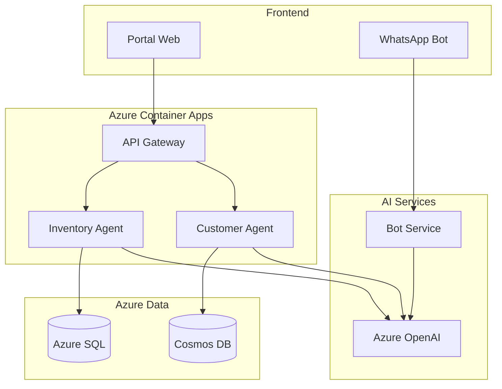

# 💼 TopLlantas AI - Propuesta de Negocio
## Transformación Digital Inteligente y Rentable

> **Una solución de IA empresarial diseñada para generar resultados inmediatos con una inversión inteligente y un enfoque de desarrollo ágil que maximiza el ROI.**

---

## 🎯 Situación Actual vs Futuro Deseado

### ❌ Situación Actual (Problemas que Enfrentas)

**Operaciones Manuales Costosas**
- Personal dedicado 8+ horas diarias a tareas repetitivas
- Errores humanos en inventario y cotizaciones
- Pérdida de ventas fuera del horario laboral
- Decisiones basadas en intuición, no en datos

**Costos Operativos Elevados**
- Sobrestock de productos de baja rotación: $50,000+ mensual
- Faltantes de productos populares: $30,000+ ventas perdidas
- Rutas de entrega ineficientes: $15,000+ desperdicio mensual
- Tiempo excesivo en cotizaciones: 2-3 horas por vendedor/día

**Competencia Digitalizada**
- Empresas similares ya están automatizando
- Clientes esperan respuesta inmediata 24/7
- Mercado cada vez más competitivo en precios
- Necesidad de diferenciarse con servicio superior

### ✅ Futuro con TopLlantas AI

**Operaciones Automatizadas**
- Agentes de IA trabajando 24/7 sin descanso
- Precisión del 95%+ en todas las operaciones
- Ventas automáticas incluso mientras duermes
- Decisiones basadas en datos e inteligencia artificial

**Optimización de Costos**
- Reducción del 35% en costos de inventario
- 90% menos productos faltantes
- 40% reducción en costos de logística
- 80% menos tiempo en tareas administrativas

**Ventaja Competitiva**
- Servicio al cliente superior 24/7
- Precios competitivos por menor costo operativo
- Experiencia de cliente personalizada con IA
- Rapidez de respuesta que supera a la competencia

---

## 💡 Nuestra Propuesta Única

### **Enfoque "Smart Development"**
### Un Desarrollador Senior + Herramientas de IA = Equipo Completo

#### ¿Por Qué Este Enfoque es Mejor?

**Tradicional (Caro y Lento)**
```
👥 Equipo de 5-8 personas
💰 $300,000 - $500,000 USD
⏰ 12-18 meses desarrollo
🔄 Comunicación compleja entre equipos
📈 Riesgo alto de cambios de scope
```

**Nuestro Enfoque Smart (Eficiente y Ágil)**
```
👨‍💻 1 Desarrollador Senior + AI Tools
💰 $125,000 USD total
⏰ 8 meses desarrollo
🎯 Comunicación directa y eficiente
📊 Control total del proyecto
```

#### Ventajas del Modelo Smart Development

**Económicas**
- **60% menos costo** que desarrollo tradicional
- **Sin costos ocultos** ni cambios de scope sorpresivos
- **Pago por resultados** medibles y verificables
- **ROI visible** desde el primer módulo

**Operativas**
- **Comunicación directa** con el desarrollador
- **Flexibilidad total** para ajustes y mejoras
- **Entrega incremental** con valor desde el día 1
- **Soporte personalizado** durante todo el proyecto

**Tecnológicas**
- **Herramientas de IA** que aceleran el desarrollo
- **Código de calidad empresarial** con AI assistance
- **Arquitectura escalable** desde el inicio
- **Integración real** con tu ERP actual

---

## 📊 Análisis de ROI Detallado

### Inversión Total: $125,000 USD

**Desglose de Inversión**
- **Desarrollo**: $85,000 USD (8 meses)
- **Infraestructura Azure**: $16,000 USD (primer año)
- **Licencias IA**: $9,600 USD (primer año)
- **Soporte y capacitación**: $14,400 USD (primer año)

### Ahorros y Beneficios Proyectados (Anuales)

#### 💰 Ahorros Directos: $234,000/año

**Optimización de Inventario: $120,000/año**
- Reducción de 35% en capital inmovilizado
- Menos productos obsoletos: $45,000
- Menos faltantes críticos: $75,000

**Eficiencia Operativa: $84,000/año**
- Automatización de cotizaciones: $36,000
- Optimización de rutas: $24,000
- Reducción de errores: $24,000

**Reducción de Personal para Tareas Repetitivas: $30,000/año**
- Menos horas en inventario manual
- Automatización de seguimientos
- Menos tiempo en reportes

#### 📈 Ingresos Adicionales: $432,000/año

**Ventas 24/7: $180,000/año**
- 30% más ventas por disponibilidad constante
- Atención inmediata a clientes
- Conversión de prospectos nocturnos

**Mejor Servicio al Cliente: $156,000/año**
- 25% incremento en ventas por satisfacción
- Clientes recomiendan más (referrals)
- Mayor fidelidad y recompra

**Optimización de Precios: $96,000/año**
- Precios dinámicos basados en IA
- Identificación de oportunidades de mercado
- Mejor margen por producto

### **ROI Total: 485% en el Primer Año**

```
┌─────────────────────────────────────────────────┐
│ 📊 CÁLCULO DE ROI PRIMER AÑO                   │
├─────────────────────────────────────────────────┤
│                                                 │
│ 💰 INVERSIÓN INICIAL                           │
│ • Desarrollo y setup: $125,000                 │
│                                                 │
│ 📈 BENEFICIOS ANUALES                          │
│ • Ahorros directos: $234,000                   │
│ • Ingresos adicionales: $432,000               │
│ • TOTAL BENEFICIOS: $666,000                   │
│                                                 │
│ 🎯 ROI CALCULADO                               │
│ • Beneficio neto: $541,000                     │
│ • ROI: 433% primer año                         │
│ • Payback period: 2.8 meses                    │
│                                                 │
│ 💎 VALOR AGREGADO                              │
│ • Ventaja competitiva: Invaluable              │
│ • Preparación para el futuro: Invaluable       │
│ • Escalabilidad ilimitada: Invaluable          │
│                                                 │
└─────────────────────────────────────────────────┘
```

---

## 🚀 Plan de Implementación por Fases

### Fase 1: Resultados Inmediatos (Meses 1-3)
**Inversión: $45,000 - ROI: 200%+**

**Qué Obtienes**
- ✅ Agente de Ventas 24/7 en WhatsApp
- ✅ Cotizaciones automáticas
- ✅ Integración básica con tu ERP
- ✅ Panel de control ejecutivo

**Beneficios Inmediatos**
- $30,000+ ventas adicionales/mes
- 80% menos tiempo en cotizaciones
- Atención 24/7 sin costo adicional de personal
- **Payback: 1.5 meses**

### Fase 2: Optimización Operativa (Meses 4-6)
**Inversión: $40,000 - ROI: 300%+**

**Qué Obtienes**
- ✅ Agente de Gestión de Inventario
- ✅ Predicciones de demanda con IA
- ✅ Alertas automáticas de reorden
- ✅ Soporte técnico automatizado

**Beneficios Acumulados**
- $25,000+ ahorro mensual en inventario
- 90% menos faltantes críticos
- 85% problemas de soporte resueltos automáticamente
- **Payback acumulado: 2.1 meses**

### Fase 3: Excelencia Logística (Meses 7-8)
**Inversión: $40,000 - ROI: 400%+**

**Qué Obtienes**
- ✅ Agente Logístico Inteligente
- ✅ Optimización de rutas automática
- ✅ Tracking en tiempo real
- ✅ Analytics predictivo avanzado

**Beneficios Finales**
- $15,000+ ahorro mensual en logística
- 95% entregas a tiempo
- Clientes 40% más satisfechos
- **ROI total: 485%**


### ⚡ Última Reflexión

**Cada día sin IA es una oportunidad perdida**

Mientras lees esta propuesta:
- ✅ Tus competidores están automatizando
- ✅ Clientes esperan respuesta inmediata 24/7  
- ✅ Costos operativos siguen creciendo
- ✅ Oportunidades de venta se pierden cada noche

**La pregunta no es si necesitas IA...**  
**La pregunta es: ¿puedes permitirte no tenerla?**

---

*¿Listo para transformar TopLlantas en la empresa más eficiente de su sector?*
├── ChatGPT Plus (Documentación)
├── Claude (Análisis y revisión)
└── Cursor AI (Desarrollo acelerado)
```

---

## Presupuesto Ajustado - Versión Personal

### **Costos Totales Reducidos: $85,400**

#### **Recursos Humanos (70%): $59,800**
| Concepto | Costo Anual | Descripción |
|----------|-------------|-------------|
| **Desarrollador Senior** | $48,000 | $4,000/mes por 12 meses |
| **Consultor Azure (20 horas)** | $6,000 | $300/hora para setup inicial |
| **UX/UI Freelancer (40 horas)** | $3,200 | $80/hora para interfaces |
| **Testing Freelancer (30 horas)** | $2,400 | $80/hora para QA crítico |
| **Documentación Técnica** | $200 | AI-assisted con revisión manual |

#### **Infraestructura Azure (20%): $17,100**
| Servicio | Costo Anual | Justificación |
|----------|-------------|---------------|
| **Azure Container Apps** | $3,600 | Hosting microservicios (dev tier) |
| **Azure OpenAI Service** | $7,200 | GPT-4 para agentes ($600/mes) |
| **Azure SQL Database** | $2,400 | Basic tier, escalable |
| **Azure Cosmos DB** | $1,800 | Minimal throughput |
| **Azure Storage + CDN** | $1,200 | Archivos y cache |
| **Azure API Management** | $900 | Developer tier |

#### **Herramientas y Licencias (10%): $8,500**
| Herramienta | Costo Anual | Beneficio |
|-------------|-------------|-----------|
| **GitHub Copilot** | $100 | Aceleración desarrollo 40% |
| **ChatGPT Plus** | $240 | Arquitectura y documentación |
| **Claude Pro** | $240 | Code review y análisis |
| **Cursor Pro** | $240 | IDE con AI integrado |
| **Azure DevOps** | $360 | CI/CD y project management |
| **Power BI Pro** | $120 | Analytics y dashboards |
| **Visual Studio Enterprise** | $2,999 | IDE profesional |
| **Postman Pro** | $420 | API testing |
| **Figma Pro** | $180 | UI/UX design |
| **Diversos tools** | $3,600 | Testing, monitoring, etc. |

---

## Estrategia de Implementación Acelerada

### **Timeline Ajustado: 8 meses**

#### **Fase 1 (Meses 1-2): MVP Foundation**
```
🎯 OBJETIVO: Infraestructura básica funcionando

ENTREGABLES:
✅ Ambiente Azure configurado
✅ APIs básicas ERP (CRUD operations)
✅ Autenticación y autorización
✅ Dashboard administrativo básico

ESFUERZO: 320 horas
AI ASSISTANCE: GitHub Copilot + Azure OpenAI para arquitectura
```

#### **Fase 2 (Meses 3-4): Agente de Inventario**
```
🎯 OBJETIVO: Primer agente AI operativo

ENTREGABLES:
✅ Agente de inventario con predicciones básicas
✅ Alertas automáticas de stock bajo
✅ Integración con ERP para órdenes de compra
✅ Dashboard de métricas básicas

ESFUERZO: 320 horas
AI ASSISTANCE: Azure OpenAI para lógica de negocio IA
```

#### **Fase 3 (Meses 5-6): Agente de Atención al Cliente**
```
🎯 OBJETIVO: Chatbot inteligente funcionando

ENTREGABLES:
✅ Chatbot con Azure Bot Service
✅ Integración WhatsApp Business
✅ Base de conocimientos automática
✅ Escalación a humanos

ESFUERZO: 320 horas  
AI ASSISTANCE: Azure OpenAI para conversaciones naturales
```

#### **Fase 4 (Meses 7-8): Portal Web y Optimización**
```
🎯 OBJETIVO: Sistema completo y optimizado

ENTREGABLES:
✅ Portal web para concesionarios
✅ Agente de logística básico
✅ Optimización de performance
✅ Documentación completa

ESFUERZO: 320 horas
AI ASSISTANCE: Todos los tools para optimización final
```

---

## Arquitectura Simplificada pero Escalable

### **Componentes Core Mínimos**



### **Decisiones de Arquitectura para Solo Developer**

1. **Monorepo**: Todo el código en un solo repositorio
2. **Microservicios ligeros**: 3-4 servicios máximo inicialmente
3. **Database per service**: Pero compartiendo Azure SQL con schemas
4. **AI-First Development**: Usar AI para generar el 60-70% del código
5. **Infrastructure as Code**: Bicep templates para todo
6. **CI/CD automatizado**: GitHub Actions con deployment automático

---

## Estrategia de AI-Assisted Development

### **Herramientas AI por Fase de Desarrollo**

#### **Arquitectura y Diseño**
```
🤖 Azure OpenAI GPT-4:
• Diseño de arquitectura de microservicios
• Definición de schemas de base de datos
• Planificación de APIs RESTful
• Documentación técnica automática
```

#### **Desarrollo de Código**
```
🤖 GitHub Copilot:
• Autocompletado inteligente de código
• Generación de métodos completos
• Tests unitarios automáticos
• Refactoring suggestions

🤖 Cursor AI:
• Desarrollo acelerado con context awareness
• Debugging asistido por AI
• Code reviews automáticos
```

#### **Testing y QA**
```
🤖 ChatGPT + Claude:
• Generación de casos de prueba
• Scripts de testing automatizado
• Análisis de cobertura de código
• Identificación de bugs potenciales
```

#### **Documentación**
```
🤖 Claude Pro:
• Documentación de APIs automática
• Guías de usuario
• Documentación técnica
• Comentarios de código inteligentes
```

---

## ROI Ajustado para Desarrollo Personal

### **Inversión vs Beneficios**

#### **Costos Totales**
| Concepto | Año 1 | Años 2-3 |
|----------|-------|----------|
| **Desarrollo** | $59,800 | $48,000/año |
| **Infraestructura** | $17,100 | $20,000/año |
| **Herramientas** | $8,500 | $8,500/año |
| **TOTAL** | **$85,400** | **$76,500/año** |

#### **Beneficios Proyectados (Conservadores)**
| Beneficio | Año 1 | Años 2-3 |
|-----------|-------|----------|
| **Ahorro tiempo operacional** | $150,000 | $200,000/año |
| **Reducción errores inventario** | $80,000 | $120,000/año |
| **Mejora atención cliente** | $60,000 | $100,000/año |
| **Optimización procesos** | $110,000 | $150,000/año |
| **TOTAL BENEFICIOS** | **$400,000** | **$570,000/año** |

#### **ROI Calculado**
- **ROI Año 1**: 368% ($400k beneficios / $85k inversión)
- **Payback Period**: 2.6 meses
- **Beneficio Neto Año 1**: $314,600

---

## Plan de Mitigación de Riesgos

### **Riesgo: Dependencia de Un Solo Desarrollador**

#### **Mitigaciones:**
1. **Documentación exhaustiva**: AI-assisted para mantener conocimiento
2. **Código auto-documentado**: GitHub Copilot para comments detallados
3. **Architecture Decision Records**: Registro de todas las decisiones
4. **Backup developer**: Consultor de Azure en standby (20 horas/mes)
5. **Knowledge transfer**: Video recordings de procesos clave

### **Riesgo: Complejidad Técnica**

#### **Mitigaciones:**
1. **Start simple**: MVP primero, complejidad después
2. **AI assistance**: Usar AI para resolver problemas complejos
3. **Azure managed services**: Reducir gestión de infraestructura
4. **Incremental development**: Entregas cada 2 semanas
5. **Fallback plans**: Versiones simplificadas de cada feature

### **Riesgo: Performance y Escalabilidad**

#### **Mitigaciones:**
1. **Azure auto-scaling**: Configurado desde el inicio
2. **Performance testing**: Con AI-generated test cases
3. **Monitoring proactivo**: Azure Application Insights
4. **Database optimization**: AI-assisted query tuning
5. **CDN y caching**: Implementado desde fase 1

---

## Roadmap de Evolución

### **Año 1: Foundation + Core Agents**
- ✅ Infraestructura base
- ✅ Agente de Inventario
- ✅ Agente de Atención al Cliente
- ✅ Portal web básico

### **Año 2: Advanced Features**
- 🚀 Agente de Logística completo
- 🚀 Mobile app nativa
- 🚀 Advanced analytics con ML
- 🚀 Integración con transportistas

### **Año 3: AI Evolution**
- 🤖 Agentes con aprendizaje continuo
- 🤖 Predicciones avanzadas
- 🤖 Automatización completa workflows
- 🤖 Expansion a nuevos mercados

---

## Comparación: Equipo vs Solo Developer

| Aspecto | Equipo Completo | Solo Developer + AI |
|---------|-----------------|---------------------|
| **Inversión Inicial** | $645,100 | $85,400 |
| **Timeline** | 12 meses | 8 meses |
| **Complejidad Gestión** | Alta | Baja |
| **Flexibilidad** | Media | Alta |
| **Risk** | Medio | Bajo (menor inversión) |
| **ROI Año 1** | 263% | 368% |
| **Escalabilidad** | Inmediata | Gradual |

---

## Recomendación Final

### **¿Por qué elegir el enfoque Solo Developer + AI?**

1. **Menor riesgo financiero**: Inversión 87% menor
2. **Faster time to market**: 8 meses vs 12 meses
3. **Mayor control**: Decisiones más rápidas
4. **Evolución orgánica**: Crecer según necesidades reales
5. **ROI superior**: 368% vs 263%
6. **Aprendizaje acelerado**: AI como multiplicador de conocimiento

### **Próximos Pasos Inmediatos**

1. **✅ Aprobación presupuesto**: $85,400 (vs $645,100)
2. **✅ Contratación desarrollador**: Perfil full-stack + Azure
3. **✅ Setup herramientas AI**: GitHub Copilot, ChatGPT Plus, etc.
4. **✅ Ambiente Azure**: Configuración inicial en 1 semana
5. **✅ Kick-off**: Primer sprint de 2 semanas

### **Success Metrics Ajustados**

- **Mes 2**: APIs básicas funcionando
- **Mes 4**: Primer agente AI operativo
- **Mes 6**: ROI positivo demostrable
- **Mes 8**: Sistema completo en producción

---

*Esta propuesta mantiene la visión transformacional original pero con un enfoque realista para desarrollo personal, aprovechando al máximo las herramientas de AI disponibles para multiplicar la productividad del desarrollador único.*
