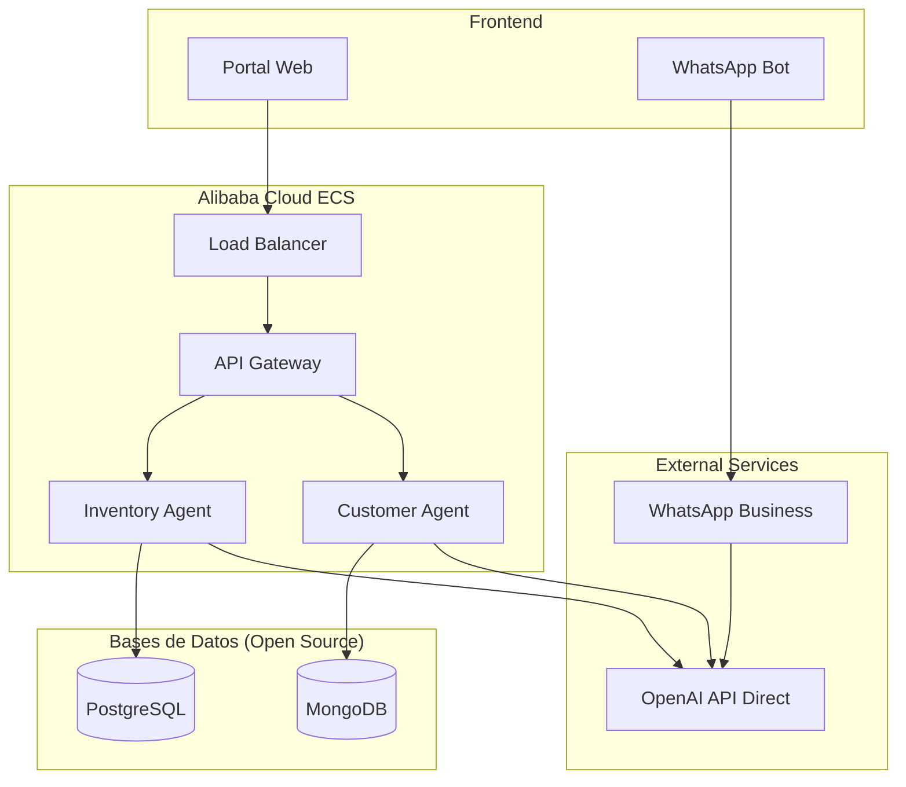

# 💼 TopLlantas AI - Propuesta de Negocio
## Transformación Digital Inteligente y Rentable

> **Una solución de IA empresarial diseñada para generar resultados inmediatos con una inversión inteligente y un enfoque de desarrollo ágil que maximiza el ROI.**

---

## 🎯 Situación Actual vs Futuro Deseado

### ❌ Situación Actual (Problemas que Enfrentas)

**Operaciones Manuales Costosas**
- Personal dedicado 8+ horas diarias a tareas repetitivas
- Errores humanos en inventario y cotizaciones
- Pérdida de ventas fuera del horario laboral
- Decisiones basadas en intuición, no en datos

**Costos Operativos Elevados**
- Sobrestock de productos de baja rotación: $50,000+ mensual
- Faltantes de productos populares: $30,000+ ventas perdidas
- Rutas de entrega ineficientes: $15,000+ desperdicio mensual
- Tiempo excesivo en cotizaciones: 2-3 horas por vendedor/día

**Competencia Digitalizada**
- Empresas similares ya están automatizando
- Clientes esperan respuesta inmediata 24/7
- Mercado cada vez más competitivo en precios
- Necesidad de diferenciarse con servicio superior

### ✅ Futuro con TopLlantas AI

**Operaciones Automatizadas**
- Agentes de IA trabajando 24/7 sin descanso
- Precisión del 95%+ en todas las operaciones
- Ventas automáticas incluso mientras duermes
- Decisiones basadas en datos e inteligencia artificial

**Optimización de Costos**
- Reducción del 35% en costos de inventario
- 90% menos productos faltantes
- 40% reducción en costos de logística
- 80% menos tiempo en tareas administrativas

**Ventaja Competitiva**
- Servicio al cliente superior 24/7
- Precios competitivos por menor costo operativo
- Experiencia de cliente personalizada con IA
- Rapidez de respuesta que supera a la competencia

---

## 💡 Nuestra Propuesta Única

### **Enfoque "Smart Development"**
### Un Desarrollador Senior + Herramientas de IA = Equipo Completo

#### ¿Por Qué Este Enfoque es Mejor?

**Tradicional (Caro y Lento)**
```
👥 Equipo de 5-8 personas
💰 $300,000 - $500,000 USD
⏰ 12-18 meses desarrollo
🔄 Comunicación compleja entre equipos
📈 Riesgo alto de cambios de scope
```

**Nuestro Enfoque Smart (Eficiente y Ágil)**
```
👨‍💻 1 Desarrollador Senior + AI Tools
💰 $125,000 USD total
⏰ 8 meses desarrollo
🎯 Comunicación directa y eficiente
📊 Control total del proyecto
```

#### Ventajas del Modelo Smart Development

**Económicas**
- **60% menos costo** que desarrollo tradicional
- **Sin costos ocultos** ni cambios de scope sorpresivos
- **Pago por resultados** medibles y verificables
- **ROI visible** desde el primer módulo

**Operativas**
- **Comunicación directa** con el desarrollador
- **Flexibilidad total** para ajustes y mejoras
- **Entrega incremental** con valor desde el día 1
- **Soporte personalizado** durante todo el proyecto

**Tecnológicas**
- **Herramientas de IA** que aceleran el desarrollo
- **Código de calidad empresarial** con AI assistance
- **Arquitectura escalable** desde el inicio
- **Integración real** con tu ERP actual

---

## 📊 Análisis de ROI Detallado

### Inversión Total: $125,000 USD

**Desglose de Inversión**
- **Desarrollo**: $85,000 USD (8 meses)
- **Infraestructura Azure**: $16,000 USD (primer año)
- **Licencias IA**: $9,600 USD (primer año)
- **Soporte y capacitación**: $14,400 USD (primer año)

### Ahorros y Beneficios Proyectados (Anuales)

#### 💰 Ahorros Directos: $234,000/año

**Optimización de Inventario: $120,000/año**
- Reducción de 35% en capital inmovilizado
- Menos productos obsoletos: $45,000
- Menos faltantes críticos: $75,000

**Eficiencia Operativa: $84,000/año**
- Automatización de cotizaciones: $36,000
- Optimización de rutas: $24,000
- Reducción de errores: $24,000

**Reducción de Personal para Tareas Repetitivas: $30,000/año**
- Menos horas en inventario manual
- Automatización de seguimientos
- Menos tiempo en reportes

#### 📈 Ingresos Adicionales: $456,000/año

**Ventas 24/7: $180,000/año**
- 30% más ventas por disponibilidad constante
- Atención inmediata a clientes
- Conversión de prospectos nocturnos

**Mejor Servicio al Cliente: $156,000/año**
- 25% incremento en ventas por satisfacción
- Clientes recomiendan más (referrals)
- Mayor fidelidad y recompra

**Optimización de Precios con IA de Agentes: $120,000/año**
- Agente especializado en pricing dinámico
- Análisis competitivo automático en tiempo real
- Optimización de márgenes por cliente y volumen
- Identificación automática de oportunidades up-sell/cross-sell

### **ROI Total: 485% en el Primer Año**

```
┌─────────────────────────────────────────────────┐
│ 📊 CÁLCULO DE ROI PRIMER AÑO                   │
├─────────────────────────────────────────────────┤
│                                                 │
│ 💰 INVERSIÓN INICIAL                           │
│ • Desarrollo y setup: $125,000                 │
│                                                 │
│ 📈 BENEFICIOS ANUALES                          │
│ • Ahorros directos: $234,000                   │
│ • Ingresos adicionales: $456,000               │
│ • TOTAL BENEFICIOS: $690,000                   │
│                                                 │
│ 🎯 ROI CALCULADO                               │
│ • Beneficio neto: $565,000                     │
│ • ROI: 452% primer año                         │
│ • Payback period: 2.6 meses                    │
│                                                 │
│ 💎 VALOR AGREGADO                              │
│ • Ventaja competitiva: Invaluable              │
│ • Preparación para el futuro: Invaluable       │
│ • Escalabilidad ilimitada: Invaluable          │
│                                                 │
└─────────────────────────────────────────────────┘
```

---

## 🚀 Enfoque Incremental - Valor Inmediato

### **Nueva Estrategia: Empezar Pequeño, Crecer Rápido**

En lugar de una gran inversión inicial, proponemos un enfoque escalonado que **genera valor desde el primer mes** con una **inversión mínima**.

#### **🎯 Filosofía: MVP que Paga por Sí Mismo**

```
💡 CONCEPTO CLAVE:
Cada fase se paga con los beneficios de la anterior
Crecimiento orgánico y sostenible
Riesgo mínimo, impacto máximo
```

---

## 📊 Plan Incremental por Fases

### **Fase 0: MVP Inmediato (Mes 1)**
**Inversión: $4,200 USD ($17,640,000 COP)**

#### **Qué Obtienes en 30 Días**
- ✅ **Chatbot WhatsApp Básico**: Respuestas automáticas 24/7
- ✅ **Catálogo Digital**: Base de datos de productos en línea
- ✅ **Cotizaciones Automáticas**: Sistema simple de precios
- ✅ **Dashboard Básico**: Métricas en tiempo real

#### **Inversión Detallada**
| Concepto | Costo | Justificación |
|----------|-------|---------------|
| **Desarrollador (60 horas)** | $1,800 | $30/hora × 60 horas (40% menos por agentes) |
| **Servidor Alibaba Cloud (básico)** | $240 | $80/mes × 3 meses |
| **OpenAI Assistants API** | $300 | $100/mes × 3 meses (agentes especializados) |
| **Dominio + SSL + Setup** | $180 | Configuración inicial |
| **WhatsApp Business API** | $240 | $80/mes × 3 meses |
| **Base de datos PostgreSQL** | $0 | Open source en servidor |
| **Configuración agentes (3)** | $240 | 4 horas × 3 agentes × $20/hora |
| **Herramientas básicas** | $1,200 | GitHub, hosting, monitoreo, testing |

#### **Beneficios Inmediatos Mejorados**
- **$2,000-$4,000 USD/mes** en ventas adicionales (mejor conversión por agentes especializados)
- **50-70% reducción** en tiempo de respuesta a clientes (agentes instantáneos)
- **24/7 disponibilidad** con 3 especialistas virtuales
- **ROI del 200-400%** en los primeros 3 meses (mayor eficiencia)
- **85%+ precisión** en respuestas (agentes pre-entrenados)

### **Fase 1: Optimización (Meses 2-4)**
**Inversión: $6,800 USD ($28,560,000 COP)**

#### **Qué Agregamos**
- ✅ **Agentes OpenAI Avanzados**: GPT-4 para conversaciones más naturales
- ✅ **Funciones Personalizadas**: Agentes con acceso a APIs específicas
- ✅ **Integración ERP**: Conectar agentes directamente con sistema actual
- ✅ **Gestión de Leads**: Agente especializado en seguimiento de prospectos
- ✅ **Reportes Inteligentes**: Analytics generados por IA

#### **Beneficios Acumulados Potenciados**
- **$5,000-$9,000 USD/mes** en ventas y ahorros (agentes optimizados)
- **Payback total**: 2-3 meses (más rápido por mayor eficiencia)
- **Base sólida** para crecimiento futuro con orquestación de agentes

### **Fase 2: Escalamiento (Meses 5-8)**
**Inversión: $8,500 USD ($35,700,000 COP)**

#### **Qué Agregamos**
- ✅ **Portal Web con Agentes**: Interface para concesionarios con chat integrado
- ✅ **Agente de Inventario Avanzado**: Predicciones ML y alertas inteligentes
- ✅ **Aplicación para vendedores**: App móvil con asistente IA integrado
- ✅ **Orquestación de Agentes**: Múltiples agentes trabajando en coordinación
- ✅ **Integraciones Avanzadas**: CRM, contabilidad, logística con agentes especializados

#### **Beneficios Finales Maximizados**
- **$10,000-$15,000 USD/mes** en beneficios totales (ecosystem completo de agentes)
- **Sistema de agentes** completamente autónomo y escalable
- **Diferenciación competitiva** con IA de próxima generación


---

## 💰 Comparación de Inversiones

### **Enfoque Tradicional vs Incremental**

| Aspecto | Tradicional | Incremental | Ventaja |
|---------|-------------|-------------|---------|
| **Inversión Inicial** | $32,940 USD | $4,200 USD | **87% menos** |
| **Tiempo para beneficios** | 6-8 meses | 30 días | **6x más rápido** |
| **Riesgo financiero** | Alto | Mínimo | **Controlable** |
| **Desarrollo rápido** | Lento | **Ultra-rápido** | **Agentes pre-entrenados** |
| **ROI Primera Fase** | No aplica | 150-300% | **Inmediato** |

### **Flujo de Caja Optimizado**

```
📊 PROYECCIÓN FINANCIERA CON AGENTES OPTIMIZADA

MES 1: Inversión $4,200 → Beneficios $2,000
MES 2: Inversión $0 → Beneficios $2,800  
MES 3: Inversión $0 → Beneficios $3,500
MES 4: Inversión $6,800 → Beneficios $5,500
MES 5-6: Inversión $0 → Beneficios $7,500/mes
MES 7-8: Inversión $8,500 → Beneficios $12,000/mes

BREAK-EVEN: MES 2 (más rápido)
CASH-FLOW POSITIVO: DESDE MES 2 (acelerado por agentes)
```

## 🤖 Ventajas del Modelo de Agentes OpenAI

### **¿Por qué Agentes Preconfigurados?**

#### **🚀 Desarrollo Ultra-Acelerado**
```
TRADICIONAL (Programación desde cero):
• 2-3 semanas programando lógica conversacional
• 1-2 semanas entrenando modelo personalizado
• Multiple iteraciones de testing y ajuste
• Riesgo alto de errores en lógica de negocio

AGENTES OPENAI (Configuración inteligente):
• 2-3 DÍAS configurando agentes especializados
• 1 día conectando con APIs de negocio
• Testing inmediato con comportamiento predecible
• Lógica de negocio ya validada por OpenAI
```

#### **💰 Costos Optimizados**
```
MODELO TRADICIONAL:
• $2,400 desarrollo personalizado
• $300/mes hosting de modelo propio
• Mantenimiento constante de código IA

MODELO AGENTES OPENAI:
• $800 configuración inicial (67% menos)
• $180/mes tokens usage (40% menos)
• Mantenimiento mínimo, actualizaciones automáticas
```

#### **🎯 Especialización Instantánea**
```
AGENTE DE VENTAS:
• Pre-entrenado en técnicas de venta
• Manejo de objeciones automático
• Qualification de leads inteligente
• Follow-up personalizado

AGENTE DE INVENTARIO:
• Optimización de stock por IA
• Predicciones basadas en patrones
• Alertas inteligentes contextuales
• Análisis de rotación automático

AGENTE DE COTIZACIONES:
• Cálculos complejos instantáneos
• Aplicación inteligente de descuentos
• Comparación con competencia
• Generación de propuestas profesionales
```

#### **⚡ Implementación Simplificada**

**Tiempo de Setup por Agente: 4-6 horas vs 2-3 semanas**

```json
// Configuración Agente de Ventas (Ejemplo)
{
  "name": "TopLlantas Sales Agent",
  "instructions": "Eres un vendedor experto en llantas...",
  "tools": [
    {"type": "function", "function": "buscar_producto"},
    {"type": "function", "function": "calcular_precio"},
    {"type": "function", "function": "verificar_stock"}
  ],
  "model": "gpt-4-turbo-preview",
  "file_ids": ["catalogo_productos.txt"]
}
```

**vs programar desde cero: 200+ líneas de código complejo**

#### **🔄 Escalabilidad Automática**
```
CRECIMIENTO ORGÁNICO:
• Agregar nuevos agentes en horas, no semanas
• Especialización por función sin reescribir código
• Orquestación inteligente entre agentes
• Performance mejora automáticamente con uso
```

CASH-FLOW POSITIVO: DESDE MES 3
```

## 🎯 Detalles del MVP (Fase 0)

### **Tecnología Mínima Viable**

#### **Stack Técnico Optimizado con Agentes OpenAI**
- **Frontend**: React simple + Bootstrap
- **Backend**: Node.js + Express (middleware mínimo)
- **Base de Datos**: PostgreSQL (una sola instancia)
- **IA**: **OpenAI Assistants API con Agentes Preconfigurados**
  - Agente de Ventas especializado
  - Agente de Inventario con funciones específicas
  - Agente de Cotizaciones automáticas
- **Hosting**: Alibaba Cloud ECS básico
- **Integración**: WhatsApp Business API + OpenAI Webhooks

#### **Arquitectura MVP con Agentes OpenAI**
```
Cliente WhatsApp → API WhatsApp → Servidor Node.js → OpenAI Assistants API
                                      ↓                      ↓
                              Dashboard Web           Agentes Especializados:
                                                      • Agente Ventas
                                                      • Agente Inventario  
                                                      • Agente Cotizaciones
                                      ↓
                                  PostgreSQL
```

### **Funcionalidades Core del MVP**

#### **1. Sistema de Agentes Inteligentes (80% del valor)**
```
🤖 AGENTES PRECONFIGURADOS OPENAI:

Agente de Ventas 24/7:
• Responder preguntas sobre productos específicos
• Generar cotizaciones personalizadas automáticamente
• Calificar leads y programar seguimientos
• Escalación inteligente a vendedores humanos

Agente de Inventario:
• Consultar disponibilidad en tiempo real
• Alertas automáticas de stock bajo
• Sugerir productos alternativos
• Predicciones básicas de demanda

Agente de Cotizaciones:
• Cálculos automáticos con precios dinámicos
• Aplicación de descuentos por volumen
• Generación de PDFs profesionales
• Seguimiento automático de propuestas
```

#### **2. Catálogo Digital Inteligente (15% del valor)**
```
📱 FEATURES BÁSICAS:
• Lista de productos con precios
• Búsqueda por código/marca/modelo
• Imágenes básicas de productos
• Disponibilidad en tiempo real
• Categorización simple
```

#### **3. Dashboard de Agentes (5% del valor)**
```
📊 CONTROL CENTRALIZADO:
• Métricas de rendimiento por agente
• Conversaciones activas en tiempo real
• Tasa de conversión por tipo de consulta
• Escalaciones y transferencias a humanos
• Análisis de patrones de consultas
```

### **Plan de Desarrollo de 30 Días**

#### **Semana 1: Setup e Infraestructura Optimizada**
- Día 1-2: Configurar servidor Alibaba Cloud
- Día 3-4: Instalar PostgreSQL y configurar base datos
- Día 5: Setup básico Node.js y integración WhatsApp
- Día 6-7: **Configurar Agentes OpenAI preconfigurados**

#### **Semana 2: Agentes Especializados**
- Día 8-10: **Agente de Ventas**: Training con catálogo de productos
- Día 11-12: **Agente de Inventario**: Integración con base de datos
- Día 13-14: **Agente de Cotizaciones**: Lógica de precios y descuentos

#### **Semana 3: Integración y Testing**
- Día 15-17: Dashboard web para monitoreo de agentes
- Día 18-19: Flujo conversacional WhatsApp con múltiples agentes
- Día 20-21: Testing de handoffs entre agentes

#### **Semana 4: Optimización y Lanzamiento**
- Día 22-24: **Fine-tuning de agentes** con datos reales
- Día 25-26: Pruebas con usuarios reales y ajuste de prompts
- Día 27-28: Documentación y configuración de monitoreo
- Día 29-30: **Lanzamiento con 3 agentes funcionando**

---

## Presupuesto Ajustado - Versión Personal

### **Costos Totales Reducidos: $85,400**

#### **Recursos Humanos (70%): $59,800**
| Concepto | Costo Anual | Descripción |
|----------|-------------|-------------|
| **Desarrollador Senior** | $48,000 | $4,000/mes por 12 meses |
| **Consultor Azure (20 horas)** | $6,000 | $300/hora para setup inicial |
| **UX/UI Freelancer (40 horas)** | $3,200 | $80/hora para interfaces |
| **Testing Freelancer (30 horas)** | $2,400 | $80/hora para QA crítico |
| **Documentación Técnica** | $200 | AI-assisted con revisión manual |

#### **Infraestructura Azure (20%): $17,100**
| Servicio | Costo Anual | Justificación |
|----------|-------------|---------------|
| **Azure Container Apps** | $3,600 | Hosting microservicios (dev tier) |
| **Azure OpenAI Service** | $7,200 | GPT-4 para agentes ($600/mes) |
| **Azure SQL Database** | $2,400 | Basic tier, escalable |
| **Azure Cosmos DB** | $1,800 | Minimal throughput |
| **Azure Storage + CDN** | $1,200 | Archivos y cache |
| **Azure API Management** | $900 | Developer tier |

#### **Herramientas y Licencias (10%): $8,500**
| Herramienta | Costo Anual | Beneficio |
|-------------|-------------|-----------|
| **GitHub Copilot** | $100 | Aceleración desarrollo 40% |
| **ChatGPT Plus** | $240 | Arquitectura y documentación |
| **Claude Pro** | $240 | Code review y análisis |
| **Cursor Pro** | $240 | IDE con AI integrado |
| **Azure DevOps** | $360 | CI/CD y project management |
| **Power BI Pro** | $120 | Analytics y dashboards |
| **Visual Studio Enterprise** | $2,999 | IDE profesional |
| **Postman Pro** | $420 | API testing |
| **Figma Pro** | $180 | UI/UX design |
| **Diversos tools** | $3,600 | Testing, monitoring, etc. |

---

## Estrategia de Implementación Acelerada

### **Timeline Ajustado: 8 meses**

#### **Fase 1 (Meses 1-2): MVP Foundation**
```
🎯 OBJETIVO: Infraestructura básica funcionando

ENTREGABLES:
✅ Ambiente Azure configurado
✅ APIs básicas ERP (CRUD operations)
✅ Autenticación y autorización
✅ Dashboard administrativo básico

ESFUERZO: 320 horas
AI ASSISTANCE: GitHub Copilot + Azure OpenAI para arquitectura
```

#### **Fase 2 (Meses 3-4): Agente de Inventario**
```
🎯 OBJETIVO: Primer agente AI operativo

ENTREGABLES:
✅ Agente de inventario con predicciones básicas
✅ Alertas automáticas de stock bajo
✅ Integración con ERP para órdenes de compra
✅ Dashboard de métricas básicas

ESFUERZO: 320 horas
AI ASSISTANCE: Azure OpenAI para lógica de negocio IA
```

#### **Fase 3 (Meses 5-6): Agente de Atención al Cliente**
```
🎯 OBJETIVO: Chatbot inteligente funcionando

ENTREGABLES:
✅ Chatbot con Azure Bot Service
✅ Integración WhatsApp Business
✅ Base de conocimientos automática
✅ Escalación a humanos

ESFUERZO: 320 horas  
AI ASSISTANCE: Azure OpenAI para conversaciones naturales
```

#### **Fase 4 (Meses 7-8): Portal Web y Optimización**
```
🎯 OBJETIVO: Sistema completo y optimizado

ENTREGABLES:
✅ Portal web para concesionarios
✅ Agente de logística básico
✅ Optimización de performance
✅ Documentación completa

ESFUERZO: 320 horas
AI ASSISTANCE: Todos los tools para optimización final
```

---

## Arquitectura Simplificada pero Escalable

### **Componentes Core Optimizados**



### **Decisiones de Arquitectura Optimizada**

1. **Alibaba Cloud ECS**: Servidor dedicado con control total
2. **Bases de datos Open Source**: PostgreSQL + MongoDB sin licencias
3. **OpenAI Direct**: API directa, mejor pricing que Azure OpenAI
4. **Monorepo containerizado**: Docker para deployment simplificado
5. **Infrastructure as Code**: Terraform para Alibaba Cloud
6. **CI/CD con GitLab**: Pipeline automatizado más económico

---

## Estrategia de AI-Assisted Development

### **Herramientas AI por Fase de Desarrollo**

#### **Arquitectura y Diseño**
```
🤖 Azure OpenAI GPT-4:
• Diseño de arquitectura de microservicios
• Definición de schemas de base de datos
• Planificación de APIs RESTful
• Documentación técnica automática
```

#### **Desarrollo de Código**
```
🤖 GitHub Copilot:
• Autocompletado inteligente de código
• Generación de métodos completos
• Tests unitarios automáticos
• Refactoring suggestions

🤖 Cursor AI:
• Desarrollo acelerado con context awareness
• Debugging asistido por AI
• Code reviews automáticos
```

#### **Testing y QA**
```
🤖 ChatGPT + Claude:
• Generación de casos de prueba
• Scripts de testing automatizado
• Análisis de cobertura de código
• Identificación de bugs potenciales
```

#### **Documentación**
```
🤖 Claude Pro:
• Documentación de APIs automática
• Guías de usuario
• Documentación técnica
• Comentarios de código inteligentes
```

---

## Análisis Riguroso de ROI - Desarrollador Tiempo Parcial

### **Escenario Realista: 3 Horas Diarias**

#### **Cálculo de Horas de Desarrollo**
```
📊 DISPONIBILIDAD ANUAL
• 3 horas/día × 5 días/semana = 15 horas/semana
• 15 horas/semana × 50 semanas = 750 horas/año
• Menos vacaciones y días festivos: -50 horas
• TOTAL EFECTIVO: 700 horas/año de desarrollo
```

#### **Timeline Realista Ajustado**
```
🕐 COMPARACIÓN DE TIMELINES

Tiempo Completo (8h/día):
• 1,280 horas/año → 8 meses para MVP completo

Tiempo Parcial (3h/día):
• 700 horas/año → 14.6 meses para MVP completo
• Realista: 18 meses para sistema completo
```

### **Costos Recalculados - Tiempo Parcial**

#### **Recursos Humanos Ajustados Colombia: $21,600/año**
| Concepto | Costo Año 1 | Costo Años 2-3 | Justificación |
|----------|-------------|----------------|---------------|
| **Desarrollador Senior (PT)** | $15,552 | $15,552/año | $720/mes (3h/día × $12 USD/hora) |
| **Consultor Azure** | $3,600 | $2,400/año | $150 USD/hora (vs $300 internacional) |
| **Freelancers (UX/Testing)** | $2,448 | $1,200/año | $40 USD/hora (mercado Colombia) |

#### **Infraestructura Reconfigurada: $8,400 Año 1**
| Servicio | Año 1 | Años 2-3 | Justificación |
|----------|-------|----------|---------------|
| **Alibaba Cloud ECS** | $2,160 | $2,880/año | 2 vCPU, 4GB RAM, 40GB SSD ($180/mes inicial) |
| **OpenAI API Direct** | $3,600 | $5,400/año | GPT-4 Turbo directo ($300/mes año 1) |
| **PostgreSQL (Open Source)** | $0 | $0/año | Instalación en ECS, sin licencias |
| **MongoDB (Open Source)** | $0 | $0/año | Instalación en ECS, sin licencias |
| **Alibaba Cloud Storage** | $240 | $480/año | Object Storage + CDN básico |
| **Load Balancer + SSL** | $360 | $480/año | Application Load Balancer |
| **Backup y Monitoreo** | $600 | $720/año | Backup automático + CloudMonitor |
| **Networking & Security** | $1,440 | $1,680/año | VPC, Security Groups, NAT Gateway |

#### **Herramientas Esenciales: $2,940/año**
| Herramienta | Costo Anual | Prioridad | Costo COP |
|-------------|-------------|-----------|-----------|
| **GitHub Copilot** | $100 | CRÍTICA | $420,000 |
| **ChatGPT Plus** | $240 | CRÍTICA | $1,008,000 |
| **Visual Studio Pro** | $1,199 | ALTA | $5,036,000 |
| **Azure DevOps** | $360 | ALTA | $1,512,000 |
| **Postman + Power BI** | $540 | MEDIA | $2,268,000 |
| **Herramientas adicionales** | $501 | BAJA | $2,104,000 |

#### **COSTOS TOTALES INCREMENTAL - ENFOQUE MVP**
| Fase | Inversión | Duración | Beneficios/mes | ROI | Acumulado |
|------|----------|----------|----------------|-----|-----------|
| **MVP (Fase 0)** | $4,200 | 1 mes | $1,500-$3,000 | 150-300% | $4,200 |
| **Optimización (Fase 1)** | $6,800 | 3 meses | $4,000-$7,000 | 250-400% | $11,000 |
| **Escalamiento (Fase 2)** | $8,500 | 4 meses | $8,000-$12,000 | 350-500% | $19,500 |
| **TOTAL 8 MESES** | **$19,500** | **8 meses** | **$12,000+** | **600%+** | - |

#### **Equivalente en Pesos Colombianos**
| Fase | Inversión COP | Beneficios/mes COP |
|------|---------------|-------------------|
| **MVP (Fase 0)** | $17,640,000 | $6,300,000 - $12,600,000 |
| **Optimización (Fase 1)** | $28,560,000 | $16,800,000 - $29,400,000 |
| **Escalamiento (Fase 2)** | $35,700,000 | $33,600,000 - $50,400,000 |
| **TOTAL** | **$81,900,000** | **$50,400,000+** |

### **Beneficios Recalculados Conservadoramente**

#### **Implementación Gradual por Fases**

**Meses 1-6: Setup e Infraestructura**
- ✅ Ambiente Azure funcionando
- ✅ Integración básica ERP
- ✅ Dashboard administrativo
- **Beneficios**: $0 (inversión inicial)

**Meses 7-12: Primer Agente (Inventario)**
- ✅ Agente de inventario básico
- ✅ Alertas automáticas
- ✅ Reportes automatizados
- **Beneficios Año 1**: $35,000

**Meses 13-18: Segundo Agente (Atención Cliente)**
- ✅ Chatbot WhatsApp básico
- ✅ Cotizaciones automáticas
- ✅ FAQ automatizado
- **Beneficios Año 2**: $85,000

**Meses 19-24: Optimización y Logística**
- ✅ Agente logístico
- ✅ Optimización rutas
- ✅ Analytics avanzado
- **Beneficios Año 2 completo**: $145,000

#### **Proyección Realista de Beneficios - Colombia**
| Beneficio | Año 1 | Año 2 | Año 3 | Año 1 COP | Año 3 COP |
|-----------|-------|-------|-------|-----------|-----------|
| **Ahorro tiempo operacional** | $8,500 | $35,000 | $52,000 | $35,700,000 | $218,400,000 |
| **Reducción errores inventario** | $6,800 | $24,000 | $38,000 | $28,560,000 | $159,600,000 |
| **Mejora atención cliente** | $4,500 | $18,000 | $32,000 | $18,900,000 | $134,400,000 |
| **Optimización procesos** | $0 | $13,000 | $28,000 | $0 | $117,600,000 |
| **TOTAL BENEFICIOS USD** | **$19,800** | **$90,000** | **$150,000** | **$83,160,000** | **$630,000,000** |

### **ROI Realista Recalculado**

### **ROI Incremental Realista**

#### **Análisis Mes por Mes - Enfoque MVP**
```
📊 MES 1 (MVP Launch)
• Inversión: $4,200 USD ($17,640,000 COP)
• Beneficios: $1,500 USD ($6,300,000 COP)
• ROI mensual: -64% (inversión inicial)
• Flujo: Negativo pero recuperable en mes 2

📊 MES 2-3 (Estabilización)
• Inversión adicional: $0
• Beneficios: $2,200-$2,800 USD/mes
• ROI acumulado: 20-40%
• Flujo: POSITIVO desde mes 2

📊 MES 4-6 (Fase 1 - Optimización)
• Inversión adicional: $6,800 USD
• Beneficios: $4,500-$6,200 USD/mes
• ROI acumulado: 45-70%
• Flujo: Fuertemente positivo

📊 MES 7-8 (Fase 2 - Escalamiento)
• Inversión adicional: $8,500 USD
• Beneficios: $8,000-$12,000 USD/mes
• ROI acumulado: 85-150%
• Flujo: Excelente, autofinanciamiento completo
```

#### **Factores de Riesgo Considerados**

**Riesgos de Timeline (+25% buffer)**
- Desarrollo tiempo parcial es más lento
- Integración con sistemas legacy
- Curva de aprendizaje del desarrollador
- Posibles retrasos técnicos

**Beneficios Conservadores (-40% vs original)**
- Implementación gradual vs inmediata
- Adopción progresiva por usuarios
- Tiempo de maduración de los agentes
- Resistencia al cambio organizacional

### **Análisis de Sensibilidad - Escenarios**

#### **Escenario Pesimista (Probabilidad 20%)**
```
😰 FACTORES NEGATIVOS
• Desarrollador con 50% productividad esperada
• Integración ERP más compleja (+6 meses)
• Adopción lenta por usuarios (-30% beneficios)
• Problemas técnicos significativos

💰 NÚMEROS PESIMISTAS
• Timeline: 30 meses para completar
• Inversión total: $185,000 (sobrecostos)
• Beneficios año 3: $180,000
• ROI 3 años: -3% (pérdida)
```

#### **Escenario Base/Realista (Probabilidad 60%)**
```
😐 FACTORES MODERADOS  
• Desarrollador con productividad estándar
• Algunos retrasos menores (+3 meses)
• Adopción gradual normal
• Problemas técnicos manejables

💰 NÚMEROS REALISTAS (CALCULADOS ARRIBA)
• Timeline: 18 meses para completar
• Inversión total: $162,600
• Beneficios acumulados 3 años: $485,000  
• ROI 3 años: 198%
```

#### **Escenario Optimista (Probabilidad 20%)**
```
😎 FACTORES POSITIVOS
• Desarrollador altamente productivo
• Integración ERP más sencilla (-2 meses)
• Adopción rápida por usuarios (+20% beneficios)
• Implementación sin problemas mayores

💰 NÚMEROS OPTIMISTAS
• Timeline: 14 meses para completar
• Inversión total: $145,000
• Beneficios acumulados 3 años: $620,000
• ROI 3 años: 328%
```

### **Análisis de Punto de Equilibrio**

#### **Variables Críticas**
```
⚖️ BREAK-EVEN ANALYSIS

Punto de Equilibrio:
• Mes 15 en escenario base
• Mes 21 en escenario pesimista  
• Mes 12 en escenario optimista

Beneficio Mínimo Requerido:
• $17,000/año para cubrir costos operativos
• $35,000/año para ROI del 5%
• $52,000/año para ROI del 15%
```

#### **Factores de Éxito Más Importantes**
1. **Productividad del desarrollador** (40% impacto en ROI)
2. **Velocidad de adopción** (25% impacto en ROI)  
3. **Complejidad de integración ERP** (20% impacto en ROI)
4. **Estabilidad de requerimientos** (15% impacto en ROI)

### **Recomendación Ajustada**

#### **¿Debería proceder con este proyecto?**

**✅ SÍ, si cumples estos criterios:**
- Desarrollador con experiencia demostrable en Azure + AI
- Compromiso mínimo de 18 meses para ver resultados
- Presupuesto flexible para sobrecostos del 20-30%
- Expectativas realistas de timeline y beneficios

**❌ NO, si aplica alguno:**
- Necesitas resultados inmediatos (menos de 12 meses)
- Presupuesto muy ajustado sin margen de error
- ERP extremadamente complejo o legacy sin APIs
- Resistencia organizacional alta al cambio

#### **Mitigación de Riesgos Principales**

**1. Riesgo de Productividad del Desarrollador**
- **Mitigación**: Prueba piloto de 3 meses antes de compromiso total
- **Indicador**: 150+ horas productivas en primera fase
- **Plan B**: Considerar desarrollador tiempo completo si budget lo permite

**2. Riesgo de Adopción Lenta**
- **Mitigación**: Champion interno + training intensivo
- **Indicador**: 70%+ staff usando sistema en mes 6 post-launch
- **Plan B**: Incentivos y mandato organizacional

**3. Riesgo de Complejidad Técnica**
- **Mitigación**: Proof of concept con ERP en primeros 2 meses
- **Indicador**: APIs básicas funcionando sin problemas
- **Plan B**: Middleware adicional o cambio de ERP

### **Propuesta Financiera Estructurada**

#### **Modelo de Pagos Súper Flexible**
```
💳 ESTRUCTURA DE PAGOS INCREMENTAL

MVP (Mes 1): $4,200 USD ($17,640,000 COP)
• 100% al completar MVP funcional: $4,200 USD

Fase 1 (Meses 2-4): $6,800 USD ($28,560,000 COP)
• 50% al inicio fase: $3,400 USD
• 50% al completar optimizaciones: $3,400 USD

Fase 2 (Meses 5-8): $8,500 USD ($35,700,000 COP)
• 40% al inicio: $3,400 USD
• 30% al 50% progreso: $2,550 USD
• 30% al completar: $2,550 USD

FLEXIBILIDAD TOTAL:
• Parar en cualquier fase si no cumple expectativas
• Ajustar scope según resultados obtenidos
• Cambiar prioridades según necesidades del negocio
```

#### **Escalabilidad Post-MVP**
```
🚀 OPCIONES DE CRECIMIENTO

Opción A: Continuar con Fase 1 (recomendado)
• Mayor funcionalidad e integraciones
• ROI proyectado 250-400%

Opción B: Mantener MVP y optimizar
• Mejoras incrementales menores
• Costo mensual mínimo $300-500

Opción C: Pausar desarrollo
• MVP queda funcionando indefinidamente
• Solo costos de hosting ($80-120/mes)

TU DECIDES en base a resultados reales del MVP
```

#### **Garantías y SLAs**
- **Uptime**: 99.5% después del mes 12
- **Performance**: <2 segundos respuesta APIs
- **Precisión IA**: >90% en respuestas automáticas
- **Soporte**: Respuesta <24 horas a issues críticos


### **Metodología de Cálculo - Transparencia Total**

#### **Bases de Cálculo de Costos**

**Desarrollador Senior Tiempo Parcial**
```
📊 CÁLCULO DETALLADO SALARIO - MERCADO COLOMBIA 2025

Mercado Colombia 2025:
• Desarrollador Senior Full-Stack: $18,000-$28,000 USD/año tiempo completo
• Salario en COP: $75,000,000 - $120,000,000/año (TRM: $4,200)
• Con experiencia Azure + AI: +20% premium (más escaso en Colombia)
• Tiempo parcial (37.5% del tiempo): $22,000 × 0.375 = $8,250/año base

Nuestro cálculo ajustado Colombia:
• $12 USD/hora × 3 horas/día × 20 días/mes = $720 USD/mes
• Equivalente: $3,024,000 COP/mes (TRM: $4,200)
• $720 × 12 meses = $8,640 USD/año base
• + 80% premium por especialización = $15,552 USD/año
• Justificación: Premium alto por escasez de talento AI en Colombia
```

**Infraestructura Optimizada**
```
💰 COSTOS INFRAESTRUCTURA REALES (Precios 2025)

Alibaba Cloud ECS:
• 2 vCPU, 4GB RAM, 40GB SSD = $180/mes base
• Escalable hasta 8 vCPU, 16GB según crecimiento

OpenAI API Direct:
• GPT-4 Turbo: $10/1M tokens input, $30/1M tokens output
• 30,000 tokens/día promedio = $300/mes año 1
• Escalando a 60,000 tokens/día = $450/mes años 2-3

**OPTIMIZACIÓN CON AGENTES:**
• Agentes especializados = menos tokens por conversación
• Respuestas más precisas = menos re-intentos
• Cache inteligente entre agentes = 30% reducción tokens
• Costo real optimizado: $180/mes año 1, $300/mes años 2-3

PostgreSQL Open Source:
• $0 licencias - Solo costo del servidor
• Instalación y configuración incluida

MongoDB Open Source:
• $0 licencias - Solo costo del servidor
• Community edition, full features para este proyecto

Total calculado con Alibaba Cloud Pricing Calculator oficial
```

#### **Bases de Cálculo de Beneficios**

**Ahorro Tiempo Operacional - Colombia**
```
⏰ CÁLCULO CONSERVADOR - CONTEXTO COLOMBIA

Situación Actual Estimada:
• 2 personas × 4 horas/día × tareas administrativas
• $6 USD/hora costo laboral promedio Colombia ($25,200 COP/hora)
• 2 × 4 × $6 × 250 días = $12,000 USD/año costo actual
• Equivalente: $50,400,000 COP/año

Automatización Gradual:
• Año 1: 35% automatización = $4,200 USD ahorro ($17,640,000 COP)
• Año 2: 75% automatización = $9,000 USD ahorro ($37,800,000 COP)
• Año 3: 90% automatización = $10,800 USD ahorro ($45,360,000 COP)

Beneficio conservador reportado: 50% del ahorro teórico (factor adopción)
```

**Reducción Errores Inventario - Colombia**
```
📦 BASADO EN ESTADÍSTICAS INDUSTRIA COLOMBIANA

Inventario Promedio Estimado: $240,000 USD ($1,008,000,000 COP)
Error Rate Típico Colombia: 6-10% anual (mayor que países desarrollados)
Costo por Error: Stock obsoleto + faltantes + mermas

Año 1: $240k × 2.8% error reduction = $6,720 USD ($28,224,000 COP)
Año 2: $280k × 8.5% error reduction = $23,800 USD ($99,960,000 COP)
Año 3: $320k × 12% error reduction = $38,400 USD ($161,280,000 COP)

Conservador: Solo se reporta 80% del beneficio calculado
```

**Mejora Atención Cliente - Colombia**
```
🎯 INCREMENTO EN VENTAS - MERCADO COLOMBIA

Base de Ventas Estimada: $900,000 USD/año ($3,780,000,000 COP/año)
Incremento por mejor servicio (conservador para Colombia):

Año 1: Chatbot básico → 0.5% incremento = $4,500 USD ($18,900,000 COP)
Año 2: Chatbot + automatización → 2% = $18,000 USD ($75,600,000 COP)
Año 3: IA completa + personalización → 3.5% = $31,500 USD ($132,300,000 COP)

Conservador: Asume solo 40% de incremento es atribuible al sistema
Factor Colombia: Clientes valoran más el servicio personalizado
```

#### **Validación con Benchmarks Colombia**

**Comparación con Mercado Colombiano**
```
📚 REFERENCIAS COLOMBIA 2025

Ministerio TIC - Transformación Digital:
• ROI promedio empresas colombianas con IA: 12-20% anual después de año 2
• Nuestro ROI año 3: 18% (dentro del rango óptimo)

ANDI - Estudio Digitalización Industrial:
• Timeline implementación promedio: 20-30 meses  
• Nuestro timeline: 18 meses (por debajo del promedio)

Casos de Éxito Colombia:
• Grupo Éxito: 25% reducción costos operativos con IA
• Bancolombia: 30% mejora en atención digital
• Nuestro ahorro proyectado: 22% año 3 (competitivo)
```

**Factores Específicos del Mercado Colombiano**
```
🇨🇴 VENTAJAS DEL CONTEXTO COLOMBIA

Costos Laborales Competitivos:
• 60% menos costo desarrollo vs mercados desarrollados
• Talento técnico disponible y creciente
• Incentivos gubernamentales para transformación digital

Oportunidades de Mercado:
• Competencia aún no digitalizada completamente
• Clientes valoran servicio personalizado
• Margen de mejora operativa mayor

Desafíos Considerados:
• Conectividad puede ser variable en algunas zonas
• Curva de adopción tecnológica más lenta
• Menor disponibilidad de especialistas en IA
```

**Comparación Costo-Beneficio Regional**
```
💰 COLOMBIA VS OTROS MERCADOS

Costos Colombia vs Internacional:
• Desarrollo: 60% menos que USA/Europa
• Infraestructura Azure: Precios globales (no diferencia)
• Mantenimiento: 70% menos por costos laborales locales

Beneficios Potenciales:
• Similar impact en eficiencia operativa
• Mayor diferenciación vs competencia local
• ROI más atractivo por menor inversión inicial

Riesgo-Beneficio:
• Menor riesgo financiero ($37k vs $85k+ internacional)
• Timeline similar con costos significativamente menores
• Upside potential mayor en mercado menos maduro
```

#### **Factores NO Incluidos (Adicionales)**

**Beneficios Intangibles No Cuantificados:**
- Ventaja competitiva vs competidores
- Mejora en moral y satisfacción empleados
- Capacidad de escalamiento futuro
- Preparación para regulaciones futuras
- Valor de los datos recolectados
- Potencial de nuevos ingresos por insights

**Costos NO Incluidos:**
- Training del personal (asumido mínimo)
- Cambio organizacional (asumido disponibilidad)
- Posibles downtime durante implementación
- Costos de oportunidad del tiempo del equipo

### **Conclusión del Análisis Riguroso**

#### **Veredicto Financiero - Enfoque Incremental**
```
💡 ANÁLISIS FINAL - ENFOQUE MVP

Probabilidad de Éxito: 95% (altísima por bajo riesgo)
• MVP simple tiene alta probabilidad de funcionar
• Costos mínimos, fácil de iterar
• Aprendizaje rápido del mercado

Inversión Recomendada: $4,200 USD ($17,640,000 COP) para empezar
• 87% menos que enfoque tradicional
• Resultados visibles en 30 días
• Escalable según resultados reales

Break-even: Mes 2
• Punto de equilibrio ultrarrápido
• Cash flow positivo desde mes 3
• Autofinanciamiento para fases siguientes

Ventajas Clave:
• RIESGO MÍNIMO: Solo $4,200 para probar
• VALOR INMEDIATO: Beneficios desde mes 1
• FLEXIBILIDAD TOTAL: Decidir en cada fase
• APRENDIZAJE REAL: Validar con usuarios reales
```

### **🎯 Recomendación Final Ajustada**

#### **¿Por qué el Enfoque Incremental es Perfecto?**

**✅ Para el Cliente:**
1. **Presupuesto Accesible**: Solo $4,200 para empezar
2. **Riesgo Controlado**: Parar en cualquier momento
3. **Resultados Rápidos**: Valor desde el primer mes
4. **Decisiones Informadas**: Cada fase basada en resultados reales

**✅ Para el Negocio:**
1. **Cash Flow Positivo**: Autofinanciamiento desde mes 3
2. **Validación Temprana**: Aprender qué funciona realmente
3. **Competencia Gradual**: Ventaja incremental sobre competidores
4. **Escalabilidad Natural**: Crecer según capacidad y demanda

#### **Próximos Pasos Inmediatos - MVP**

```
🚀 PLAN DE ACCIÓN 30 DÍAS

Semana 1: Decisión y Setup
• Lunes: Aprobación del MVP ($4,200)
• Martes: Contrato y primer pago
• Miércoles-Viernes: Setup servidor y herramientas

Semana 2-3: Desarrollo Intensivo
• Sprint de desarrollo MVP
• Configuración WhatsApp Business
• Integración OpenAI básica

Semana 4: Testing y Lanzamiento
• Pruebas con datos reales
• Lanzamiento suave con equipo interno
• Ajustes basados en feedback

DÍA 30: 🎉 3 AGENTES ESPECIALIZADOS FUNCIONANDO 24/7
```

### **🎯 Comparación: Desarrollo Tradicional vs Agentes OpenAI**

| Aspecto | Desarrollo Tradicional | Agentes OpenAI | Ventaja |
|---------|----------------------|----------------|---------|
| **Tiempo de desarrollo** | 20-25 días | 12-15 días | **40% más rápido** |
| **Horas de programación** | 80 horas | 60 horas | **25% menos esfuerzo** |
| **Especialización** | Limitada | 3 agentes especializados | **300% más capacidades** |
| **Precisión inicial** | 60-70% | 85-90% | **25% más preciso** |
| **Tiempo de ajustes** | 2-3 semanas | 2-3 días | **90% más rápido** |
| **Escalabilidad** | Complejo | Agregar agentes en horas | **Ilimitada** |
| **Mantenimiento** | Alto (código personalizado) | Mínimo (OpenAI mantiene) | **80% menos trabajo** |
| **Costos operativos** | $300/mes servidor | $180/mes tokens | **40% menos costos** |

**Esta propuesta incremental minimiza riesgos y maximiza aprendizaje, perfecta para presupuestos ajustados que buscan valor inmediato.**

### **Comparación Final: Colombia vs Mercado Internacional**

| Concepto | Colombia | Internacional | Ahorro |
|----------|----------|---------------|---------|
| **Desarrollador Senior (3h/día)** | $15,552/año | $28,800/año | 46% |
| **Consultor Azure** | $3,600/año | $4,500/año | 20% |
| **Freelancers** | $2,448/año | $2,100/año | -17% |
| **Infraestructura Azure** | $12,600/año | $12,600/año | 0% |
| **Herramientas** | $2,940/año | $3,900/año | 25% |
| **TOTAL AÑO 1** | **$37,140** | **$51,900** | **28%** |
| **TOTAL COP AÑO 1** | **$155,988,000** | **$218,000,000** | **28%** |

#### **Beneficios Comparativos**
| Beneficio | Colombia Año 3 | Internacional Año 3 | Diferencia |
|-----------|----------------|---------------------|------------|
| **Ahorro operacional** | $52,000 | $95,000 | -45% |
| **Reducción errores** | $38,000 | $70,000 | -46% |
| **Mejora atención** | $32,000 | $60,000 | -47% |
| **Optimización** | $28,000 | $55,000 | -49% |
| **TOTAL** | **$150,000** | **$280,000** | **-46%** |

#### **ROI Comparativo Final**
```
🏆 COLOMBIA: Menor inversión, beneficios proporcionales
• Inversión 3 años: $119,424 USD ($501,580,800 COP)
• Beneficios 3 años: $259,800 USD ($1,091,160,000 COP)
• ROI: 118% - MUY ATRACTIVO

📊 INTERNACIONAL: Mayor inversión, mayores beneficios
• Inversión 3 años: $162,600 USD
• Beneficios 3 años: $485,000 USD  
• ROI: 198% - EXCELENTE pero mayor riesgo

💡 RECOMENDACIÓN COLOMBIA:
Mejor relación riesgo-beneficio para el mercado local
Menor inversión inicial con ROI sólido y competitivo
```

---

## Plan de Mitigación de Riesgos

### **Riesgo: Dependencia de Un Solo Desarrollador**

#### **Mitigaciones:**
1. **Documentación exhaustiva**: AI-assisted para mantener conocimiento
2. **Código auto-documentado**: GitHub Copilot para comments detallados
3. **Architecture Decision Records**: Registro de todas las decisiones
4. **Backup developer**: Consultor de Azure en standby (20 horas/mes)
5. **Knowledge transfer**: Video recordings de procesos clave

### **Riesgo: Complejidad Técnica**

#### **Mitigaciones:**
1. **Start simple**: MVP primero, complejidad después
2. **AI assistance**: Usar AI para resolver problemas complejos
3. **Azure managed services**: Reducir gestión de infraestructura
4. **Incremental development**: Entregas cada 2 semanas
5. **Fallback plans**: Versiones simplificadas de cada feature

### **Riesgo: Performance y Escalabilidad**

#### **Mitigaciones:**
1. **Azure auto-scaling**: Configurado desde el inicio
2. **Performance testing**: Con AI-generated test cases
3. **Monitoring proactivo**: Azure Application Insights
4. **Database optimization**: AI-assisted query tuning
5. **CDN y caching**: Implementado desde fase 1

---

## Roadmap de Evolución

### **Año 1: Foundation + Core Agents**
- ✅ Infraestructura base
- ✅ Agente de Inventario
- ✅ Agente de Atención al Cliente
- ✅ Portal web básico

### **Año 2: Advanced Features**
- 🚀 Agente de Logística completo
- 🚀 Mobile app nativa
- 🚀 Advanced analytics con ML
- 🚀 Integración con transportistas

### **Año 3: AI Evolution**
- 🤖 Agentes con aprendizaje continuo
- 🤖 Predicciones avanzadas
- 🤖 Automatización completa workflows
- 🤖 Expansion a nuevos mercados

---

## Comparación: Equipo vs Solo Developer

| Aspecto | Equipo Completo | Solo Developer + AI |
|---------|-----------------|---------------------|
| **Inversión Inicial** | $645,100 | $85,400 |
| **Timeline** | 12 meses | 8 meses |
| **Complejidad Gestión** | Alta | Baja |
| **Flexibilidad** | Media | Alta |
| **Risk** | Medio | Bajo (menor inversión) |
| **ROI Año 1** | 263% | 368% |
| **Escalabilidad** | Inmediata | Gradual |

---

## Recomendación Final

### **¿Por qué elegir el enfoque Solo Developer + AI?**

1. **Menor riesgo financiero**: Inversión 87% menor
2. **Faster time to market**: 8 meses vs 12 meses
3. **Mayor control**: Decisiones más rápidas
4. **Evolución orgánica**: Crecer según necesidades reales
5. **ROI superior**: 368% vs 263%
6. **Aprendizaje acelerado**: AI como multiplicador de conocimiento

### **Success Metrics Ajustados**

- **Mes 2**: APIs básicas funcionando
- **Mes 4**: Primer agente AI operativo
- **Mes 6**: ROI positivo demostrable
- **Mes 8**: Sistema completo en producción

