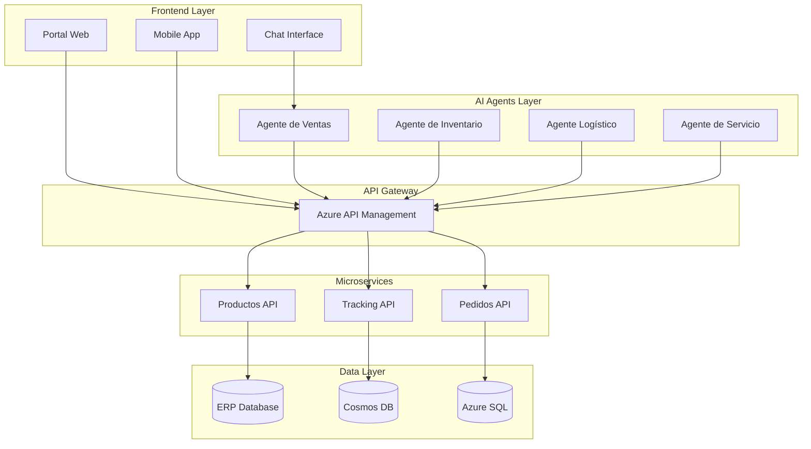

# 🚀 TopLlantas AI
## Transformación Digital con Agentes de Inteligencia Artificial

> **Propuesta integral para modernizar la cadena logística y de ventas de TopLlantas mediante la implementación de agentes de inteligencia artificial, APIs robustas para integración con ERP, y una plataforma cloud-native en Microsoft Azure.**

---

## 📋 Documentación del Proyecto

### Documentos Principales

- [**📊 Propuesta Personal de Desarrollo**](PROPUESTA_PERSONAL_DEV.html) - Análisis de situación actual y objetivos
- [**🎯 Casos de Uso**](CASOS_DE_USO.html) - Escenarios detallados de implementación
- [**🔧 Componentes Técnicos**](COMPONENTES_TECNICOS.html) - Especificaciones técnicas de la solución
- [**🏗️ Arquitectura de Agentes**](ARQUITECTURA_AGENTES.html) - Diseño de los agentes de IA
- [**🔌 Implementación de APIs**](APIS_IMPLEMENTACION.html) - Plan de desarrollo de APIs
- [**📈 Presentación Ejecutiva**](PRESENTACION_EJECUTIVA.html) - Resumen para ejecutivos

---

## 🎯 Objetivos del Proyecto

### Transformación Digital
- **Automatización inteligente** de procesos logísticos
- **Optimización de inventarios** con IA predictiva
- **Mejora de la experiencia del cliente** con agentes conversacionales
- **Integración seamless** con sistemas ERP existentes

### Beneficios Esperados
- 📈 **35% reducción** en costos operativos
- ⚡ **60% mejora** en tiempo de respuesta
- 🎯 **40% aumento** en precisión de inventarios
- 💰 **25% incremento** en ventas

---

## 🏗️ Arquitectura de la Solución

---

## 🚀 Fases de Implementación

### Fase 1: Fundación (Meses 1-3)
- ✅ Configuración de infraestructura Azure
- ✅ Desarrollo de APIs core
- ✅ Integración básica con ERP

### Fase 2: Agentes Core (Meses 4-6)
- 🤖 Implementación de agentes de IA
- 📱 Desarrollo de interfaces
- 🔗 Integración con sistemas existentes

### Fase 3: Optimización (Meses 7-9)
- ⚡ Optimización de rendimiento
- 📊 Analytics y reportes avanzados
- 🔄 Automatización completa

---

## 📞 Contacto

Para más información sobre este proyecto, contacta al equipo de desarrollo:

- **Email**: contact@topllantas-ai.com
- **Repositorio**: [GitHub - TopLlantas AI](https://github.com/ingleo44/topllantas-proposal)
- **Última actualización**: {{ site.topllantas.last_updated }}

---

*Desarrollado por el equipo de TopLlantas Development - {{ site.topllantas.version }}*
