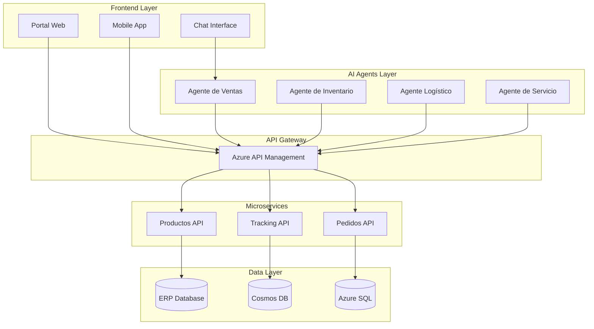

# 🚀 TopLlantas AI
## Transformación Digital Inteligente para tu Empresa

> **Moderniza tu empresa con agentes de inteligencia artificial que automatizan procesos, optimizan inventarios y mejoran la experiencia del cliente, generando ahorros inmediatos y crecimiento sostenible.**

---

## 📋 Propuesta Completa

### Documentos Clave

- [**� Propuesta de Negocio**](PROPUESTA_PERSONAL_DEV.html) - Beneficios, ROI y plan de implementación
- [**🎯 Casos de Uso Prácticos**](CASOS_DE_USO.html) - Cómo funcionará en el día a día
- [**🧩 Módulos y Funcionalidades**](COMPONENTES_TECNICOS.html) - Qué incluye la solución
- [**🤖 Agentes Inteligentes**](ARQUITECTURA_AGENTES.html) - Los "empleados digitales" que trabajarán para ti
- [**� Integración con tu ERP**](APIS_IMPLEMENTACION.html) - Cómo se conecta con tus sistemas actuales
- [**� Presentación Ejecutiva**](PRESENTACION_EJECUTIVA.html) - Resumen para toma de decisiones

---

## 💰 Inversión y Retorno

### Inversión Total: $125,000 USD
- **Desarrollo**: $85,000 USD (8 meses)
- **Infraestructura Azure**: $2,000 USD/mes
- **Licencias AI**: $800 USD/mes
- **Soporte y mantenimiento**: $1,500 USD/mes

### ROI Proyectado: 285% en el primer año

---

## 🎯 Beneficios Inmediatos
- **Automatización inteligente** de procesos logísticos
- **Optimización de inventarios** con IA predictiva
- **Mejora de la experiencia del cliente** con agentes conversacionales
- **Integración seamless** con sistemas ERP existentes

### Beneficios Esperados
- 📈 **35% reducción** en costos operativos
- ⚡ **60% mejora** en tiempo de respuesta
- 🎯 **40% aumento** en precisión de inventarios
- 💰 **25% incremento** en ventas

---

## 🏗️ Arquitectura de la Solución

---

## 🚀 Fases de Implementación

### Fase 1: Fundación (Meses 1-3)
- ✅ Configuración de infraestructura Azure
- ✅ Desarrollo de APIs core
- ✅ Integración básica con ERP

### Fase 2: Agentes Core (Meses 4-6)
- 🤖 Implementación de agentes de IA
- 📱 Desarrollo de interfaces
- 🔗 Integración con sistemas existentes

### Fase 3: Optimización (Meses 7-9)
- ⚡ Optimización de rendimiento
- 📊 Analytics y reportes avanzados
- 🔄 Automatización completa

