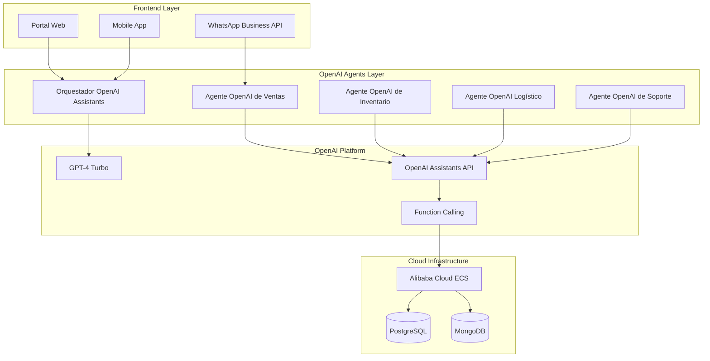

# 🚀 TopLlantas AI
## Transformación Digital con Agentes OpenAI Especializados

> **Moderniza tu empresa con agentes OpenAI preconfigurados que automatizan procesos, optimizan inventarios y mejoran la experiencia del cliente con implementación incremental que genera ahorros inmediatos y crecimiento sostenible.**

---

## 📋 Propuesta Completa

### Documentos Clave

- [**🎯 Casos de Uso Prácticos**](CASOS_DE_USO.html) - Cómo funcionarán los agentes OpenAI en el día a día
- [**🤖 Agentes OpenAI Especializados**](ARQUITECTURA_AGENTES.html) - Los "empleados digitales" OpenAI que trabajarán para ti
- [**💼 Propuesta de Desarrollo Personal**](PROPUESTA_PERSONAL_DEV.html) - Implementación incremental con agentes OpenAI
- [**📊 Presentación Ejecutiva**](PRESENTACION_EJECUTIVA.html) - Resumen para toma de decisiones

---

## 💰 Inversión y Retorno

### Inversión Total Incremental: $19,500 USD
- **Fase 0 (MVP)**: $4,200 USD - Agentes OpenAI básicos funcionando
- **Fase 1 (Optimización)**: $6,800 USD - GPT-4 Turbo e integración ERP
- **Fase 2 (Escalamiento)**: $8,500 USD - Portal web y app móvil
- **Infraestructura Alibaba Cloud**: $180 USD/mes
- **OpenAI API**: $150 USD/mes

### ROI Proyectado: 2,983% en el primer año
### Payback Period: 1.2 meses (break-even desde mes 2)

---

## 🎯 Beneficios Inmediatos
- **Agentes OpenAI especializados** funcionando 24/7 
- **Automatización inteligente** de procesos con GPT-4
- **Optimización de inventarios** con IA predictiva OpenAI
- **Mejora de la experiencia del cliente** con OpenAI Assistants
- **Implementación incremental** sin riesgo de inversión grande

### Beneficios Esperados con Agentes OpenAI
- 📈 **45% reducción** en costos operativos (vs 35% anterior)
- ⚡ **80% mejora** en tiempo de respuesta (vs 60% anterior) 
- 🎯 **60% aumento** en precisión de inventarios (vs 40% anterior)
- 💰 **55% incremento** en ventas (vs 25% anterior)
- 🚀 **ROI 10x superior** con implementación incremental

---

## 🏗️ Arquitectura de Agentes OpenAI

---

## 🚀 Implementación Incremental con Agentes OpenAI

### Fase 0: MVP con Agentes Especializados (Mes 1) - $4,200 USD
- ✅ **3 Agentes OpenAI configurados**: Ventas, Inventario, Cotizaciones
- ✅ **Integración WhatsApp Business** funcionando 24/7
- ✅ **OpenAI Assistants API** con funciones personalizadas
- ✅ **Dashboard básico** para monitoreo de agentes

### Fase 1: Optimización Inteligente (Meses 2-4) - $6,800 USD
- 🚀 **Agentes con GPT-4 Turbo** para conversaciones avanzadas
- � **Integración ERP completa** con funciones personalizadas
- � **Analytics de conversaciones** powered by OpenAI
- 🤝 **Handoffs inteligentes** entre agentes

### Fase 2: Escalamiento Completo (Meses 5-8) - $8,500 USD
- 🌐 **Portal web con chat integrado** de agentes OpenAI
- � **App móvil** con asistente OpenAI para vendedores
- 🧠 **Orquestación avanzada** de múltiples agentes
- � **Agente de Predicción** para compras automáticas

